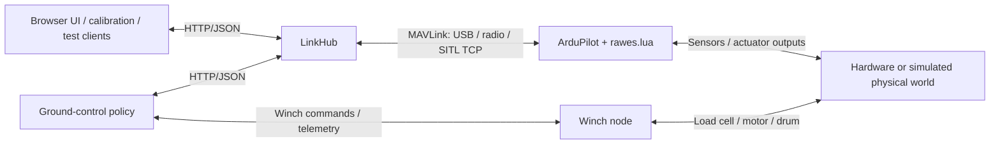

# RAWES -- Rotary Airborne Wind Energy System

A tethered autorotating rotor kite that harvests wind energy through a pumping cycle.
This repository contains the flight scripts, production ground-control policy,
LinkHub transport gateway and browser UI, physics simulation, calibration tooling,
and documentation for the RAWES hardware and control system.

---

## What Is This System?

Imagine a large spinning rotor -- like a helicopter rotor, but with no engine. Instead of an
engine driving the blades, the **wind drives them**. As the wind blows, the rotor spins
automatically (this is called autorotation, the same principle a helicopter uses when its
engine fails to glide safely to the ground).

Now attach a long cable to the bottom of that rotor and connect the other end to a winch on
the ground. As the rotor climbs and pulls the cable out, the tension in the cable spins a
generator on the ground -- **generating electricity**. Reel the cable back in at low power
cost, let the rotor climb again, and repeat. This is a Rotary Airborne Wind Energy System.

Our system has four blades, each two metres long, spinning at roughly 270 RPM at an altitude
of 50 metres. Three servo motors tilt a mechanical plate inside the hub (a swashplate)
to control the blade pitch through trailing-edge flaps. The airborne flight
controller handles the fast control loops; the ground station supplies slow
flight setpoints.

Key distinction from a drone: **no motor drives rotation** -- wind does. Control is entirely
through blade pitch, actuated indirectly via trailing-edge flaps on each blade.

Hardware dimensions, assembly, and the distinction between physical and
simulation geometry are documented in [hardware.md](design/hardware.md).

---

## Runtime Architecture

The physical system has three nodes: ground winch, ground station, and airborne
Pixhawk. Software ownership is the same on hardware and in full-stack SITL:



| Component | Owns | Does not own |
|-----------|------|--------------|
| ArduPilot + Lua | Estimation, vehicle modes, flight guidance, attitude/rate control, servo mixing | Ground phase planning or winch load-cell feedback |
| Production ground policy (`groundstation/`) | Pumping/landing planning and commanded tension, altitude, phase | Vehicle estimation or fast attitude control |
| LinkHub (`linkhub/`) | Sole MAVLink connection, heartbeat, frame writer, transactions, message-rate configuration, ordered RX/TX and diagnostics journal | Flight policy, physics, or browser rendering |
| Browser UI / calibration | Operator workflows, visualization, HTTP client requests | Direct MAVLink transport or a duplicate transport journal |
| Simulation mediator (`simulation/`) | Dynamics, aero, tether, wind, sensors, simulated hardware plants, actuator application, lockstep, raw physics telemetry | Production ground policy or MAVLink consumption to decorate CSV rows |
| SITL harness (`tests/sitl/`) | Processes, timeouts, artifacts, post-run enrichment of physics CSV with LinkHub observations | Replacement flight control or simulation-only stabilization |

The winch closes its own load-cell tension loop. The vehicle receives **commanded
tension**, target altitude, and phase -- not measured tension. Lua uses commanded
tension for orientation feedforward and altitude feedback for collective.
See [flight_stack.md](design/flight_stack.md) for the control contract.

SITL replaces the hardware world with the mediator, not the flight controller.
The full stack uses 1200 Hz lockstep physics frames with ArduPilot's 400 Hz control
loop; simtests use an in-process mock and the Python control port. These are
different test tiers, not interchangeable flight acceptance.

### Link throughput and stream management

**Implemented:** LinkHub measures validated MAVLink frame bytes separately for
RX and TX, publishes bits/s using one-second samples and a three-second average,
and resets the rate window on reconnect. The browser only formats these values.
They exclude UART/radio/network overhead and are not a measurement of RF capacity.
Clients currently request explicit message intervals through LinkHub.

**Proposed, not implemented:** LinkHub-owned USB/radio profiles, priority tiers,
minimum useful rates, and conservative adaptation using delivered rates, message
age, and radio feedback. Sustained congestion would shed optional streams first
and restore them slowly; filtering browser HTTP batches does not save radio
bandwidth. ArduPilot's own radio-buffer flow control is complementary.
The detailed boundary and proposal live in [linkhub.md](design/linkhub.md).

### Repository entry points

| Area | Entry point |
|------|-------------|
| Physical-world simulation and Python/Lua test adapters | [simulation/README.md](simulation/README.md) |
| Python port of ArduPilot control loops | [arduloop/README.md](arduloop/README.md) |
| Rust gateway, service commands, and HTTP API usage | [linkhub/README.md](linkhub/README.md) |
| Browser telemetry, control, and 3D visualization | [linkhub-ui/README.md](linkhub-ui/README.md) |
| Shared typed Python HTTP client | [linkhub_client/README.md](linkhub_client/README.md) |
| Production phase planning and winch protocol | [groundstation/](groundstation/) |
| Hardware calibration | [design/calibration.md](design/calibration.md) |
| Offline reports, envelope analysis, telemetry playback | [analysis/](analysis/), [envelope/](envelope/), [viz3d/](viz3d/) |
| Deployed Lua and standalone tools | [scripts/](scripts/) |

---

## Documentation Map

Each topic has one owner. Other documents link to the owner instead of
restating it, and numeric defaults live in code or parm files rather than
prose. [AGENTS.md](AGENTS.md) points agents directly at the owner for a task
so they do not load unrelated documents.

- Parameter defaults and their explanations: [copter-heli.parm](tests/sitl/copter-heli.parm)
  (ArduPilot), [rawes_common_defaults.parm](tests/sitl/rawes_common_defaults.parm)
  (RAWES, shared and SITL) and [rawes_hardware_defaults.parm](hardware/rawes_hardware_defaults.parm)
  (hardware-only).
- The RAWES wire/API contract is owned by [flight_stack.md](design/flight_stack.md).
- Module READMEs give orientation and local usage only.
- Historical observations are evidence, never current procedure.

### Design documents

| Document | Owns |
|----------|------|
| [flight_stack.md](design/flight_stack.md) | System ownership, ground/AP command contract, Lua modes and wire interface, yaw behavior |
| [GUIDED_CONTROL_LOOPS.md](design/GUIDED_CONTROL_LOOPS.md) | ArduPilot Guided/heli attitude and rate-control internals |
| [arming.md](design/arming.md) | Arm/disarm, safe-off invariant, passive and ACRO startup (hardware safety) |
| [calibration.md](design/calibration.md) | `calibrate` commands, recording, Lua deployment, operator workflows |
| [linkhub.md](design/linkhub.md) | LinkHub ownership, journal, cursor API, generated protocol, throughput, rate policy |
| [simulation.md](design/simulation.md) | Physical-world runtime: `PhysicsCore`, sensors, plants, test adapters, lockstep interface |
| [aero_conventions.md](design/aero_conventions.md) | `dynbem` interface, frames, signs, reference rotors and papers |
| [sitl_testing.md](design/sitl_testing.md) | Docker stack execution, artifacts, diagnosis, lockstep behavior, flight timeline anchors |
| [testing.md](design/testing.md) | Unit/simtest layout and Lua/Python test conventions |
| [EKF_GATING.md](design/EKF_GATING.md) | GPS/moving-baseline yaw bring-up gates and `const_pos_mode` triage |
| [hardware.md](design/hardware.md) | Airframe geometry, components, swash mapping, yaw motor and DShot path |

### Other documents

| Document | Purpose |
|----------|---------|
| [HARDWARE_STARTUP.md](HARDWARE_STARTUP.md) | Current verified hardware state plus dated session evidence; read before touching hardware |
| [simulation/README.md](simulation/README.md) | Simulation package orientation and entry points |
| [arduloop/README.md](arduloop/README.md) | Python port of the ArduPilot heli attitude/rate stack |
| [linkhub/README.md](linkhub/README.md) | Build, run, CLI, HTTP usage and journal queries |
| [linkhub-ui/README.md](linkhub-ui/README.md) | Browser UI setup and behavior |
| [linkhub_client/README.md](linkhub_client/README.md) | Typed Python HTTP client |
| [envelope/CLAUDE.md](envelope/CLAUDE.md) | Agent notes for the flight-envelope package |
| [presentations/presentation_sitl_aero.md](presentations/presentation_sitl_aero.md) | Slide deck on the SITL and aero architecture |

Swashplate geometry and sign mapping are owned by the implementation,
[swashplate.py](simulation/swashplate.py). The reference papers are in
[documents/](documents/).

---
## Running Tests

First-time setup (creates/refreshes the repository Python environment, idempotent):

```cmd
setup.cmd            (Windows)         or       bash setup.sh
```

Docker image builds:

```bash
# Full image (includes ArduPilot SITL build; cached in reusable Docker stage)
bash setup.sh build

# Fast image (no ArduPilot build)
bash setup.sh build-lite
```

Use `uv` for the local Python environment. `uv sync --dev` provisions the
lightweight hardware environment; `uv sync --dev --extra simulation` adds the
scientific/Lua stack. Run `uv sync` explicitly after dependency changes
(`UV_NO_SYNC=1` is configured on this workstation).

Choose the smallest tier that covers the change; full validation proceeds from
unit tests to simtests to the real SITL stack.

```bash
# Stage 1 -- Unit tests (local Python, no Docker)
uv run python -m pytest tests/unit -m "not simtest" -q

# Stage 2 -- Simtests (local Python, no Docker)
uv run python -m pytest tests/simtests -m simtest -q

# Stage 3 -- Stack tests (Docker, ArduPilot SITL)
bash test.sh stack -n 4
```

For one stack test, use `bash test.sh stack -n 1 -k <test_name>`.
All Docker operations go through these scripts, which select WSL when launched
from Windows; never run stack tests with host-side pytest.
`test.cmd` is a Windows shim to `test.sh` for Docker SITL workflows.
See [design/testing.md](design/testing.md) and
[design/sitl_testing.md](design/sitl_testing.md) for full workflow and troubleshooting.

---
