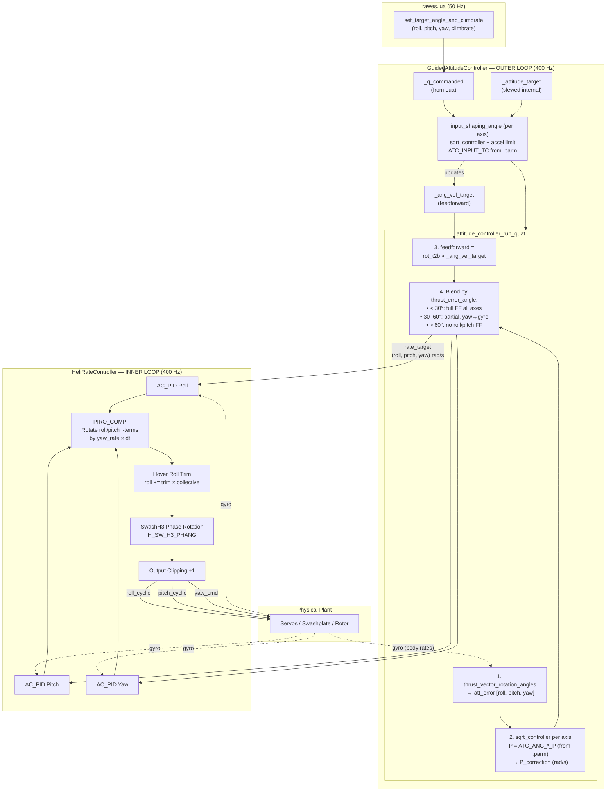
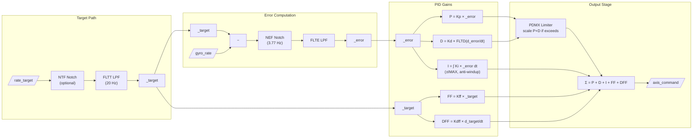
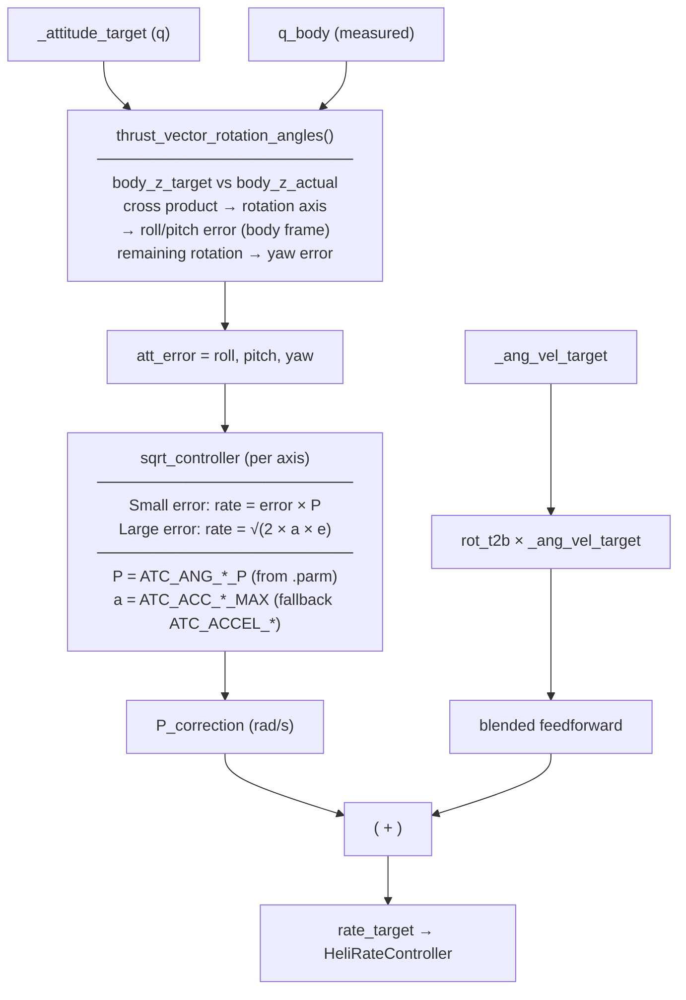
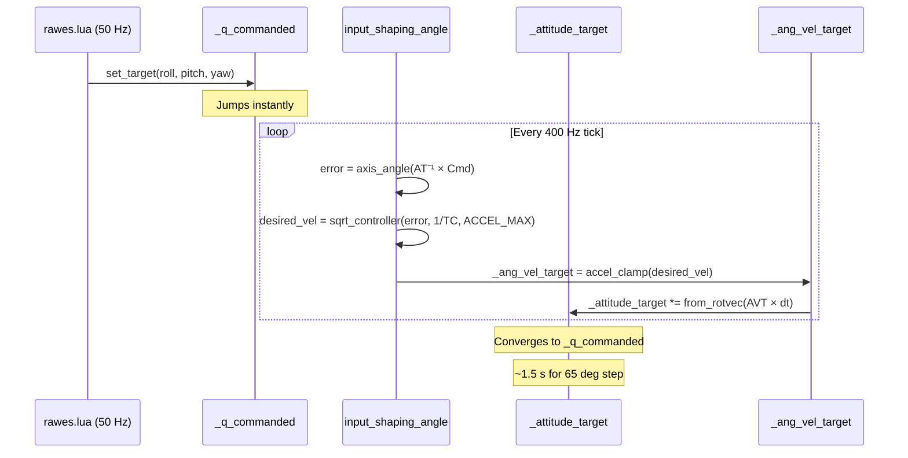
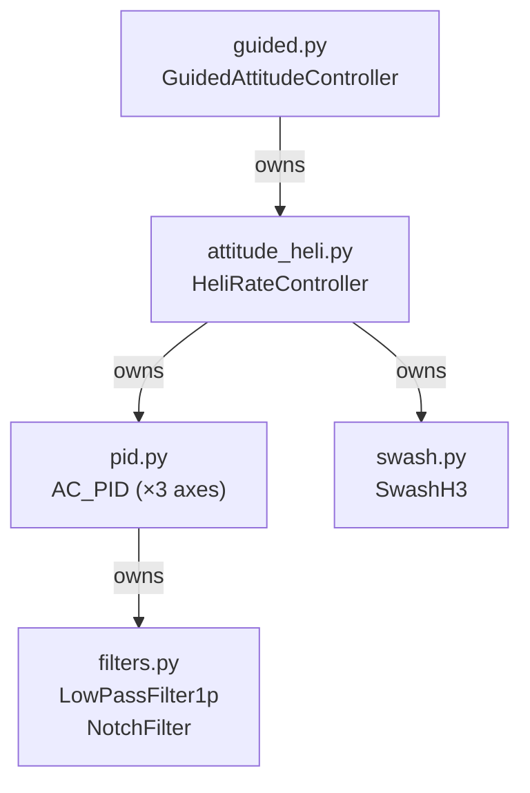

# ArduLoop Control Loop & PID Architecture

A visual guide to the two-layer attitude control stack ported from ArduPilot.

---

## High-Level Block Diagram

---

## Per-Axis AC_PID Signal Flow (Detail)

---

## Outer Loop: Attitude Error Decomposition

---

## Input Shaping: How _attitude_target Slews

---

## Module Dependency Graph

---

## Parameter Quick Reference

### Outer Loop (GuidedAttitudeParams)

| Parameter | Default | Role |
|-----------|---------|------|
| `ATC_ANG_RLL_P` | loaded from .parm | Attitude P-gain: rad/s per rad error |
| `ATC_ANG_PIT_P` | loaded from .parm | Same for pitch |
| `ATC_ANG_YAW_P` | loaded from .parm | Same for yaw |
| `ATC_ACCEL_R_MAX` | loaded from .parm | AP 4.7 `ATC_ACC_R_MAX`, fallback `ATC_ACCEL_R_MAX` |
| `ATC_ACCEL_P_MAX` | loaded from .parm | AP 4.7 `ATC_ACC_P_MAX`, fallback `ATC_ACCEL_P_MAX` |
| `ATC_ACCEL_Y_MAX` | loaded from .parm | AP 4.7 `ATC_ACC_Y_MAX`, fallback `ATC_ACCEL_Y_MAX` |
| `ATC_RATE_R/P/Y_MAX` | 0 (unlimited) | Max body rate cap (deg/s) |
| `ATC_INPUT_TC` | loaded from .parm | Slew time constant |

### Inner Loop (RateAxisParams per axis)

| Parameter | Roll/Pitch | Yaw | Role |
|-----------|-----------|-----|------|
| `P` | loaded from .parm | loaded from .parm | Proportional gain |
| `I` | loaded from .parm | loaded from .parm | Integral gain |
| `D` | loaded from .parm | loaded from .parm | Derivative gain |
| `FF` | loaded from .parm | loaded from .parm | Feedforward on target |
| `IMAX` | loaded from .parm | loaded from .parm | Integrator clamp |
| `FLTT` | loaded from .parm | loaded from .parm | Target signal LPF |
| `FLTE` | 0 Hz | 0 Hz | Error signal LPF |
| `FLTD` | loaded from .parm | loaded from .parm | Derivative LPF |
| `NEF` | 3.77 Hz | — | Error notch (tether spring) |
| `NTF` | — | — | Target notch |
| `PDMX` | 0 | 0 | PD sum limit (0=off) |

### Heli-Specific

| Parameter | Default | Role |
|-----------|---------|------|
| `H_SW_H3_PHANG` | 0 deg | Swashplate phase angle |
| `ATC_HOVR_ROL_TRM` | 0 cd | Collective-scaled roll trim |
| `ATC_PIRO_COMP` | Off | Rotate I-terms with yaw rate |

---

## Timing & Execution Context

| Layer | Rate | Caller | Output |
|-------|------|--------|--------|
| rawes.lua target command | 50 Hz | Lua `update()` | quaternion target |
| GuidedAttitudeController.update | 400 Hz | Physics runner | rate targets |
| HeliRateController.update | 400 Hz | (inside above) | cyclic + yaw |
| Plant / Servo actuation | 400 Hz | Physics dynamics | torques |

---

## Key Design Insight: Why Two Quaternion States?

ArduPilot maintains **two** attitude quaternions:

1. **`_q_commanded`** — what Lua asked for (jumps instantly at 50 Hz)
2. **`_attitude_target`** — internal slewed target (advances smoothly at 400 Hz)

The **attitude error** used for the P-loop is computed between `_attitude_target`
and `q_body` (actual), NOT between `_q_commanded` and `q_body`. This means:

- Large commanded steps don't produce huge instant rate demands
- The input shaping acts as a reference-model prefilter
- Feedforward (`_ang_vel_target`) provides the expected rate while slewing
- The P-loop only corrects tracking error relative to the slewed reference

This is critical for RAWES: the 65° tether tilt means initial commanded angles
are large, and without slewing the rate PIDs would instantly saturate.
