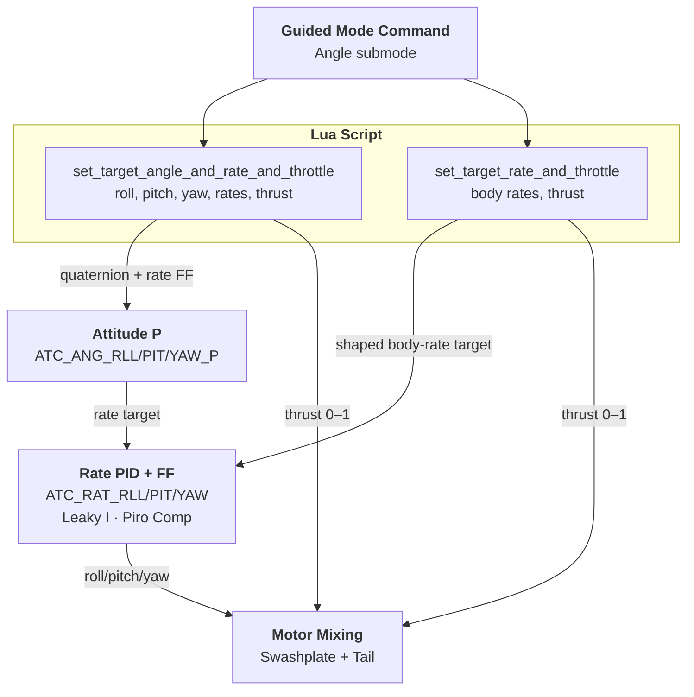
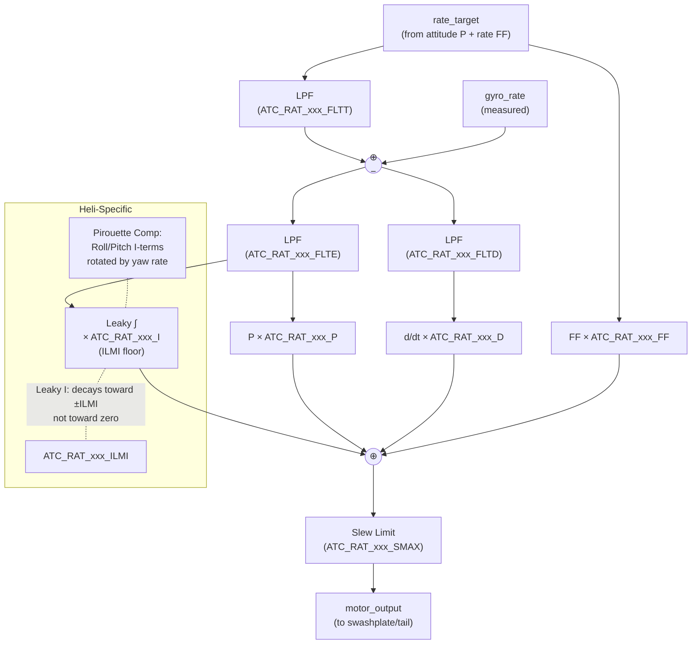
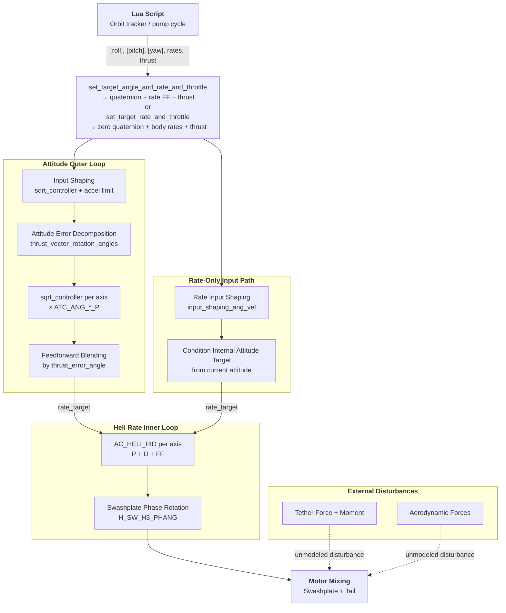

# Guided Mode Control Loops — Helicopter (RAWES Focus)

## Scope and Ownership

This is a low-level Guided/attitude-control deep dive.

- Canonical system-level behavior and mode ownership live in [flight_stack.md](flight_stack.md).
- This document should focus on ArduPilot control-chain internals and parameter effects.
- Avoid repeating full system architecture text already covered in [flight_stack.md](flight_stack.md).

## 1. Overview

This document describes the control loop architecture for ArduPilot's **Guided mode** as used by the RAWES (Rotary Airborne Wind Energy System). It is intended for control system engineers who need to understand the signal flow from an attitude command down to swashplate and tail actuator outputs.

RAWES uses the **Angle submode** of Guided mode, which bypasses all position, velocity, and altitude controllers. There are two relevant Angle-submode entry paths:

- **Angle + rate + thrust**: Lua provides an absolute attitude target, optional body-rate feed-forward, and direct thrust.
- **Rate-only + thrust**: Lua provides body-rate targets and direct thrust, but no absolute attitude target.

Both paths use ArduPilot's attitude/rate machinery and both command collective directly from thrust. The difference is where the body-rate target comes from: either from quaternion attitude error plus feed-forward, or directly from the rate-only command shaper.

### High-Level Signal Flow



### Helicopter Rate Controller Detail (Per Axis)



---

## 2. Guided Mode Submodes

Guided mode supports multiple submodes. **RAWES uses exclusively the Angle submode.**

| Submode | Input | Active for RAWES? |
|---------|-------|----|
| TakeOff | Altitude target | No |
| Pos | 3D position (NEU) | No — routes through AC_PosControl |
| Accel | 3D acceleration | No — routes through AC_PosControl |
| VelAccel | Velocity + Acceleration | No — routes through AC_PosControl |
| PosVelAccel | Position + Velocity + Accel | No — routes through AC_PosControl |
| **Angle** | **Roll/Pitch/Yaw + Thrust** or **Body Rates + Thrust** | **Yes** |

### Angle Submode Entry

The Lua API enters the Angle submode by calling `ModeGuided::set_angle()`. No position, velocity, or altitude controller is involved. Inside `run_angle_control()`, ArduPilot chooses one of two attitude-controller inputs based on whether the stored quaternion is nonzero or zero.

#### Angle + Rate + Thrust Entry

**RAWES API**: `set_target_angle_and_rate_and_throttle(roll, pitch, yaw, roll_rate, pitch_rate, yaw_rate, throttle)`

This calls `set_angle(q, ang_vel_body, throttle, use_thrust=true)`:
- Euler angles are converted to a quaternion and passed to the attitude controller
- Body-rate feed-forward terms are added to the rate target (supply the known orbital angular velocity to reduce tracking lag)
- Throttle (0–1) goes directly to collective output, bypassing the vertical PID chain entirely

Control-chain summary:

```
roll/pitch/yaw + body-rate FF → set_angle(nonzero quaternion, rates, thrust, use_thrust=true)
                                → input_quaternion()
                                → attitude error + feed-forward blending
                                → heli rate PID
thrust                          → set_throttle_out(...)
                                → direct collective output
```

#### Rate-Only + Thrust Entry

**RAWES API**: `set_target_rate_and_throttle(roll_rate, pitch_rate, yaw_rate, throttle)`

This calls the same `ModeGuided::set_angle(...)` storage path, but with a **zero quaternion**:

```cpp
Quaternion q;
q.zero();
mode_guided.set_angle(q, ang_vel_body, throttle, true);
```

At 400 Hz, `ModeGuided::run_angle_control()` detects that zero quaternion and switches from `input_quaternion(...)` to:

```cpp
attitude_control->input_rate_bf_roll_pitch_yaw(...);
attitude_control->set_throttle_out(thrust, apply_angle_boost=true, filt);
```

Important behavior:
- The caller does **not** provide an absolute attitude target.
- ArduPilot conditions its internal `_attitude_target` from the current body attitude, then integrates that target using the shaped body-rate target.
- Desired body rates are smoothed by `input_shaping_ang_vel(...)` using `ATC_INPUT_TC` and `ATC_ACCEL_R/P/Y_MAX`.
- The normal quaternion attitude controller still runs afterward, so this is **stabilized rate control**, not a raw PID-only passthrough.
- With requested rates `(0, 0, 0)`, the vehicle tries to settle body rates to zero while holding the internally conditioned attitude target.
- Throttle remains the same direct-thrust path as angle+rate+throttle; the Z PID chain is still bypassed.

Why this matters for RAWES: if the controller knows “stop rotating” but does not know the correct absolute roll/pitch/yaw for the current tether/wind state, rate-only Guided can avoid injecting a wrong absolute attitude command while still using ArduPilot's shaped rate and heli PID machinery.

Control-chain summary:

```
body rates → set_angle(zero quaternion, rates, thrust, use_thrust=true)
           → input_rate_bf_roll_pitch_yaw()
           → input_shaping_ang_vel()
           → internal attitude target conditioned from current attitude
           → heli rate PID
thrust     → set_throttle_out(...)
           → direct collective output
```

### Vertical Path: Raw Thrust

```
thrust → attitude_control->set_throttle_out(thrust, apply_angle_boost=true)
       → directly to collective output (with angle boost)
```

The vertical PID chain (Section 4) is **completely bypassed**. The thrust value goes directly to the collective servo (after angle boost scaling). No ArduPilot altitude hold, no velocity PID, no acceleration PID. The Lua script owns collective and runs its **own** altitude PID (at 50 Hz) to set thrust.

> **Note**: The equivalent MAVLink path is `SET_ATTITUDE_TARGET` with `GUID_OPTIONS` bit 3 set — both call the same `set_angle()` function with `use_thrust=true`.

#### Why Direct Collective for RAWES?

RAWES decouples attitude and collective so the two flight tasks never fight (see [tension_collective_control_loop.md](tension_collective_control_loop.md)):

- **Orientation (attitude)** is a feedforward force balance: the **commanded** tension `RAWES_TEN` + actual position + gravity sets the disk-axis direction. A higher commanded tension aims the disk more tether-aligned (power phase, reel-out); a lower one tilts it back (recovery, reel-in). The actual tension is produced by the kite/winch interaction — the winch closes the only tension loop, on its own load cell.
- **Collective (thrust)** is a closed-loop altitude PID running inside the Lua. It rejects gusts and holds the commanded altitude, while the force balance only slowly re-trims direction.

The AP therefore receives only two slow setpoints — commanded tension and target altitude — and never the measured tension. ArduPilot's built-in Z controller is bypassed precisely so the Lua can own this decoupling.

---

## 3. Horizontal Control Chain (XY) — Why AC_PosControl Doesn't Work for RAWES

**Not active for RAWES.** The Angle submode bypasses `AC_PosControl` for horizontal axes. This section explains why.

### 3.1 What AC_PosControl Does

The standard horizontal position controller chains:

```
Position error → P → Velocity target → PID → Accel target → accel_to_lean_angles() → Roll/Pitch
```

The final conversion `accel_to_lean_angles()` uses `atan(a/g)` — this is mathematically exact at any angle, **not** a small-angle approximation. The function itself works correctly even at 70° tilt. The problems are in the loops around it.

### 3.2 Three Reasons It Fails at Steep Tilt

**1. Velocity PID gain scaling**

The velocity PID is tuned assuming a linear plant: small changes in lean angle produce proportional changes in horizontal acceleration. The true relationship is `a = g·tan(θ)`, whose derivative (plant gain) is `g/cos²(θ)`:

| Tilt angle | Plant gain | Effective gain multiplier |
|------------|-----------|--------------------------|
| 0° (hover) | g | 1× (tuned for this) |
| 30° | 1.33g | 1.3× |
| 45° | 2g | **2×** |
| 60° | 4g | **4×** |

At 60° tilt the velocity PID is effectively 4× more aggressive than tuned, causing oscillation. ArduPilot does not gain-schedule by `cos²(θ)`.

**2. Lean angle clamping**

`ANGLE_MAX` (default 30°, hard max typically 45°) and the collective-margin lean limit (`get_althold_lean_angle_max_cd()`) clamp the output of `accel_to_lean_angles()`. RAWES needs 45–70° tilt — well beyond these limits. Even if `ANGLE_MAX` is raised, problem 1 and 3 remain.

**3. Decoupled Z controller**

The altitude controller treats collective as approximately vertical force. At steep tilt, only `cos(θ)` of total thrust is vertical — at 60° that's 50%. The `angle_boost` feed-forward (`1/cos(θ)` collective scaling) partially compensates, but the XY and Z loops don't coordinate: the XY loop commands tilt without telling the Z loop that more collective is needed, and the Z loop increases collective without knowing it's also increasing horizontal force. This cross-coupling worsens with tilt angle.

### 3.3 Why Submarines Get Away With It

ArduSub uses the same `AC_PosControl` and `atan(a/g)` math, but avoids these problems because **the output is consumed differently**. In `ArduSub/motors.cpp`, `translate_pos_control_rp()` converts the roll/pitch outputs into **forward/lateral thruster commands** rather than actually tilting the vehicle body. On vectored 6DOF frames (`AP_Motors6DOF`), horizontal movement comes from dedicated thrusters — the vehicle stays level regardless of horizontal acceleration.

The `atan(a/g)` calculation is technically wrong for a neutrally buoyant vehicle (there's no gravitational restoring force linking tilt to horizontal acceleration), but it doesn't matter because the output is just a proportional signal routed to lateral thrusters, and PID tuning absorbs the nonlinearity.

RAWES cannot use this approach — horizontal force comes from tilting the rotor disc, so the vehicle **must** actually tilt to the commanded angle.

### 3.4 RAWES Solution

RAWES uses Guided Angle submode to bypass `AC_PosControl` entirely. The Lua script closes its own flight-regime logic with full knowledge of steep tilt, tether forces, and orbital dynamics, then commands either attitude+thrust via `set_target_angle_and_rate_and_throttle()` or body-rates+thrust via `set_target_rate_and_throttle()`.

---

## 4. Collective Path (Direct Thrust)

With either `set_target_angle_and_rate_and_throttle` or `set_target_rate_and_throttle`, the thrust value (0–1) bypasses the entire Z PID chain and goes directly to the collective servo:

```
thrust (from Lua) → set_throttle_out(thrust, apply_angle_boost)
                  → collective = H_COL_MIN + thrust × (H_COL_MAX − H_COL_MIN)
```

> **Note**: The Z altitude/velocity/acceleration PID chain (`PSC_POSZ_P`, `PSC_VELZ_*`, `PSC_ACCZ_*`) exists in ArduPilot but is **completely inactive** when using this API. The Lua script owns collective directly.

### Angle Boost

When `apply_angle_boost` is true (default), the collective is scaled by `1/cos(tilt)` to compensate for reduced vertical thrust at lean angles. For RAWES at steep tilt, this scaling becomes large (`2× at 60°`) and may be undesirable since collective controls blade pitch for tether tension, not hover thrust. Consider setting `ATC_ANG_BOOST = 0`.

### Helicopter Collective Mapping

| Parameter | Units | Description |
|-----------|-------|-------------|
| `H_COL_MIN` | PWM or 0-1 | Minimum collective pitch |
| `H_COL_MAX` | PWM or 0-1 | Maximum collective pitch |
| `H_COL_MID` | PWM or 0-1 | Mid-stick collective |
| `H_COL_ANG_MIN` | degrees | Blade pitch at minimum collective |
| `H_COL_ANG_MAX` | degrees | Blade pitch at maximum collective |

---

## 5. Attitude Control Loop

### 5.1 Attitude Error → Body Rate Target (P Controller)

The attitude controller computes a quaternion error between the target and current attitude, then extracts an angular rate command proportional to the error:

```
attitude_error = target_quat * current_quat.inverse()
ang_vel_target_roll  = att_error_roll  * ATC_ANG_RLL_P
ang_vel_target_pitch = att_error_pitch * ATC_ANG_PIT_P
ang_vel_target_yaw   = att_error_yaw   * ATC_ANG_YAW_P
```

- **Controller**: Proportional (quaternion-based)
- **Parameters**: `ATC_ANG_RLL_P`, `ATC_ANG_PIT_P`, `ATC_ANG_YAW_P` (units: rad/s per rad)
- **Output**: Body-frame angular rate targets in rad/s
- **Rate feedforward**: If the target attitude is changing (e.g., during a maneuver), the rate of change is added as feedforward
- **Code**: `AC_AttitudeControl::attitude_controller_run_quat()` → `update_ang_vel_target_from_att_error()`

---

## 6. Rate Control Loop (Helicopter-Specific)

This is where helicopter control diverges significantly from multicopter. The helicopter uses `AC_AttitudeControl_Heli` with `AC_HELI_PID` controllers.

### 6.1 Rate PID Structure

For each axis (roll, pitch, yaw):

```
rate_error = rate_target - gyro_rate

P_term   = rate_error * ATC_RAT_xxx_P
I_term   = integral(rate_error) * ATC_RAT_xxx_I    [with leaky integrator]
D_term   = d/dt(rate_error) * ATC_RAT_xxx_D
FF_term  = rate_target * ATC_RAT_xxx_FF

output = P_term + I_term + D_term + FF_term
```

### 6.2 Leaky Integrator (ILMI)

Unique to helicopters, the integrator uses a **leak-to-minimum** strategy:

- The integrator decays at rate `0.02/s` toward `±ILMI` (not toward zero)
- If `|integrator| > ILMI`: integrator leaks toward ILMI
- If `|integrator| <= ILMI`: no leak applied
- **Purpose**: Maintains a minimum I-term to compensate for known steady-state offsets (e.g., tail rotor torque compensation) while still preventing windup

```
if |I_term| > ILMI:
    I_term -= sign(I_term) * leak_rate * dt
```

- **Parameter**: `ATC_RAT_xxx_ILMI` (default 0.1)
- **Leak rate**: 0.02 (hardcoded constant `AC_ATTITUDE_HELI_RATE_INTEGRATOR_LEAK_RATE`)
- **Code**: `AC_HELI_PID::update_leaky_i()`

### 6.3 Pirouette Compensation

During yaw rotation, the roll and pitch I-terms are rotated to maintain their earth-frame orientation:

```
// Rotate roll/pitch integrators by yaw rate * dt
new_roll_I  = roll_I * cos(yaw_rate*dt) - pitch_I * sin(yaw_rate*dt)
new_pitch_I = roll_I * sin(yaw_rate*dt) + pitch_I * cos(yaw_rate*dt)
```

- **Code**: `AC_AttitudeControl_Heli::rate_bf_to_motor_roll_pitch()` (piro comp section)

### 6.4 Filtering

Each rate PID has configurable filters:

| Filter | Parameter | Description |
|--------|-----------|-------------|
| Target filter | `ATC_RAT_xxx_FLTT` | Low-pass on rate target input |
| Error filter | `ATC_RAT_xxx_FLTE` | Low-pass on rate error (affects P & I) |
| D-term filter | `ATC_RAT_xxx_FLTD` | Low-pass on derivative term |
| Slew rate limit | `ATC_RAT_xxx_SMAX` | Maximum rate of change of output |
| Notch (target) | `ATC_RAT_xxx_NTF` | Notch filter bitmask on target |
| Notch (error) | `ATC_RAT_xxx_NEF` | Notch filter bitmask on error |

### 6.5 Flybar / Tail Passthrough Modes

For mechanical flybar helicopters or direct-drive tails:
- **Flybar passthrough**: Roll/pitch rate controller is bypassed; pilot/attitude output goes directly to swashplate
- **Tail passthrough**: Yaw rate controller is bypassed; output goes directly to tail servo/motor

---

## 7. Yaw Control in Guided Mode

### Yaw Control Chain

```
yaw_heading_target → attitude_error_yaw → ATC_ANG_YAW_P → yaw_rate_target
yaw_rate_target → rate_PID (ATC_RAT_YAW_*) → tail_output
```

For RAWES, the yaw axis is controlled by an anti-rotation motor whose sole purpose is to counter the reaction torque from the spinning rotor. The yaw PID should ideally see only yaw rate error — no coupling from collective or cyclic.

### Collective → Yaw Coupling Paths (Unwanted for RAWES)

ArduPilot's helicopter motor code contains several paths where collective or cyclic changes leak into the yaw output. These are designed for conventional single-rotor helicopters where main rotor torque varies with collective pitch. **For RAWES, where the rotor is wind-driven and torque is not a function of collective, these couplings are undesirable.**

#### 1. `H_COL2YAW` — Collective-to-Yaw Feedforward

**File**: `AP_MotorsHeli_Single.cpp:442-466` (`get_yaw_offset()`)

Adds a yaw offset proportional to collective pitch raised to the 1.5 power:

```
yaw_offset = H_COL2YAW × |collective − zero_thrust_pct|^1.5
```

This compensates for the conventional helicopter's main rotor torque increasing with collective. For RAWES, the anti-rotation motor counters aerodynamic reaction torque from wind-driven autorotation, which is **not correlated with collective**. Any nonzero `H_COL2YAW` will inject spurious yaw commands when collective changes during altitude control.

**Action**: Set `H_COL2YAW = 0` (default is 0 — verify it stays there).

#### 2. `H_YAW_TRIM` — Fixed Yaw Bias (DDFP Tails)

**File**: `AP_MotorsHeli_Single.cpp:181-184, 462-463`

Adds a constant offset to the yaw output for DDFP (Direct Drive Fixed Pitch) tail types. This is a static trim to reduce I-term load in hover.

**Action**: If using a DDFP-type tail configuration, verify `H_YAW_TRIM` is appropriate for the RAWES anti-rotation motor's operating point. It may help or hurt depending on the steady-state yaw torque.

#### 3. Angle Boost → Collective → COL2YAW Chain

**File**: `AC_AttitudeControl_Heli.cpp:537-574` (`set_throttle_out()`, `get_throttle_boosted()`)

When `apply_angle_boost` is true, the throttle/collective is scaled by `1/cos(tilt)` to maintain vertical thrust during lean. This increased collective then feeds through `H_COL2YAW` (if nonzero) into yaw.

At steep tilt angles this boost factor becomes large (`1/cos(60°) = 2×`), amplifying any COL2YAW coupling. Even if COL2YAW is small, the boost can make the leakage significant.

**Action**: With `H_COL2YAW = 0` this path is inactive. Additionally, angle boost itself may be inappropriate for RAWES since collective controls blade pitch for autorotation, not thrust-to-weight. Consider setting `ATC_ANG_BOOST` = 0 if the angle boost concept doesn't apply.

#### 4. Collective Margin Lean Limit → Indirect Yaw Effect

**File**: `AC_AttitudeControl_Heli.cpp:445-448` (`update_althold_lean_angle_max()`)

While this doesn't directly inject yaw, it clips the maximum allowed attitude based on available collective margin. At steep tilt, this can clip the roll/pitch targets, which changes the attitude error, which changes the body rates, which the yaw PID may respond to via cross-axis gyroscopic effects.

**Action**: Increase `ATC_ANG_LIM_TC` to soften the lean limit or verify it doesn't clip at RAWES operating angles.

### Summary of Yaw Coupling Parameters

| Parameter | Default | Effect on Yaw | RAWES Recommendation |
|-----------|---------|---------------|----------------------|
| `H_COL2YAW` | 0 | Collective → yaw feedforward | **Must be 0** — rotor torque is wind-driven, not collective-driven |
| `H_YAW_TRIM` | 0 | Fixed yaw bias (DDFP only) | Set to steady-state anti-rotation motor trim if known |
| `ATC_ANG_BOOST` | 1 (enabled) | Scales collective by 1/cos(tilt) → feeds COL2YAW | **Set to 0** — angle boost concept doesn't apply to autorotation |
| `ATC_HOVR_ROL_TRM` | 0 | Adds roll trim for tail thrust in hover | Not relevant for RAWES (no tail thrust side-force) |

---

## 8. Input Shaping

> **Position/velocity S-curve shaping is not active for RAWES** (bypassed with Angle submode). The relevant input shaping is the **attitude input shaper** within `AC_AttitudeControl`, which uses `sqrt_controller` with acceleration limits to slew the internal attitude target toward the commanded quaternion. Controlled by `ATC_INPUT_TC`.

---

## 9. Feed-Forward Paths Summary

| Loop Layer | Feed-Forward Source | Parameter | Purpose |
|------------|-------------------|-----------|---------|
| Roll Rate PID | Rate target | `ATC_RAT_RLL_FF` | **Primary roll response** (heli main gain) |
| Pitch Rate PID | Rate target | `ATC_RAT_PIT_FF` | **Primary pitch response** (heli main gain) |
| Yaw Rate PID | Rate target | `ATC_RAT_YAW_FF` | Primary yaw response |
| Attitude Loop | Target attitude rate of change | (internal) | Smooth attitude tracking during maneuvers |
| Attitude Loop | Lua rate FF arguments | (from API) | Known orbital angular velocity reduces tracking lag |

> **Note for Helicopters**: The `FF` term in the rate loops is often the **dominant control term** (larger than P), because helicopter rotor dynamics respond proportionally to cyclic/collective input rather than to rate error integration. For RAWES, P + FF together provide the angular rate damping that is the sole source of attitude stability.

---

## 10. Parameter Reference Table

### Attitude Controller Parameters (ATC_ANG_*)

| Parameter | Default | Units | Loop Layer | Description |
|-----------|---------|-------|------------|-------------|
| `ATC_ANG_RLL_P` | 4.5 | rad/s per rad | Attitude → Rate | Roll angle proportional gain |
| `ATC_ANG_PIT_P` | 4.5 | rad/s per rad | Attitude → Rate | Pitch angle proportional gain |
| `ATC_ANG_YAW_P` | 4.5 | rad/s per rad | Attitude → Rate | Yaw angle proportional gain |

### Rate Controller Parameters — Helicopter (ATC_RAT_*)

#### Roll Axis (ATC_RAT_RLL_*)

| Parameter | Default | Units | Description |
|-----------|---------|-------|-------------|
| `ATC_RAT_RLL_P` | 0.024 | —/(rad/s) | Proportional gain on roll rate error |
| `ATC_RAT_RLL_I` | 0.15 | —/(rad) | Integral gain on roll rate error |
| `ATC_RAT_RLL_D` | 0.001 | —/(rad/s²) | Derivative gain on roll rate error |
| `ATC_RAT_RLL_FF` | 0.15 | —/(rad/s) | Feed-forward gain on roll rate target |
| `ATC_RAT_RLL_IMAX` | 0.4 | — | Maximum integrator output |
| `ATC_RAT_RLL_ILMI` | 0.1 | — | Integrator leak minimum (heli-specific) |
| `ATC_RAT_RLL_FLTT` | 20 | Hz | Target input low-pass filter |
| `ATC_RAT_RLL_FLTE` | 20 | Hz | Error low-pass filter |
| `ATC_RAT_RLL_FLTD` | 0 | Hz | D-term low-pass filter (0 = disabled) |
| `ATC_RAT_RLL_SMAX` | 0 | deg/s | Slew rate limit (0 = disabled) |
| `ATC_RAT_RLL_D_FF` | 0 | — | Derivative feed-forward |
| `ATC_RAT_RLL_NTF` | 0 | bitmask | Notch filter on target |
| `ATC_RAT_RLL_NEF` | 0 | bitmask | Notch filter on error |

#### Pitch Axis (ATC_RAT_PIT_*)

| Parameter | Default | Units | Description |
|-----------|---------|-------|-------------|
| `ATC_RAT_PIT_P` | 0.024 | —/(rad/s) | Proportional gain on pitch rate error |
| `ATC_RAT_PIT_I` | 0.15 | —/(rad) | Integral gain on pitch rate error |
| `ATC_RAT_PIT_D` | 0.001 | —/(rad/s²) | Derivative gain on pitch rate error |
| `ATC_RAT_PIT_FF` | 0.15 | —/(rad/s) | Feed-forward gain on pitch rate target |
| `ATC_RAT_PIT_IMAX` | 0.4 | — | Maximum integrator output |
| `ATC_RAT_PIT_ILMI` | 0.1 | — | Integrator leak minimum (heli-specific) |
| `ATC_RAT_PIT_FLTT` | 20 | Hz | Target input low-pass filter |
| `ATC_RAT_PIT_FLTE` | 20 | Hz | Error low-pass filter |
| `ATC_RAT_PIT_FLTD` | 0 | Hz | D-term low-pass filter |
| `ATC_RAT_PIT_SMAX` | 0 | deg/s | Slew rate limit |
| `ATC_RAT_PIT_D_FF` | 0 | — | Derivative feed-forward |
| `ATC_RAT_PIT_NTF` | 0 | bitmask | Notch filter on target |
| `ATC_RAT_PIT_NEF` | 0 | bitmask | Notch filter on error |

#### Yaw Axis (ATC_RAT_YAW_*)

| Parameter | Default | Units | Description |
|-----------|---------|-------|-------------|
| `ATC_RAT_YAW_P` | 0.18 | —/(rad/s) | Proportional gain on yaw rate error |
| `ATC_RAT_YAW_I` | 0.12 | —/(rad) | Integral gain on yaw rate error |
| `ATC_RAT_YAW_D` | 0.003 | —/(rad/s²) | Derivative gain on yaw rate error |
| `ATC_RAT_YAW_FF` | 0.024 | —/(rad/s) | Feed-forward gain on yaw rate target |
| `ATC_RAT_YAW_IMAX` | 0.4 | — | Maximum integrator output |
| `ATC_RAT_YAW_ILMI` | 0.1 | — | Integrator leak minimum (heli-specific) |
| `ATC_RAT_YAW_FLTT` | 20 | Hz | Target input low-pass filter |
| `ATC_RAT_YAW_FLTE` | 20 | Hz | Error low-pass filter |
| `ATC_RAT_YAW_FLTD` | 0 | Hz | D-term low-pass filter |
| `ATC_RAT_YAW_SMAX` | 0 | deg/s | Slew rate limit |
| `ATC_RAT_YAW_D_FF` | 0 | — | Derivative feed-forward |
| `ATC_RAT_YAW_NTF` | 0 | bitmask | Notch filter on target |
| `ATC_RAT_YAW_NEF` | 0 | bitmask | Notch filter on error |

### Helicopter Motor/Collective Parameters (H_*)

| Parameter | Units | Description |
|-----------|-------|-------------|
| `H_COL_MIN` | PWM or 0-1 | Minimum collective pitch |
| `H_COL_MAX` | PWM or 0-1 | Maximum collective pitch |
| `H_COL_MID` | PWM or 0-1 | Mid-stick collective (hover approx) |
| `H_COL_ANG_MIN` | degrees | Blade pitch at minimum collective |
| `H_COL_ANG_MAX` | degrees | Blade pitch at maximum collective |

---

## 11. Loop Execution Order (Per Control Cycle)

For RAWES (Angle submode with direct thrust), the per-cycle execution has two symmetric entry paths:

1. **Lua script** (~50 Hz or script-defined rate):
    - Determines thrust based on flight phase / tether tension
    - Either computes an earth-frame attitude target and calls `set_target_angle_and_rate_and_throttle(roll, pitch, yaw, rates..., thrust)`
    - Or computes body-rate targets and calls `set_target_rate_and_throttle(roll_rate, pitch_rate, yaw_rate, thrust)`

2. **Angle + rate + thrust path** (~400 Hz):
   - Quaternion target from Lua
   - Input shaping: slew target toward command via `sqrt_controller`
   - Compute quaternion attitude error
   - Attitude P → body rate targets
   - Add rate feedforward (from Lua rate arguments + attitude target rate of change)
   - Blend feedforward by thrust error angle (degrades at steep tilt transients)

3. **Rate-only + thrust path** (~400 Hz):
    - Zero-quaternion sentinel selects `input_rate_bf_roll_pitch_yaw()`
    - Shape requested body rates via `input_shaping_ang_vel()`
    - Condition internal attitude target from current attitude
    - Produce the same heli rate-controller target used by the normal rate stack

4. **Rate controller** (~400 Hz):
   - Filter rate target (FLTT)
   - Compute rate error (target − gyro)
   - Filter error (FLTE)
   - PID computation (I-term disabled for RAWES via IMAX = 0)
   - Add FF term (rate_target × FF gain)
   - Apply slew limit (SMAX)
   - Output to motor mixing

5. **Direct thrust** (same cycle):
   - Thrust value from Lua → `set_throttle_out()` → collective servo
   - Angle boost applied if `ATC_ANG_BOOST` enabled (scales by `1/cos(tilt)`)

6. **Motor mixing**:
   - Roll/Pitch/Collective → swashplate servo positions (phase-rotated by `H_SW_H3_PHANG`)
   - Yaw → anti-rotation motor

---

## 12. Source Code References

| Component | File | Key Functions |
|-----------|------|---------------|
| Guided mode logic | `ArduCopter/mode_guided.cpp` | `init()`, `run()`, `pos_control_run()`, `velaccel_control_run()`, `posvelaccel_control_run()`, `angle_control_run()` |
| Position controller | `libraries/AC_PosControl/AC_PosControl.cpp` | `update_xy_controller()`, `update_z_controller()`, `input_pos_xyz()`, `accel_to_lean_angles()` |
| Attitude controller | `libraries/AC_AttitudeControl/AC_AttitudeControl.cpp` | `input_thrust_vector_heading()`, `attitude_controller_run_quat()`, `update_ang_vel_target_from_att_error()` |
| Heli attitude control | `libraries/AC_AttitudeControl/AC_AttitudeControl_Heli.cpp` | `rate_controller_run()`, `rate_bf_to_motor_roll_pitch()`, `rate_target_to_motor_yaw()` |
| Heli PID | `libraries/AC_PID/AC_HELI_PID.cpp` | `update_all()`, `update_leaky_i()` |
| Motor output | `libraries/AP_Motors/AP_MotorsHeli.cpp` | `output_armed_stabilizing()` |
| Yaw control | `ArduCopter/autoyaw.cpp` | `get_heading()`, mode selection |
| Heli-specific hooks | `ArduCopter/heli.cpp` | `update_heli_control_dynamics()` |

---

## 13. Diagram Legend

| Symbol | Meaning |
|--------|---------|
| **P** | Proportional controller |
| **PID** | Full PID controller |
| **FF** | Feed-forward path |
| **LPF** | Low-pass filter |
| **⊕** | Summation point |
| **Leaky ∫** | Helicopter leaky integrator (ILMI) |

---

## 14. Application to RAWES (Rotary Airborne Wind Energy System)

This section describes how the control loops documented above apply to the RAWES project — a tethered autorotating rotor kite that harvests wind energy through a pumping cycle.

### 14.1 System Summary

RAWES is an autorotating rotor (no engine — wind drives rotation) tethered to a ground winch. As the rotor climbs, tether tension drives a ground-based generator. The cable is then reeled in at low cost and the cycle repeats. Control is achieved entirely through blade pitch via a swashplate, commanded by an onboard Pixhawk running ArduPilot in helicopter frame.

Key distinctions from a conventional helicopter:

- **No motor drives rotation** — wind provides all rotational energy (autorotation)
- **Tethered** — an elastic cable connects the hub to a ground anchor/winch
- **High equilibrium tilt** — the rotor operates at steep angles from vertical (well beyond what ArduPilot's position controller assumes)
- **Spinning gyroscope** — the rotor's angular momentum dominates the attitude dynamics

### 14.2 Which Guided Submode RAWES Uses

RAWES uses exclusively the **Angle submode** of Guided mode, via one of two Lua APIs:

```lua
vehicle:set_target_angle_and_rate_and_throttle(roll_deg, pitch_deg, yaw_deg,
    roll_rate_dps, pitch_rate_dps, yaw_rate_dps, throttle)

vehicle:set_target_rate_and_throttle(roll_rate_dps, pitch_rate_dps, yaw_rate_dps,
    throttle)
```

An outer Lua script owns the pumping-cycle logic. It can either compute earth-frame attitude targets directly, or command body rates when the desired absolute attitude is unknown and the immediate objective is rate damping. In both cases, thrust commands collective directly.

#### Why Not Position/Velocity Submodes?

All `*_NED` position and velocity Guided APIs route through `AC_PosControl`, which is linearized around small tilt angles. The effective gain scales as **g / cos²(θ)** — doubling at 45° and quadrupling at 60°. At steep equilibrium tilt the position controller becomes unstable and `ANGLE_MAX` lean-limit clips engage.

The Angle submode bypasses `AC_PosControl` entirely — both horizontal and vertical. The Lua script sends either a full quaternion attitude target or a body-rate target directly to `AC_AttitudeControl`, and sends thrust directly to the collective servo.

### 14.3 Resulting Control Loop Architecture for RAWES



**Key difference from standard helicopter Guided**: the horizontal position and velocity loops (Sections 3.1–3.3) are entirely bypassed. Roll/pitch/yaw enter either through the attitude → rate → motor chain or through the rate-only → rate → motor chain.

### 14.4 High Tilt Angle Implications

Even when using the Angle submode (bypassing `AC_PosControl`), steep tilt creates issues within the attitude controller itself:

#### Feedforward Blending Thresholds

The attitude controller blends feedforward based on `thrust_error_angle` — the angle between the current and target body-Z vectors:

- **Small error**: full feedforward on all axes
- **Moderate error (~30°–60°)**: partial feedforward; yaw reverts to gyro rate
- **Large error (>60°)**: roll/pitch feedforward disabled entirely

During large tilt transitions (e.g., reel-out to reel-in), the thrust error angle can exceed these thresholds, causing feedforward dropout and degraded tracking. The controller effectively "goes blind" on feedforward during the steepest maneuvers.

#### Collective Margin Lean Limit

`get_althold_lean_angle_max_cd()` derives the maximum lean from available collective margin above hover thrust. At steep tilt the vertical thrust component is `T·cos(θ)`, requiring more collective. This limit can clip attitude targets even though `ANGLE_MAX` is bypassed.

#### EKF Confidence Degradation

EKF3 tilt confidence degrades at steep angles. Symptoms include yaw alignment resets, lane-switching events, and position/velocity estimate degradation. The attitude controller may receive degraded state estimates during the most demanding flight phases.

### 14.5 Tether Influence on Control Loops

The tether is not modeled within ArduPilot — the flight controller sees only its effects through the IMU and EKF.

#### Tether Force

The tether applies an elastic tension directed from the hub toward the ground anchor. Stiffness is nonlinear (`k = EA/L` — stiffer at shorter tether lengths) and force is zero when slack. This appears to the controller as an unmodeled external force bias.

#### Tether Offset Moment — Inverted Pendulum (Unstable)

The tether attaches **below the centre of mass** (at the bottom of the axle). This creates an **inverted pendulum** geometry — the CoM sits above the pivot point. Any tilt away from the tether line causes the tether torque to **increase** the tilt further, not restore it.

**The tether moment is destabilizing, not restoring.** For a non-spinning body this would be a classic topple — unconditionally unstable without active control.

#### Gyroscopic Precession Converts All Torques to 90° Drift

The spinning rotor fundamentally changes the instability character. Any torque applied to a spinning gyroscope does not produce rotation in the torque direction — it produces **precession at 90°** to the torque:

| Torque Source | Non-Spinning Response | Spinning Rotor Response |
|---|---|---|
| Tether offset (inverted pendulum) | Increases tilt (topple) | Precesses body-Z sideways |
| Gravity on CoM above attachment | Pulls CoM down (topple) | Precesses body-Z (spinning-top behavior) |
| Aerodynamic cyclic moment | Tilts disk directly | Precesses body-Z 90° from intended direction |

The tether and gravity torques therefore drive **uncontrolled orbital precession** rather than a simple fall. Without active cyclic control, the hub drifts into an uncontrolled orbit and diverges within seconds.

**The tether does not stabilize the system. It is a persistent destabilizing disturbance that the rate controller must actively reject.**

### 14.6 Gyroscopic Coupling and Stability

#### Precession Dominates All Torque Responses

Because rotor angular momentum H is large relative to orbital moments of inertia, every external torque produces precession rather than direct rotation:

```
ω_precession = M / H    (perpendicular to both M and spin axis)
```

The swashplate phase angle `H_SW_H3_PHANG` compensates for this: it rotates the cyclic control axes so that a "pitch forward" command from the controller produces the correct 90°-advanced swashplate tilt that (servoflaps complicate this), after gyroscopic precession, results in actual forward pitch. **If this phase angle is wrong, the attitude controller tilts the disk in the wrong direction and the system crashes immediately.**

#### Stability Requires Active Angular Rate Damping

The natural orbit is stable **only with sufficient angular rate damping** provided by the rate PIDs (P + FF terms). Without this damping, the gyroscopic cross-coupling drives divergent oscillation within seconds. The rate controller's combined P + FF gain must provide enough damping torque to keep the orbital settling time well below the orbital period.

#### Body-Z Slew Rate Must Be Limited

The gyroscopic precession limit (maximum torque ÷ angular momentum) sets an upper bound on how fast the disk can tilt. The closed-loop bandwidth is a small fraction of this limit. Commanding faster body-Z slew rates causes oscillation. The Lua controller enforces a slew rate limit derived from the rotor's gyroscopic properties.

### 14.7 Control Tuning Consequences for RAWES

These physical principles lead to several non-obvious tuning requirements that differ from conventional helicopter tuning:

| Principle | Consequence | Parameter Action |
|-----------|-------------|------------------|
| Inverted pendulum + gyroscopic precession → orbital drift | Rate damping is the only stabilizer | P + FF gains must provide sufficient damping torque |
| Steady-state orbital body rate is desired, not a disturbance | I-term integrates orbital rate as error and saturates | **Disable I-term** (set IMAX = 0 for roll/pitch) |
| I-term disabled | Leaky integrator (ILMI) and pirouette compensation become irrelevant | Leave at defaults; they have no effect with IMAX = 0 |
| Gyroscopic 90° phase between cyclic input and disk response | Wrong phase angle = immediate crash | `H_SW_H3_PHANG` must be calibrated for rotor spin speed |
| Feedforward blending drops out during large tilt transitions | Degraded tracking during reel-out ↔ reel-in transitions | Accept or modify blending thresholds in firmware |
| Tether vertical component offloads part of rotor weight | Effective weight varies with tether tension | Lua script must account for tether force when computing thrust |
| EKF degrades at steep tilt | State estimates degrade during most demanding phases | Monitor for yaw alignment resets and lane switches |

---

*Document generated from ArduPilot source code analysis and the RAWES project. Parameter defaults and descriptions are subject to change between firmware versions.*
