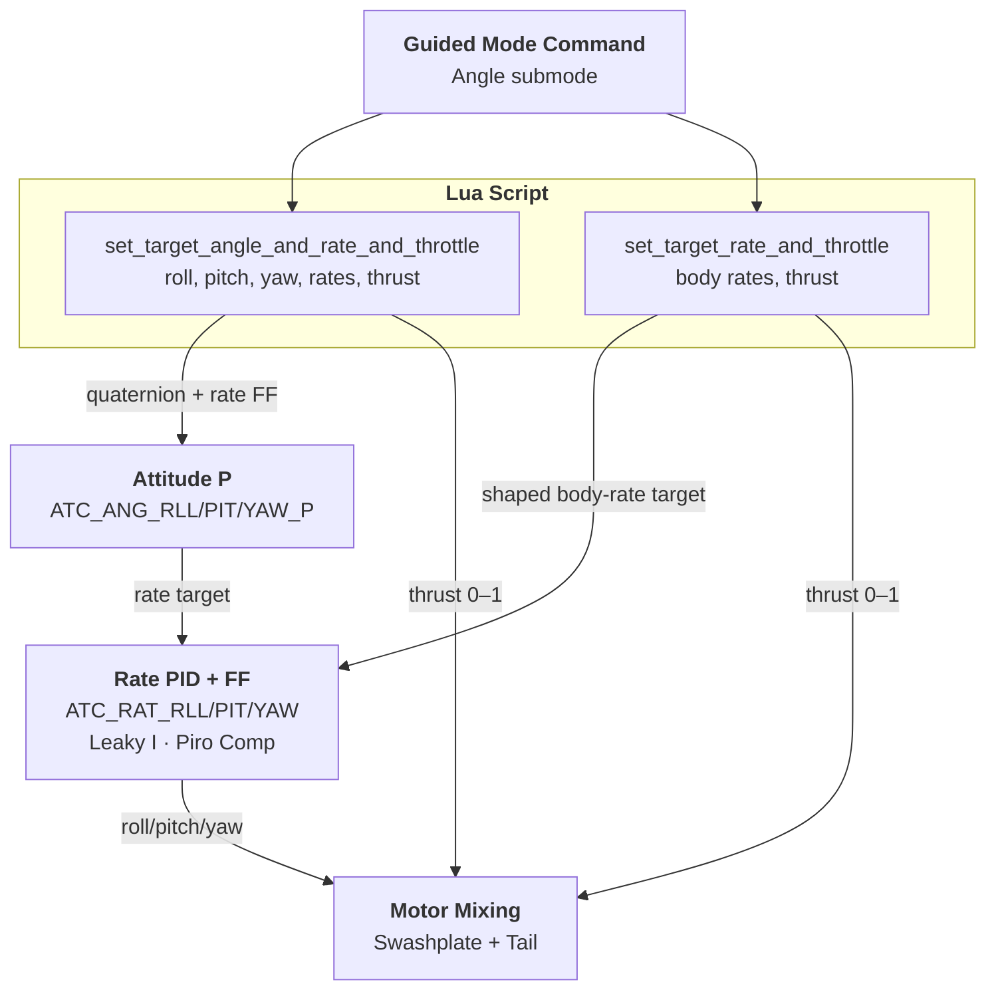
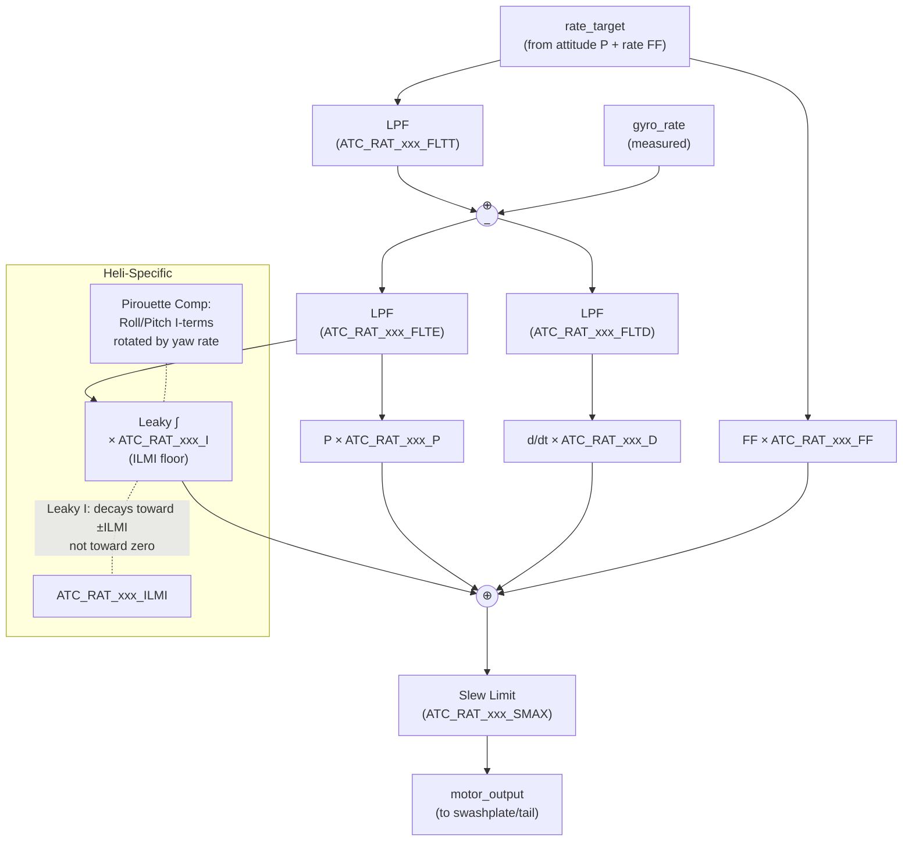

# Guided Mode Control Loops — Helicopter (RAWES Focus)

## Scope and Ownership

This is a low-level Guided/attitude-control deep dive.

- Canonical system-level behavior and mode ownership live in [flight_stack.md](flight_stack.md).
- This document should focus on ArduPilot control-chain internals and parameter effects.
- Avoid repeating full system architecture text already covered in [flight_stack.md](flight_stack.md).

## 1. Overview

This document describes the control loop architecture for ArduPilot's **Guided mode** as used by the RAWES (Rotary Airborne Wind Energy System). It is intended for control system engineers who need to understand the signal flow from an attitude command down to swashplate and tail actuator outputs.

RAWES uses the **Angle submode** of Guided mode, which bypasses all position, velocity, and altitude controllers. ArduPilot exposes two relevant Angle-submode entry paths:

- **Angle + rate + thrust**: Lua provides an absolute attitude target, optional body-rate feed-forward, and direct thrust.
- **Rate-only + thrust**: Lua provides body-rate targets and direct thrust, but no absolute attitude target.

Current `scripts/rawes.lua` steady, passive, and takeoff behavior uses the **angle + rate + thrust** path (`set_target_angle_and_rate_and_throttle`). The **rate-only** path remains relevant because ArduPilot implements it, `arduloop` ports it, and tests still exercise it.

### High-Level Signal Flow


```mermaid
graph TD
    CMD[<b>Guided Mode Command</b><br/>Angle submode]

    CMD --> ANGLE
    CMD --> RATEONLY

    subgraph "<b>Lua Script</b>"
        ANGLE["set_target_angle_and_rate_and_throttle<br/>roll, pitch, yaw, rates, thrust"]
        RATEONLY["set_target_rate_and_throttle<br/>body rates, thrust"]
    end

    ANGLE -->|quaternion + rate FF| ATT
    ANGLE -->|thrust 0–1| MIX
    RATEONLY -->|shaped body-rate target| RATE
    RATEONLY -->|thrust 0–1| MIX

    ATT[<b>Attitude P</b><br/>ATC_ANG_RLL/PIT/YAW_P]
    RATE[<b>Rate PID + FF</b><br/>ATC_RAT_RLL/PIT/YAW<br/>Leaky I · Piro Comp]
    MIX[<b>Motor Mixing</b><br/>Swashplate + Tail]

    ATT -->|rate target| RATE
    RATE -->|roll/pitch/yaw| MIX
```

### Helicopter Rate Controller Detail (Per Axis)


```mermaid
graph TD
    RT["rate_target<br/>(from attitude P + rate FF)"] --> FLTT["LPF<br/>(ATC_RAT_xxx_FLTT)"]
    FLTT --> ERR(("⊕<br/>−"))
    GYRO["gyro_rate<br/>(measured)"] --> ERR

    ERR --> FLTE["LPF<br/>(ATC_RAT_xxx_FLTE)"]
    FLTE --> P["P × ATC_RAT_xxx_P"]
    FLTE --> I["Leaky ∫<br/>× ATC_RAT_xxx_I<br/>(ILMI floor)"]
    ERR --> FLTD["LPF<br/>(ATC_RAT_xxx_FLTD)"]
    FLTD --> D["d/dt × ATC_RAT_xxx_D"]

    RT --> FF["FF × ATC_RAT_xxx_FF"]

    P --> SUM(("⊕"))
    I --> SUM
    D --> SUM
    FF --> SUM

    SUM --> SMAX["Slew Limit<br/>(ATC_RAT_xxx_SMAX)"]
    SMAX --> OUT["motor_output<br/>(to swashplate/tail)"]

    subgraph Heli-Specific
        I -.-|"Leaky I: decays toward ±ILMI<br/>not toward zero"| ILMI["ATC_RAT_xxx_ILMI"]
        PIRO["Pirouette Comp:<br/>Roll/Pitch I-terms<br/>rotated by yaw rate"] -.- I
    end
```

---

## 2. Guided Mode Submodes

Guided mode supports multiple submodes. **RAWES uses exclusively the Angle submode.**

| Submode | Input | Active for RAWES? |
|---------|-------|----|
| TakeOff | Altitude target | No |
| Pos | 3D position (NEU) | No — routes through AC_PosControl |
| Accel | 3D acceleration | No — routes through AC_PosControl |
| VelAccel | Velocity + Acceleration | No — routes through AC_PosControl |
| PosVelAccel | Position + Velocity + Accel | No — routes through AC_PosControl |
| **Angle** | **Roll/Pitch/Yaw + Thrust** or **Body Rates + Thrust** | **Yes** |

### Angle Submode Entry

The Lua API enters the Angle submode by calling `ModeGuided::set_angle()`. No position, velocity, or altitude controller is involved. Inside `run_angle_control()`, ArduPilot chooses one of two attitude-controller inputs based on whether the stored quaternion is nonzero or zero.

#### Angle + Rate + Thrust Entry

**RAWES API**: `set_target_angle_and_rate_and_throttle(roll, pitch, yaw, roll_rate, pitch_rate, yaw_rate, throttle)`

This calls `set_angle(q, ang_vel_body, throttle, use_thrust=true)`:
- Euler angles are converted to a quaternion and passed to the attitude controller
- Body-rate feed-forward terms are added to the rate target (supply the known orbital angular velocity to reduce tracking lag)
- Throttle (0–1) goes directly to collective output, bypassing the vertical PID chain entirely

Control-chain summary:

```
roll/pitch/yaw + body-rate FF → set_angle(nonzero quaternion, rates, thrust, use_thrust=true)
                                → input_quaternion()
                                → attitude error + feed-forward blending
                                → heli rate PID
thrust                          → set_throttle_out(...)
                                → direct collective output
```

#### Rate-Only + Thrust Entry

**Alternative API (implemented in ArduPilot/arduloop, but not used by the current `scripts/rawes.lua` steady/passive/takeoff paths):** `set_target_rate_and_throttle(roll_rate, pitch_rate, yaw_rate, throttle)`

This calls the same `ModeGuided::set_angle(...)` storage path, but with a **zero quaternion**:

```cpp
Quaternion q;
q.zero();
mode_guided.set_angle(q, ang_vel_body, throttle, true);
```

At 400 Hz, `ModeGuided::run_angle_control()` detects that zero quaternion and switches from `input_quaternion(...)` to:

```cpp
attitude_control->input_rate_bf_roll_pitch_yaw(...);
attitude_control->set_throttle_out(thrust, apply_angle_boost=true, filt);
```

Important behavior:
- The caller does **not** provide an absolute attitude target.
- ArduPilot integrates the existing internal `_attitude_target`; this API does
  not reset that target from current body attitude. RAWES gives ACRO a
  ground-idle control interval after arm and before asserting CH8, then clears
  Copter's landed state in ACRO before entering GUIDED_NOGPS. See
  [arming.md](arming.md).
- Desired body rates are smoothed by `input_shaping_ang_vel(...)` using `ATC_INPUT_TC` and `ATC_ACCEL_R/P/Y_MAX`.
- The normal quaternion attitude controller still runs afterward, so this is **stabilized rate control**, not a raw PID-only passthrough.
- With requested rates `(0, 0, 0)`, the vehicle tries to settle body rates to zero while holding the internally conditioned attitude target.
- Throttle remains the same direct-thrust path as angle+rate+throttle; the Z PID chain is still bypassed.

Why this matters for RAWES: if the controller knows “stop rotating” but does not know the correct absolute roll/pitch/yaw for the current tether/wind state, rate-only Guided can avoid injecting a wrong absolute attitude command while still using ArduPilot's shaped rate and heli PID machinery.

Control-chain summary:

```
body rates → set_angle(zero quaternion, rates, thrust, use_thrust=true)
           → input_rate_bf_roll_pitch_yaw()
           → input_shaping_ang_vel()
           → existing internal attitude target advanced by shaped rates
           → heli rate PID
thrust     → set_throttle_out(...)
           → direct collective output
```

### Vertical Path: Raw Thrust

```
thrust → attitude_control->set_throttle_out(thrust, apply_angle_boost=true)
       → directly to collective output (with angle boost)
```

The vertical PID chain (Section 4) is **completely bypassed**. The thrust value goes directly to the collective servo (after angle boost scaling). No ArduPilot altitude hold, no velocity PID, no acceleration PID. The Lua script owns collective and runs its **own** altitude PID (at 50 Hz) to set thrust.

> **Note**: The equivalent MAVLink path is `SET_ATTITUDE_TARGET` with `GUID_OPTIONS` bit 3 set — both call the same `set_angle()` function with `use_thrust=true`.

#### Why Direct Collective for RAWES?

RAWES decouples attitude and collective so the two flight tasks never fight (see [flight_stack.md](flight_stack.md)):

- **Orientation (attitude)** is a feedforward force balance: the **commanded** tension `RAWES_TEN` + actual position + gravity sets the disk-axis direction. A higher commanded tension aims the disk more tether-aligned (power phase, reel-out); a lower one tilts it back (recovery, reel-in). The actual tension is produced by the kite/winch interaction — the winch closes the only tension loop, on its own load cell.
- **Collective (thrust)** is a closed-loop altitude PID running inside the Lua. It rejects gusts and holds the commanded altitude, while the force balance only slowly re-trims direction.

The AP therefore receives only two slow setpoints — commanded tension and target altitude — and never the measured tension. ArduPilot's built-in Z controller is bypassed precisely so the Lua can own this decoupling.

---

## 3. Horizontal Control Chain (XY) — Why AC_PosControl Doesn't Work for RAWES

**Not active for RAWES.** The Angle submode bypasses `AC_PosControl` for horizontal axes. This section explains why.

### 3.1 What AC_PosControl Does

The standard horizontal position controller chains:

```
Position error → P → Velocity target → PID → Accel target → accel_to_lean_angles() → Roll/Pitch
```

The final conversion `accel_to_lean_angles()` uses `atan(a/g)` — this is mathematically exact at any angle, **not** a small-angle approximation. The function itself works correctly even at 70° tilt. The problems are in the loops around it.

### 3.2 Three Reasons It Fails at Steep Tilt

**1. Velocity PID gain scaling**

The velocity PID is tuned assuming a linear plant: small changes in lean angle produce proportional changes in horizontal acceleration. The true relationship is `a = g·tan(θ)`, whose derivative (plant gain) is `g/cos²(θ)`:

| Tilt angle | Plant gain | Effective gain multiplier |
|------------|-----------|--------------------------|
| 0° (hover) | g | 1× (tuned for this) |
| 30° | 1.33g | 1.3× |
| 45° | 2g | **2×** |
| 60° | 4g | **4×** |

At 60° tilt the velocity PID is effectively 4× more aggressive than tuned, causing oscillation. ArduPilot does not gain-schedule by `cos²(θ)`.

**2. Lean angle clamping**

`ANGLE_MAX` (default 30°, hard max typically 45°) and the collective-margin lean limit (`get_althold_lean_angle_max_cd()`) clamp the output of `accel_to_lean_angles()`. RAWES needs 45–70° tilt — well beyond these limits. Even if `ANGLE_MAX` is raised, problem 1 and 3 remain.

**3. Decoupled Z controller**

The altitude controller treats collective as approximately vertical force. At steep tilt, only `cos(θ)` of total thrust is vertical — at 60° that's 50%. The `angle_boost` feed-forward (`1/cos(θ)` collective scaling) partially compensates, but the XY and Z loops don't coordinate: the XY loop commands tilt without telling the Z loop that more collective is needed, and the Z loop increases collective without knowing it's also increasing horizontal force. This cross-coupling worsens with tilt angle.

### 3.3 Why Submarines Get Away With It

ArduSub uses the same `AC_PosControl` and `atan(a/g)` math, but avoids these problems because **the output is consumed differently**. In `ArduSub/motors.cpp`, `translate_pos_control_rp()` converts the roll/pitch outputs into **forward/lateral thruster commands** rather than actually tilting the vehicle body. On vectored 6DOF frames (`AP_Motors6DOF`), horizontal movement comes from dedicated thrusters — the vehicle stays level regardless of horizontal acceleration.

The `atan(a/g)` calculation is technically wrong for a neutrally buoyant vehicle (there's no gravitational restoring force linking tilt to horizontal acceleration), but it doesn't matter because the output is just a proportional signal routed to lateral thrusters, and PID tuning absorbs the nonlinearity.

RAWES cannot use this approach — horizontal force comes from tilting the rotor disc, so the vehicle **must** actually tilt to the commanded angle.

### 3.4 RAWES Solution

RAWES uses Guided Angle submode to bypass `AC_PosControl` entirely. The Lua script closes its own flight-regime logic with full knowledge of steep tilt, tether forces, and orbital dynamics, then commands attitude+thrust via `set_target_angle_and_rate_and_throttle()`. The body-rates+thrust path remains available in ArduPilot/arduloop for tests and experiments, but it is not the current deployed steady/passive/takeoff path.

---

## 4. Collective Path (Direct Thrust)

With either `set_target_angle_and_rate_and_throttle` or
`set_target_rate_and_throttle`, the thrust value (0–1) bypasses ArduPilot's Z
PID chain and goes directly to the helicopter collective path:

```
thrust (from Lua) → set_throttle_out(thrust, apply_angle_boost)
                  → collective = H_COL_MIN + thrust × (H_COL_MAX − H_COL_MIN)
```

The PSC altitude / velocity / acceleration controllers are therefore inactive on
this path; Lua owns the vertical controller.

`set_throttle_out(..., apply_angle_boost=true)` still requests ArduPilot's
angle-boost handling. This document does **not** assume a particular live value
for `ATC_ANG_BOOST`: the project parameter files do not currently set it, so
verify the active firmware default / vehicle dump before claiming additional
`1/cos(tilt)` scaling in a specific run.

For RAWES this direct-thrust path matters because attitude and collective are
intentionally decoupled (see [flight_stack.md](flight_stack.md)):

- **Orientation (attitude)** is a feedforward force balance from commanded tension, actual position, and gravity.
- **Collective (thrust)** is a Lua-owned altitude PID. The AP rate loops then track the resulting attitude/throttle setpoints.

---

## 5. Attitude Control Loop

### 5.1 Attitude Error → Body Rate Target (P Controller)

The attitude controller computes a quaternion error between the target and current attitude, then extracts an angular rate command proportional to the error:

```
attitude_error = target_quat * current_quat.inverse()
ang_vel_target_roll  = att_error_roll  * ATC_ANG_RLL_P
ang_vel_target_pitch = att_error_pitch * ATC_ANG_PIT_P
ang_vel_target_yaw   = att_error_yaw   * ATC_ANG_YAW_P
```

- **Controller**: Proportional (quaternion-based)
- **Parameters**: `ATC_ANG_RLL_P`, `ATC_ANG_PIT_P`, `ATC_ANG_YAW_P` (units: rad/s per rad)
- **Output**: Body-frame angular rate targets in rad/s
- **Rate feedforward**: If the target attitude is changing (e.g., during a maneuver), the rate of change is added as feedforward
- **Code**: `AC_AttitudeControl::attitude_controller_run_quat()` → `update_ang_vel_target_from_att_error()`

---

## 6. Rate Control Loop (Helicopter-Specific)

This is where helicopter control diverges significantly from multicopter. The helicopter uses `AC_AttitudeControl_Heli` with `AC_HELI_PID` controllers.

### 6.1 Rate PID Structure

For each axis (roll, pitch, yaw):

```
rate_error = rate_target - gyro_rate

P_term   = rate_error * ATC_RAT_xxx_P
I_term   = integral(rate_error) * ATC_RAT_xxx_I    [with leaky integrator]
D_term   = d/dt(rate_error) * ATC_RAT_xxx_D
FF_term  = rate_target * ATC_RAT_xxx_FF

output = P_term + I_term + D_term + FF_term
```

### 6.2 Leaky Integrator (ILMI)

Unique to helicopters, the integrator uses a **leak-to-minimum** strategy:

- The integrator decays at rate `0.02/s` toward `±ILMI` (not toward zero)
- If `|integrator| > ILMI`: integrator leaks toward ILMI
- If `|integrator| <= ILMI`: no leak applied
- **Purpose**: Maintains a minimum I-term to compensate for known steady-state offsets (e.g., tail rotor torque compensation) while still preventing windup

```
if |I_term| > ILMI:
    I_term -= sign(I_term) * leak_rate * dt
```

- **Parameter**: `ATC_RAT_xxx_ILMI` (default 0.1)
- **Leak rate**: 0.02 (hardcoded constant `AC_ATTITUDE_HELI_RATE_INTEGRATOR_LEAK_RATE`)
- **Code**: `AC_HELI_PID::update_leaky_i()`

### 6.3 Pirouette Compensation

During yaw rotation, the roll and pitch I-terms are rotated to maintain their earth-frame orientation:

```
// Rotate roll/pitch integrators by yaw rate * dt
new_roll_I  = roll_I * cos(yaw_rate*dt) - pitch_I * sin(yaw_rate*dt)
new_pitch_I = roll_I * sin(yaw_rate*dt) + pitch_I * cos(yaw_rate*dt)
```

- **Code**: `AC_AttitudeControl_Heli::rate_bf_to_motor_roll_pitch()` (piro comp section)

### 6.4 Filtering

Each rate PID has configurable filters:

| Filter | Parameter | Description |
|--------|-----------|-------------|
| Target filter | `ATC_RAT_xxx_FLTT` | Low-pass on rate target input |
| Error filter | `ATC_RAT_xxx_FLTE` | Low-pass on rate error (affects P & I) |
| D-term filter | `ATC_RAT_xxx_FLTD` | Low-pass on derivative term |
| Slew rate limit | `ATC_RAT_xxx_SMAX` | Maximum rate of change of output |
| Notch (target) | `ATC_RAT_xxx_NTF` | Notch filter bitmask on target |
| Notch (error) | `ATC_RAT_xxx_NEF` | Notch filter bitmask on error |

### 6.5 Flybar / Tail Passthrough Modes

For mechanical flybar helicopters or direct-drive tails:
- **Flybar passthrough**: Roll/pitch rate controller is bypassed; pilot/attitude output goes directly to swashplate
- **Tail passthrough**: Yaw rate controller is bypassed; output goes directly to tail servo/motor

---

## 7. Yaw Control in Guided Mode

### Yaw Control Chain

```
yaw_heading_target → attitude_error_yaw → ATC_ANG_YAW_P → yaw_rate_target
yaw_rate_target → rate_PID (ATC_RAT_YAW_*) → tail_output
```

For RAWES, the yaw axis is controlled by an anti-rotation motor whose sole purpose is to counter the reaction torque from the spinning rotor. The yaw PID should ideally see only yaw rate error — no coupling from collective or cyclic.

### Collective → Yaw Coupling Paths (Unwanted for RAWES)

ArduPilot's helicopter motor code contains several paths where collective or cyclic changes leak into the yaw output. These are designed for conventional single-rotor helicopters where main rotor torque varies with collective pitch. **For RAWES, where the rotor is wind-driven and torque is not a function of collective, these couplings are undesirable.**

#### 1. `H_COL2YAW` — Collective-to-Yaw Feedforward

**File**: `AP_MotorsHeli_Single.cpp:442-466` (`get_yaw_offset()`)

Adds a yaw offset proportional to collective pitch raised to the 1.5 power:

```
yaw_offset = H_COL2YAW × |collective − zero_thrust_pct|^1.5
```

This compensates for the conventional helicopter's main rotor torque increasing with collective. For RAWES, the anti-rotation motor counters aerodynamic reaction torque from wind-driven autorotation, which is **not correlated with collective**. Any nonzero `H_COL2YAW` will inject spurious yaw commands when collective changes during altitude control.

Current RAWES defaults set `H_COL2YAW = 0`, which disables this collective →
yaw feed-forward path.

#### 2. `H_YAW_TRIM` — Fixed Yaw Bias (DDFP Tails)

**File**: `AP_MotorsHeli_Single.cpp:181-184, 462-463`

Adds a constant offset to the yaw output for DDFP (Direct Drive Fixed Pitch) tail types. This is a static trim to reduce I-term load in hover.

Current RAWES operation writes `H_YAW_TRIM` from `rawes.lua`'s trim observer, so
the important question is whether the live observer output matches the expected
steady-state anti-rotation operating point.

#### 3. Angle Boost → Collective → COL2YAW Chain

**File**: `AC_AttitudeControl_Heli.cpp:537-574` (`set_throttle_out()`, `get_throttle_boosted()`)

When `apply_angle_boost` is true, the throttle/collective is scaled by `1/cos(tilt)` to maintain vertical thrust during lean. This increased collective then feeds through `H_COL2YAW` (if nonzero) into yaw.

At steep tilt angles this boost factor becomes large (`1/cos(60°) = 2×`), amplifying any COL2YAW coupling. Even if COL2YAW is small, the boost can make the leakage significant.

If `H_COL2YAW` is kept at zero (as in the current RAWES defaults), this
particular yaw-coupling path is inactive. Any remaining effect is then limited
to whatever the active firmware does for angle boost itself.

#### 4. Collective Margin Lean Limit → Indirect Yaw Effect

**File**: `AC_AttitudeControl_Heli.cpp:445-448` (`update_althold_lean_angle_max()`)

While this doesn't directly inject yaw, it clips the maximum allowed attitude based on available collective margin. At steep tilt, this can clip the roll/pitch targets, which changes the attitude error, which changes the body rates, which the yaw PID may respond to via cross-axis gyroscopic effects.

For RAWES the important question is whether this lean-limit path clips at the
operating angles actually used in a run; check logs/telemetry before treating it
as active.

### Summary of Yaw Coupling Parameters

This section names the relevant coupling points, but it does **not** own the
live numeric defaults. Use:

- [`tests/sitl/rawes_common_defaults.parm`](../tests/sitl/rawes_common_defaults.parm)
  for current project overrides such as `H_COL2YAW=0`, `ATC_RAT_YAW_*`, and the
  yaw-motor wiring;
- [`tests/sitl/copter-heli.parm`](../tests/sitl/copter-heli.parm)
  for heli baseline defaults;
- `rawes.lua` for runtime updates such as the `H_YAW_TRIM` observer.

---

## 8. Input Shaping

> **Position/velocity S-curve shaping is not active for RAWES** (bypassed with Angle submode). The relevant input shaping is the **attitude input shaper** within `AC_AttitudeControl`, which uses `sqrt_controller` with acceleration limits to slew the internal attitude target toward the commanded quaternion. Controlled by `ATC_INPUT_TC`.

---

## 9. Feed-Forward Paths Summary

| Loop Layer | Feed-Forward Source | Parameter | Purpose |
|------------|-------------------|-----------|---------|
| Roll Rate PID | Rate target | `ATC_RAT_RLL_FF` | **Primary roll response** (heli main gain) |
| Pitch Rate PID | Rate target | `ATC_RAT_PIT_FF` | **Primary pitch response** (heli main gain) |
| Yaw Rate PID | Rate target | `ATC_RAT_YAW_FF` | Primary yaw response |
| Attitude Loop | Target attitude rate of change | (internal) | Smooth attitude tracking during maneuvers |
| Attitude Loop | Lua rate FF arguments | (from API) | Known orbital angular velocity reduces tracking lag |

> **Note for Helicopters**: The `FF` term in the rate loops is often the **dominant control term** (larger than P), because helicopter rotor dynamics respond proportionally to cyclic/collective input rather than to rate error integration. For RAWES, P + FF together provide the angular rate damping that is the sole source of attitude stability.

---

## 10. Parameter ownership

This document explains **where** the key ArduPilot parameters act in the
control chain; it deliberately does **not** duplicate the live numeric tables.
Those are owned by:

- [`tests/sitl/copter-heli.parm`](../tests/sitl/copter-heli.parm) for ArduPilot heli defaults and inline explanations;
- [`tests/sitl/rawes_common_defaults.parm`](../tests/sitl/rawes_common_defaults.parm) for RAWES-specific overrides;
- `arduloop/params.py` for the Python-port field names and fallback handling (`ATC_ACC_*_MAX` vs `ATC_ACCEL_*_MAX`, `H_SW_H3_PHANG`, etc.).

---

## 11. Loop Execution Order (Per Control Cycle)

Current RAWES usage is asymmetric:

1. **Lua script** (~50 Hz):
   - Current `scripts/rawes.lua` steady, passive, and takeoff modes compute an
     absolute attitude target and call
     `set_target_angle_and_rate_and_throttle(...)`.
   - The rate-only API (`set_target_rate_and_throttle(...)`) remains an
     alternative ArduPilot path and is still ported/tested in `arduloop`, but
     it is not the current deployed steady/passive/takeoff path.
   - Lua also computes direct thrust and sends it through the GUIDED throttle
     path.

2. **Angle + rate + thrust path** (~400 Hz):
   - input shaping slews `_attitude_target` toward the commanded quaternion;
   - quaternion attitude error produces body-rate targets;
   - body-rate feed-forward is blended by thrust-vector error angle.

3. **Rate controller** (~400 Hz):
   - `ATC_RAT_*` filtering/PID/FF compute roll, pitch, and yaw outputs;
   - helicopter-specific logic applies leaky I, piro compensation, hover-roll
     trim, and swash phase rotation.

4. **Direct thrust** (same cycle):
   - the Lua thrust value goes through `set_throttle_out()` into the helicopter
     collective mapping.

5. **Motor mixing**:
   - roll/pitch/collective feed the swashplate path;
   - yaw feeds the anti-rotation motor path.

---

## 12. Source Code References

For the current repo, the best verified pointers are the parity ports and
docstrings in `arduloop/guided.py`, `arduloop/attitude_heli.py`, and
`arduloop/params.py`. If you need to compare against upstream ArduPilot, check
those files against the current ArduPilot checkout rather than relying on a
stale path/function inventory in this document.

---

## 13. Diagram Legend

| Symbol | Meaning |
|--------|---------|
| **P** | Proportional controller |
| **PID** | Full PID controller |
| **FF** | Feed-forward path |
| **LPF** | Low-pass filter |
| **⊕** | Summation point |
| **Leaky ∫** | Helicopter leaky integrator (ILMI) |

---

## 14. Application to RAWES (Rotary Airborne Wind Energy System)

For current RAWES ownership and behavior, use [flight_stack.md](flight_stack.md).
This document's verified scope ends at the generic ArduPilot guided / heli
control chain above.
