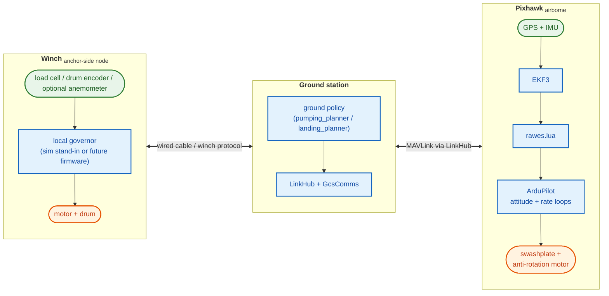
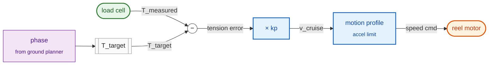

# RAWES — Flight Control Stack Reference

Primary reference for system ownership, ground/vehicle command contracts, and
Pixhawk Lua behavior. Transport and journal architecture belong to
[linkhub.md](linkhub.md); physical-world simulation to
[simulation.md](simulation.md); startup and safe-off procedures to
[arming.md](arming.md); AP control internals to
[GUIDED_CONTROL_LOOPS.md](GUIDED_CONTROL_LOOPS.md); EKF bring-up to
[EKF_GATING.md](EKF_GATING.md). The complete ownership index is in the
[root README](../README.md#documentation-map).

---

## 1. System Architecture

### Software ownership across hardware and SITL

LinkHub is the sole MAVLink owner between ground-side clients and ArduPilot.
Production planners in `groundstation/`, calibration, and the browser use its
HTTP/JSON API; they do not independently open vehicle transports or maintain
duplicate MAVLink journals. LinkHub owns rate requests and transport throughput
measurement (`rx_bps` / `tx_bps`), not flight policy.

ArduPilot owns estimation, modes, Lua guidance, attitude/rate control, and servo
mixing. The simulation mediator replaces only the physical world and lockstep
adapter: aero, dynamics, tether, wind, sensors, hardware plants, and actuator
application. Production ground policy runs outside it, including when tests host
that policy in-process through production command boundaries.

The SITL harness owns process orchestration, deadlines, and artifacts. It joins
raw mediator physics telemetry with LinkHub observations after the run; the
mediator must not consume MAVLink just to enrich CSV rows. The diagram below
describes physical nodes, not permission for the ground planner to bypass LinkHub.

Three physical nodes — **winch**, **ground station**, **Pixhawk**. The winch is a
standalone anchor-side unit (drum + motor + load cell + optional anemometer)
that exposes only the cable-side `WinchCommand` / `WinchTelemetry` boundary. The
ground station runs production policy from `groundstation/` and reaches the
Pixhawk only through LinkHub. `rawes.lua` on the Pixhawk owns all flight control;
the ground station forwards only slow setpoints such as **commanded tension** and
**target altitude** — never the measured/load-cell tension.



**What flows on each link:**

- **Winch cable boundary (winch ↔ ground):** `WinchTelemetry` up (`tension_n`, `rest_length`, `speed_ms`, `net_energy_j`, `wind_ned`) and `WinchCommand` down (`cruise_v`, `tension_target`). No hub attitude/position crosses this boundary.
- **MAVLink radio (ground ↔ Pixhawk):** slow setpoints up (phase/substate, target altitude, **commanded** tension, mode/command messages) and telemetry/journal data down through LinkHub.

**Key design principles:**

- **`rawes.lua` owns flight guidance, ArduPilot owns actuator mixing.** Lua sends GUIDED attitude/throttle setpoints; it does not own servo mixing.
- **Orientation is a feedforward force balance.** `bz_altitude_hold` computes a body_z setpoint from the **commanded tension** + actual hub position + gravity (`b_z = normalize(T_cmd·t_hat + mg·z_hat)`, `t_hat = -r/|r|`). Pure geometry at the current commanded tension and position — no barometer, no measured tension, no tension feedback.
- **Altitude hold owns collective.** A 50 Hz PID on altitude error (target altitude vs. actual) sets thrust/collective, with warm-start from the IC thrust. This is the fast disturbance rejector in steady flight.
- **No TensionPI on the AP.** The vehicle never sees the load cell. The only tension feedback loop in the system is on the winch side (or its simulation stand-ins). Commanded tension reaches the AP via `RAWES_TEN` purely as a feedforward into the orientation force balance.
- **Production ground policy lives in `groundstation/`; simulation-only hardware stand-ins stay in `simulation/`.** `simulation.winch`, `simulation.winch_node`, and related helpers model hardware that does not yet exist as a separate deployed node.

For detail on individual blocks see §3 (ground), §4 (rawes.lua modes / pre-GPS behaviour / channel ownership), and [GUIDED_CONTROL_LOOPS.md](GUIDED_CONTROL_LOOPS.md) (ArduPilot internals).

---

## 2. Concepts & Glossary

### 2.1 Glossary

| Term | Meaning |
|---|---|
| body_z | Unit vector along the rotor axle (spin axis), NED frame |
| bz_altitude_hold | Function: given hub position + **commanded tension** + gravity → body_z_eq (force-balance disk axis) that the attitude controller holds. Mirrors Python `compute_bz_altitude_hold`. Feedforward only — no tension feedback. |
| Elevation hold | Rate-limited azimuth-preserving slew of body_z toward the force-balance resultant of commanded tension + gravity. |
| TensionPI | Collective PID controller: `col = kp*err + ki*∫err + kd*(err−prev_err)/dt`, clamped to [coll_min, coll_max]. Used **only offline** — in `test_generate_ic` warmup (IC equilibrium) and as the winch's own load-cell loop. **Not on the AP flight loop**; the AP holds altitude with a PID on altitude error, not tension. |
| TensionCommand | Ground→AP 10 Hz message: (tension_target_n = **commanded** tension, alt_m = target altitude, phase). Carries setpoints only — never measured/actual tension. The AP feeds the commanded tension into its orientation force balance. |
| NED | North-East-Down coordinate frame. Altitude = −pos[2]. Up = [0,0,−1]. |
| Slerp | Spherical linear interpolation — moves body_z toward a target at a constant angular rate (rad/s). Uses Rodrigues rotation component-wise (no quaternion library in Lua). |
| Rodrigues | Rotates unit vector v around axis k by angle θ: `v·cos(θ) + (k×v)·sin(θ) + k·(k·v)·(1−cos(θ))`. Used in rawes.lua for cyclic projection and slerp. |
| xi | Angle between body_z and the horizontal wind direction [deg]. xi=0 → tether-aligned. xi=80° → disk nearly perpendicular to wind (reel-in tilt). |
| RAWES_SUB | Generic substate index sent by ground to rawes.lua. Current production pumping uses hold=0, reel-out=1, reel-in=3; other values remain reserved by the shared constants in `groundstation.rawes_modes`. |
| RAWES_ALT | Named float: target altitude [m] above anchor. The AP's altitude PID drives collective toward it. |
| RAWES_TEN | Named float: **commanded** tether tension [N] (the winch's own setpoint, also broadcast to the AP). Feedforward into the orientation force balance — NOT a measurement and NOT a feedback setpoint. |
| RAWES_ARM | Named float: arm vehicle + timed disarm countdown [ms]. Re-send refreshes timer. |

### 2.2 Physical and Control Variables

| Symbol | Name | Description |
|---|---|---|
| pos | Hub position | 3D position of rotor hub in NED [m] |
| vel | Hub velocity | 3D velocity of rotor hub in NED [m/s] |
| body_z | Disk axis | Unit vector along rotor axle (≈ tether direction at equilibrium) |
| xi | Disk tilt from wind | Angle between body_z and horizontal wind direction [deg] |
| el | Tether elevation | `asin(alt / tlen)` — elevation angle of tether above horizontal [rad] |
| T | Tether tension | Force along tether at anchor [N] |
| L0 | Tether rest length | Unstretched tether length [m], changed by winch |
| theta_col | Collective pitch | Average blade pitch [rad]; driven by GUIDED throttle path |
| v_winch | Winch speed | Tether length change rate [m/s]. +ve = pay out, −ve = reel in |

---

## 3. Ground Station

### 3.1 Overview

Production ground policy lives in `groundstation/`:

- `groundstation.pumping_planner.PumpingGroundController` — current pumping schedule owner;
- `groundstation.landing_planner.LandingGroundController` — landing-side controller code currently used by tests, not by deployed Lua flight control;
- `groundstation.unified_ground.GcsComms` — production `TensionCommand` → `NamedValueFloat` adapter through LinkHub;
- `groundstation.winch_protocol` — the real ground↔winch wire contract (`WinchCommand`, `WinchTelemetry`).

Ground sends setpoints only. The airborne contract is a `TensionCommand`
containing **commanded** tension, target altitude, and a phase label. Ground does
not send measured tension or direct collective commands to the AP.

### 3.2 Current Pumping Planner

The current `PumpingGroundController` is a **length-driven two-phase cycle plus
hold**. Its public `phase` strings are currently only:

| Phase | Current planner behavior |
|---|---|
| `hold` | Wait for `notify_captured()` plus `capture_settle_s`; command `tension_ic`, hold the current rest length, zero cruise velocity. |
| `reel-out` | Target `start_length + delta_l`; ramp commanded tension toward `tension_out`; command positive cruise velocity. |
| `reel-in` | Target `start_length`; ramp commanded tension toward `tension_in`; command negative cruise velocity. |

Current production pumping keeps `RAWES_ALT` fixed at the capture altitude
(`target_alt_m`) and ramps `RAWES_TEN` on the ground over `tension_ramp_s`
before Lua applies its own `RAWES_TRP` smoothing. `groundstation.rawes_modes`
still defines transition-related substate constants, but `PumpingGroundController`
does not emit them today.

**WinchController control loop (simulation stand-in, tension-following):**

The winch has one job: drive the reel motor so that the load-cell tension tracks a per-phase target. Every 2.5 ms it does:



So the current simulation stand-in is a **single proportional gain on tension error**
followed by a trapezoidal motion-profile smoother. In `simulation.winch.WinchController`
the current law is:

- reel-out: `v = +clip(kp * (T_measured - T_target), 0, v_max_out)`
- reel-in: `v = -clip(kp * (T_target - T_measured), 0, v_max_in)`

Numeric defaults are owned by the caller (`groundstation.pumping_planner.py`,
test fixtures, or hardware-node stand-ins) and by the code in
`simulation/winch.py`; this file intentionally does not duplicate that table.

### 3.3 TensionCommand Protocol

Ground→AP command packet (10 Hz), carried by `simulation.unified_ground`
(simtests) or `groundstation.unified_ground.GcsComms` (stack / hardware):

```python
@dataclass(frozen=True)
class TensionCommand:
    tension_target_n: float     # commanded/feed-forward tension; AP feeds it into the orientation force balance
    alt_m: float                # target altitude; AP's altitude PID drives collective toward it
    phase: str                  # current production planner: "hold" | "reel-out" | "reel-in"
```

`groundstation.unified_ground._PHASE_TO_SUB` still contains a reserved
`"transition" -> 2` mapping for compatibility, but the current pumping planner
never emits that phase string.

### 3.4 Winch Node Protocol Boundary

`WinchCommand` / `WinchTelemetry` enforce the production cable boundary; the
simulation-side `GovernedWinchNode` hosts a stand-in fast loop behind that
boundary:

- Planner calls `exchange(WinchCommand)` and receives `WinchTelemetry`.
- The node's local fast loop consumes only local sensors (`tension_n`, drum
  state, co-located anemometer).
- The mediator feeds stand-in physics through `update_sensors(...)` and `step(dt)`.
- No hub altitude / position / attitude crosses this cable boundary.

### 3.5 Wind Estimation

There is **no production `WindEstimator` class in `groundstation/` today**. The
current cable contract exposes wind only as `WinchTelemetry.wind_ned`, i.e. the
co-located anemometer reading from the winch side. In simulation that reading is
produced by `simulation.winch_node.Anemometer`. Any future ground-side wind
estimator must sit above this boundary; it is not part of the current deployed
contract.

---

## 4. Pixhawk Lua Scripts

### 4.1 rawes.lua Overview

Single unified controller (`scripts/rawes.lua`) running at 50 Hz (FLIGHT_PERIOD_MS=20) on a 100 Hz base tick (BASE_PERIOD_MS=10).

#### How one 50 Hz tick works

The loop is mode-dependent but the command boundary is consistent: `rawes.lua`
converts ground inputs plus onboard state into **GUIDED attitude/throttle
setpoints** (or ACRO-manual RC overrides in mode 2), while ArduPilot owns the
400 Hz attitude/rate loops and servo mixing.

| Mode | Attitude / body_z behavior | Collective / thrust behavior | Used for |
|---|---|---|---|
| 0 — none | controller inactive | controller inactive | passive logging / disarmed idle |
| 1 — steady | force-balance `bz_goal` from commanded tension + actual position + gravity; sent through `set_target_angle_and_rate_and_throttle(...)` | 50 Hz altitude PID on actual altitude; output goes through GUIDED throttle | steady flight and pumping |
| 2 — ACRO manual | normalized `RAWES_RLL` / `RAWES_PIT` through ACRO flybar passthrough | normalized `RAWES_COL` through ACRO collective | manual bench / flight staging |
| 3 — passive | Lua-captured AHRS quaternion anchor composed with relative `RAWES_ROFF` / `RAWES_POFF` / `RAWES_YOFF` offsets (§4.2b) | IC thrust via GUIDED throttle | armed-but-quiet kinematic release hold |
| 4 — landing | reserved in the current script; no landing controller runs here yet | reserved | reserved |
| 5 — takeoff | fixed level attitude (`roll=pitch=0`, current yaw) via GUIDED angle target | altitude-PID climb toward `RAWES_ALT` | vertical climb before handoff to steady |

**Before the first valid position fix:**

- steady mode holds the current attitude and warm-start thrust until anchor and
  position data are usable;
- takeoff mode holds a level attitude and IC thrust until position is available;
- passive mode waits for explicit activation through `ENTER_PASSIVE`.

**RAWES_\* script-generated parameters.** `rawes.lua` registers the current
script-generated parameters directly in code: `RAWES_MODE`, `RAWES_YAW_SLP`,
`RAWES_KP_ALT`, `RAWES_KI_ALT`, `RAWES_KD_VZ`, `RAWES_KP_EL`, `RAWES_KP_AZ`,
`RAWES_KD_EL`, `RAWES_CWMAX`, `RAWES_SLW`, `RAWES_TEL_HZ`, `RAWES_YFF_MAX`,
`RAWES_YFF_TAU`, and `RAWES_TRP`. The **current defaults** are owned by
[`tests/sitl/rawes_common_defaults.parm`](../tests/sitl/rawes_common_defaults.parm);
this document owns only the behavioral contract.

**Named float inputs (ground → Lua, via `gcs.send_message(NamedValueFloat(...))`):**

| Name | Value | Purpose |
|---|---|---|
| RAWES_ARM | ms | Arm vehicle + start disarm countdown of `ms` milliseconds. Re-send refreshes timer. |
| RAWES_SUB | integer substate | Generic substate/diagnostic index. Current pumping uses `0=hold`, `1=reel-out`, `3=reel-in`; `2/4` remain reserved and `1` is also the landing final-drop value in `groundstation.rawes_modes`. |
| RAWES_ALT | m | Target altitude above anchor. Steady/takeoff modes drive the local altitude PID toward it. |
| RAWES_TEN | N | **Commanded** tether tension (the winch setpoint, broadcast to the AP). Feedforward into the orientation force balance in steady flight. Never the measured/load-cell tension. Ramped locally by RAWES_TRP. |
| RAWES_ROFF | rad | Passive roll offset relative to the Lua-captured anchor (§4.2b). Latched; may be sent before or after ENTER_PASSIVE. |
| RAWES_POFF | rad | Passive pitch offset relative to the Lua-captured anchor. |
| RAWES_YOFF | rad | Passive yaw offset relative to the Lua-captured anchor. |
| RAWES_THR | [0..1] | IC/passive thrust seed. ENTER_GUIDED requires it; passive and takeoff warm-start from it. |
| RAWES_RLL | [-1..1] | Latched ACRO-manual roll input. Lua converts it with the inverse RC MIN/TRIM/MAX mapping and continuously refreshes the RC override. |
| RAWES_PIT | [-1..1] | Latched ACRO-manual pitch input. Positive is ArduPilot positive pitch; the calibration Up arrow increases it. |
| RAWES_COL | [0..1] | Latched ACRO-manual collective input using RC3 MIN/MAX and reversal. |

**Command inputs (ground → Lua, via `COMMAND_LONG`):** one-shot actions use
script-handled MAVLink commands instead of NAMED_VALUE_FLOAT. rawes.lua calls
`mavlink:block_command(id)` so ArduPilot's GCS command handler skips them
(no autopilot ACK), receives the COMMAND_LONG through its rx queue, and sends
the single `COMMAND_ACK` itself on the receiving channel. Ground clients
retry with an incremented `confirmation`; Lua treats a retry of an already
completed command as ACCEPTED without repeating the side effect. Rejections
also emit `RAWES cmd <id> rejected: <reason>` STATUSTEXT. IDs live in
`groundstation/rawes_modes.py` (`CMD_*`, typed `MavCmd.USER_1`/`USER_2`;
`send_rawes_command` requires `MavResult.ACCEPTED`) and `linkhub-ui/src/passive.ts`.

| Command | ID | Params | Lua action | Gate (else DENIED; set_mode failure → FAILED) |
|---|---|---|---|---|
| ENTER_GUIDED | 31010 (`MAV_CMD_USER_1`) | none | Captures the current AHRS quaternion, calls `vehicle:set_mode(GUIDED_NOGPS)` and installs that attitude + IC thrust in the same tick, then holds it (guided-entry hold; re-sent only on change or as a 1 s keepalive, see §4.2b) until ENTER_PASSIVE, disarm, or leaving the guided/acro staging flow. This removes the level-target transient that `ModeGuided::angle_control_start()` would otherwise command before the first ground target arrives. | armed, `RAWES_MODE=2`, IC thrust seeded, AHRS healthy |
| ENTER_PASSIVE | 31011 (`MAV_CMD_USER_2`) | param1 = yaw-trim seed [0, `RAWES_YFF_MAX`]; negative = adaptive observer | Captures the passive quaternion anchor (§4.2b), enables passive hold, and ends the guided-entry hold. | `RAWES_MODE=3`, AHRS healthy |

**Named int inputs (ground → Lua, via `gcs.send_message(NamedValueInt(...))`, one-shot anchor location):**

| Name | Value | Purpose |
|---|---|---|
| RAWES_LAT | deg × 1e7 | Anchor latitude. |
| RAWES_LON | deg × 1e7 | Anchor longitude. |
| RAWES_AAL | cm, AMSL | Anchor altitude. |

Sent as NAMED_VALUE_INT (not FLOAT) to preserve ArduPilot's own Location int32
precision (~1 cm) end-to-end — a float32 NVF would quantize latitude to
~0.5–1 m. Lua converts this absolute location into the EKF-local NED anchor
offset on board via `Location:get_vector_from_origin_NEU_m()`, which returns
`nil` until the EKF origin is set, so all three ints must arrive AND the
onboard conversion must succeed at least once before MODE_STEADY initialises
altitude hold (see `_try_resolve_anchor()` in rawes.lua).

**MAVLink rx queue:** `mavlink:init(queue_size, num_msgs)` is called as
`(20, 10)` at module load.  The first arg is the per-tick rx buffer depth;
with `1` (the prior default) multiple back-to-back NAMED_VALUE_FLOATs sent
by the ground get dropped — only the first survives until the next
update() drains it.  20 is safe for the typical ~5 NVFs/tick burst.
NAMED_VALUE_FLOAT (msgid 251), NAMED_VALUE_INT (msgid 252) and
COMMAND_LONG (msgid 76) are registered and share this one queue; the drain loop peeks the 3-byte msgid
at byte offset 10 (`string.unpack("<I3", raw, 10)`) to dispatch each message.

`_nv_floats` dict resets to `{}` on every mode change. `_nv_ints` (anchor) is
NOT cleared on mode change — the anchor is a static, one-shot location that
persists for the whole flight once resolved.

**Key physical constants:**

| Constant | Value | Meaning |
|---|---|---|
| MASS_KG | 5.0 | Hub + rotor mass |
| G_ACCEL | 9.81 | Gravity [m/s²] |
| MIN_TETHER_M | 0.5 | Minimum tether length before GPS init activates elevation hold |
| THRUST_CRUISE | 0.263 | Pre-GPS thrust hold; altitude PID warm-start |
| THRUST_SLEW_MAX | 0.058 | Max thrust change per 50 Hz step |
| RP_RATE_DEG | 360.0 | Must match ArduPilot roll/pitch rate scaling |

Collective physical limits are no longer hard-coded as `COL_*` constants. The
runtime mapping is thrust `[0..1]` to collective `[rad]` using rotor YAML
`control.col_min_rad/control.col_max_rad` combined with ArduPilot `H_COL_*`
via `load_collective_phys_range()`.

### 4.2 Pre-GPS Stabilization (all modes)

Before `_el_initialized` is set (first valid GPS position fix with tlen ≥ MIN_TETHER_M):

1. Hold thrust at `THRUST_CRUISE` (0.263) to prevent tension runaway.
2. Command current attitude with zero corrective rate/throttle transients via
    GUIDED APIs so the natural orbital rate is preserved until GPS fusion.

On first valid GPS fix: initialize `_el_rad` and `_target_alt` from position, set
`_el_initialized = true`, send STATUSTEXT.

### 4.2b Mode 3 — Passive (RAWES_MODE=3)

Armed-but-quiet mode used during the kinematic hold/release of stack tests.
The vehicle stays armed (motor interlock ch8 high) and does **not** write
swashplate channels directly or run body_z/altitude/winch guidance.

**Ground-owned capture gate.** After the temporary landed-state-clearing
collective, ground sends the ENTER_GUIDED command. Lua switches to
GUIDED_NOGPS and holds the attitude it captured in that same tick (see the
command table above), so there is no window in which ArduPilot's level entry
target is active.

**Lua-owned quaternion anchor.** Ground sets `RAWES_MODE=3` (the guided-entry
hold keeps streaming) and then sends ENTER_PASSIVE. Lua performs a final AHRS
health/quaternion-validity check, captures `ahrs:get_quaternion()` once,
enables passive hold, and acknowledges the command. Ground sends complete
relative state through:

- `RAWES_ROFF` — roll offset [rad];
- `RAWES_POFF` — pitch offset [rad];
- `RAWES_YOFF` — yaw offset [rad].

Lua computes `q_target = q_anchor * q_relative`, normalizes it, and converts to
Euler only at the final `set_target_angle_and_rate_and_throttle` API boundary.
The target is sent when it changes (at most every `PASSIVE_TARGET_PERIOD_MS`,
50 ms) and otherwise only as a `GUIDED_KEEPALIVE_MS` (1 s) keepalive, well
inside `GUID_TIMEOUT` (3 s): every `vehicle:*` binding takes the scheduler
semaphore and repeated calls starve the scripting thread in SITL. No
`AP_Vehicle` call is made before activation and passive hold does not
separately poll `vehicle:get_mode()`. The anchor remains fixed until hold is
explicitly disabled.

Lua owns continuous RC fallback throughout the handoff. ACRO staging temporarily
uses the passive collective to clear landed state. Mode 3 changes RC1-RC4 to
neutral roll, pitch, collective, and yaw before its first steady
`vehicle:set_target_*()` call, and keeps those overrides active in GUIDED_NOGPS.

**Yaw observer.** Passive yaw trim remains inhibited before ENTER_PASSIVE.
After the fixed anchor is active, `run_yaw_trim()` may operate alongside the
angle hold and reads actual SERVO9 output via
`SRV_Channels:get_output_pwm(36)` (see §5.2).

### 4.3 Mode 1 — Steady (RAWES_MODE=1)

Post-GPS, each 50 Hz step:

1. Rate-limit `_el_rad` toward the current tether elevation at `RAWES_SLW` rad/s (default 0.40).
2. **Orientation (feedforward):** `bz_goal = bz_altitude_hold(rel, _el_rad, RAWES_TEN)` — the
   force-balance disk axis from the **commanded** tension `RAWES_TEN` + actual position +
   gravity (mirrors Python `compute_bz_altitude_hold`). `RAWES_TEN` is a feedforward only —
   no tension feedback, no load-cell reading.
3. **Attitude:** convert `bz_goal` to roll/pitch via `bz_ned_to_roll_pitch` and command the
   GUIDED angle path (`vehicle:set_target_angle_and_rate_and_throttle`), so ArduPilot's
   native attitude + rate PID closes the cyclic loop at 400 Hz.
4. **Altitude (feedback):** thrust from a 50 Hz PID on altitude error
   (`thrust = _thrust_trim + KP_ALT·alt_err + KI_ALT·∫alt_err − KD_VZ·vz`, integrator clamped,
   vz-damping gain-scheduled down while body rates are high, slew-limited). `_thrust_trim`
   warm-starts from the IC thrust (`RAWES_THR`). Output is the GUIDED throttle.

**Collective ownership:** ground never sends collective directly. Lua sends GUIDED
throttle setpoints; ArduPilot maps them to actuator outputs.

### 4.4 Pumping schedule (runs in steady mode, RAWES_MODE=1)

There is **no dedicated pumping mode**. Pumping is a ground-side schedule executed while
the vehicle stays in **steady mode (RAWES_MODE=1)**. `RAWES_SUB` is diagnostic
state; it does **not** switch Lua onto a different control law. The AP keeps
running the same steady-flight controller:

- orientation from `bz_altitude_hold(rel, _el_rad, _tension_n, _az_ref)`;
- thrust from the 50 Hz altitude PID;
- no AP-side tension feedback.

The current production pumping planner is `groundstation.pumping_planner.PumpingGroundController`.
It emits only `hold`, `reel-out`, and `reel-in` phases:

| Planner phase | Current `RAWES_SUB` | Ground-side behavior |
|---|---|---|
| `hold` | 0 | Keep capture altitude, ramp/hold commanded tension at `tension_ic`, hold current rest length / zero cruise velocity. |
| `reel-out` | 1 | Keep capture altitude, ramp commanded tension toward `tension_out`, command the winch toward `start_length + delta_l`. |
| `reel-in` | 3 | Keep capture altitude, ramp commanded tension toward `tension_in`, command the winch back toward `start_length`. |

`groundstation.rawes_modes` still defines `transition` / `transition_back`
constants for compatibility and future use, but the current production planner
does not emit them. `RAWES_ALT` therefore stays constant in today's pumping
planner unless a caller explicitly overrides `target_alt_m`.

### 4.5 Mode 4 — Landing (reserved) and Mode 5 — Takeoff (RAWES_MODE=5)

**Mode 4 — landing is reserved in the current Lua script.** `scripts/rawes.lua`
explicitly labels `MODE_LANDING = 4` as “not yet implemented”, and the current
landing simtests are skipped pending landing-controller rework. The ground-side
`groundstation.landing_planner.py` and Python-side
`tests/common/mock_ardupilot.py::_LandingPythonMode` remain prototype/test
logic; they are not a deployed Lua control law today.

**Mode 5 — takeoff is implemented.** In `run_takeoff()` the script:

1. requires `GUIDED` / `GUIDED_NOGPS` plus healthy AHRS;
2. before position is available, holds a level attitude with IC thrust;
3. once position is available, holds `roll=pitch=0`, uses current yaw, and runs
   the same altitude-PID structure as steady mode toward `RAWES_ALT`;
4. does **not** perform anchor/elevation tracking or lateral position hold;
5. relies on the ground station to switch `RAWES_MODE` back to steady once the
   desired climb / tether state has been reached.

### 4.6 RAWES_ARM: Timed Arm/Disarm

`NAMED_VALUE_FLOAT("RAWES_ARM", ms)` arms the vehicle and starts a disarm countdown.
Re-sending refreshes the timer. Works in any mode.

The detailed arm/disarm procedure, force-arm semantics, interlock, and cleanup
rules are owned by [arming.md](arming.md). This document keeps only the wire
contract: `RAWES_ARM` is the Lua-side timed arm/disarm trigger.

### 4.7 Channel Ownership

| Channel | Owner | Rate | Path |
|---|---|---|---|
| Ch1-Ch3 (swash inputs) | ArduPilot, with Lua RC fallback in modes 2 and 3 | 400 Hz / 100 Hz | Mode 2 applies normalized staging commands through ACRO; mode 3 refreshes neutral fallback overrides while GUIDED setpoints own active control. |
| Ch4 (yaw input) | rawes.lua | 100 Hz | Held at 1500 µs so AP yaw-rate demand is zero; AP yaw PID and Lua trim observer drive the anti-rotation motor. |
| Ch8 — motor interlock | rawes.lua (RAWES_ARM active) | 50 Hz | 2000 µs (interlock ON) while armed; 1000 µs during disarm transition. |
| Motor4 output — anti-rotation motor | ArduPilot `ATC_RAT_YAW` path | 400 Hz / 100 Hz | Current hardware uses `SERVO9_FUNCTION=36` (Motor4) with `H_TAIL_TYPE=3` (DDFP CW, no sign flip). |

### 4.8 Yaw Regulation — ArduPilot ATC_RAT_YAW

Yaw regulation is handled by ArduPilot's built-in yaw rate PID whenever the
anti-rotation motor path is active (steady, passive, ACRO staging, and takeoff).

ACRO manual additionally requires `H_FLYBAR_MODE=1` and
`IM_ACRO_COL_EXP=0`. Disabling ACRO collective expo makes `RAWES_COL`
follow the same linear normalized `[0,1]` collective convention as the
GUIDED throttle path. The mode-2 to mode-3 handoff does not release RC1-RC3;
it replaces the temporary staging values with neutral fallback overrides.

```
Sensing:    gyro.z (from EKF attitude estimate)
Control:    ATC_RAT_YAW P/I/D → Motor4 output (H_TAIL_TYPE=3 DDFP CW, no sign flip)
Actuator:   anti-rotation motor on output 9 (AUX 1)
            (current hardware: GB4008 + 10:1 spur gear — see [hardware.md](hardware.md))
```

During the LinkHub UI stationary passive bench route, ground sends
ENTER_PASSIVE with param1 = 0. Lua holds that explicit trim seed instead
of adapting from a disconnected actuator, while continuing to publish the
live applied Motor4 readback as `YFF_U`.

The current project configuration uses **`H_TAIL_TYPE=3` (DDFP CW)**, so a
positive yaw PID output maps directly to more Motor4 throttle. That sign choice
matches the US-convention rotor/body-drift sign used in the shared torque tests;
`H_TAIL_TYPE=4` would flip the correction and clamp the useful side away.

**Biased throttle mapping in SITL** (`mediator_torque.py`):

```
pwm ≤ 1500 µs: throttle = trim × (pwm − 1000) / 500
pwm > 1500 µs: throttle = trim + (1 − trim) × (pwm − 1500) / 500
trim = equilibrium_throttle(omega_rotor) ≈ 0.485 at omega_rotor=28 rad/s
```

Equilibrium throttle: `throttle_eq = omega_rotor × GEAR_RATIO / RPM_SCALE` (see `torque_model.py` for constants)

### 4.9 Simulation Mapping

| Lua component | Python equivalent | File |
|---|---|---|
| `bz_altitude_hold` | `compute_bz_altitude_hold` | `controller.py` |
| `_el_rad` rate-limiting | `AltitudeHoldController.update` | `controller.py` |
| `bz_altitude_hold` (commanded-tension force balance) | `compute_bz_altitude_hold` | `controller.py` |
| Guided attitude/rate inner-loop parity | `GuidedAttitudeController`, `HeliRateController` | `arduloop/guided.py`, `arduloop/attitude_heli.py` |
| Steady/pumping Lua parity in Python simtests | `_PumpingPythonMode` | `tests/common/mock_ardupilot.py` |
| Landing prototype parity in Python simtests | `_LandingPythonMode` | `tests/common/mock_ardupilot.py` |
| RAWES_ARM state machine | N/A — Lua only | `rawes.lua` |
| ATC_RAT_YAW (yaw regulation) | `torque_model.py` hub ODE | `mediator_torque.py` |

---

## 5. Yaw / Torque Compensation

### 5.1 The Problem

The RAWES rotor (blades + outer hub shell) spins freely in autorotation. The stationary inner
assembly (flight controller, battery, servos) must maintain a fixed heading while the outer shell
spins. The anti-rotation motor counters the reaction torque from rotor drag. Current hardware: EMAX GB4008 — see §5.2 and [hardware.md](hardware.md).

### 5.2 Actuator: GB4008 + 10:1 Gear

**Motor:** EMAX GB4008, 66 KV, hollow shaft, stator fixed to inner assembly.
**ESC:** REVVitRC 50A AM32. Current Pixhawk defaults drive it through
bidirectional DShot on output 9; see
[`rawes_common_defaults.parm`](../tests/sitl/rawes_common_defaults.parm) and
[hardware.md](hardware.md).
**Gear:** 10:1 spur (motor runs at 10× rotor hub speed).

The motor drives the inner-hub yaw inertia through the gear. The ESC is a speed
governor with **finite peak torque**, so the motor speed cannot change
instantaneously — it must accelerate the gear-reflected inertia:

```
omega_target      = throttle × RPM_SCALE
Q                 = clamp(ESC_KP × (omega_target − omega_motor), ±ESC_Q_MAX)
d(omega_motor)/dt = Q / J_total        J_total = I_hub / GEAR_RATIO² + I_motor
```

Inner assembly yaw rate (rigid gear): `psi_dot = −omega_rotor + omega_motor / GEAR_RATIO`.
Because the finite torque slew-limits the speed, `|d psi_dot/dt| ≤ ESC_Q_MAX /
(J_total × GEAR_RATIO)` — the plant no longer produces instantaneous yaw-rate
jumps (the old zero-inertia algebraic model did, which drove a yaw limit cycle).

**Model parameters:**

| Symbol | Value | Source |
|---|---|---|
| RPM_SCALE | 578 rad/s | Motor full-speed (verify against actual motor + voltage) |
| GEAR_RATIO | 10 | Motor shaft 10× faster than rotor hub (torque_model.py) |
| HUB_INERTIA | 0.02 kg·m² | Inner-hub yaw inertia (excl. rotor) |
| ESC_KP | 5.2e-3 N·m/(rad/s) | Governor gain (τ ≈ J_total/ESC_KP ≈ 40 ms) |
| ESC_Q_MAX | 2.0 N·m | GB4008 peak torque (finite → bounded slew) |

**Yaw control — servo-readback trim observer (rawes.lua):**

ArduPilot's yaw rate loop uses gains sized to ArduCopter-Heli's stock default
(P=0.18, I=0.018, D=0) so it has enough authority to keep heading error under
the hardcoded 45 deg heading-error-max ceiling (`AC_AttitudeControl::thrust_heading_rotation_angles`)
instead of falling into a "target follows spin" mode where the attitude target
gets rewritten onto the current (spinning) body every cycle and the rate loop
sees near-zero error while the vehicle keeps rotating. rawes.lua still runs a
model-based trim observer (`run_yaw_trim`) that writes `H_YAW_TRIM` every 10 ms tick:

```
u          = (SERVO9_PWM − SERVO9_MIN) / (SERVO9_MAX − SERVO9_MIN)   ← read back from AP output
trim_target = clamp(u − psi_dot / YFF_A,  0,  YFF_MAX)
trim       += (dt / (TAU + dt)) × (trim_target − trim)
param:set("H_YAW_TRIM", trim)
```

This drives `H_YAW_TRIM` toward the equilibrium throttle `u_eq = omega_rotor × GEAR_RATIO / RPM_SCALE`
(see `torque_model.py` for constants) at which `psi_dot = 0`.  `YFF_A = RAWES_YAW_SLP × SERVO9_SPAN_US × 2π/60` (default ≈ 52.8 rad/s per
throttle unit; RAWES_YAW_SLP=0 uses bench value 0.504 RPM/µs).  The AP yaw P/I-term handles
fast transients and residual drift; the observer carries the
bulk DC trim so AP's rate loop mainly acts as a fast disturbance-rejection assist.

### 5.3 Current configuration source of truth

Current yaw-related numeric defaults are intentionally owned by the parameter
files, not this prose page:

- [`tests/sitl/rawes_common_defaults.parm`](../tests/sitl/rawes_common_defaults.parm)
  for `H_TAIL_TYPE`, `H_COL2YAW`, `ATC_RAT_YAW_*`, `SERVO9_*`, `RPM1_*`, and
  `RAWES_YAW_SLP` defaults;
- [`tests/sitl/copter-heli.parm`](../tests/sitl/copter-heli.parm) for the heli
  baseline defaults that the RAWES overrides layer builds on.

`rawes.lua` additionally writes `H_YAW_TRIM` at runtime via the observer in
§5.2, so a static table here would drift.

---

## 6. ArduPilot Configuration

### 6.1 Parameter ownership

- [`tests/sitl/copter-heli.parm`](../tests/sitl/copter-heli.parm) is the
  canonical owner for ArduPilot heli defaults and their inline explanations.
- [`tests/sitl/rawes_common_defaults.parm`](../tests/sitl/rawes_common_defaults.parm)
  owns RAWES-specific overrides, yaw-motor wiring, and the current defaults for
  script-generated `RAWES_*` parameters.
- [`tests/sitl/rawes_sitl_defaults.parm`](../tests/sitl/rawes_sitl_defaults.parm)
  owns SITL-only overrides such as dual-GPS simulator settings, relaxed EKF
  gates, and logging.
- `scripts/rawes.lua` is the source of truth for which `RAWES_*` parameters are
  registered at runtime.

### 6.2 Current configuration notes

- The current runtime architecture is heli-frame GUIDED control: `rawes.lua`
  emits GUIDED attitude/throttle setpoints, ArduPilot closes the 400 Hz
  attitude/rate loops, and ArduPilot owns servo mixing.
- `H_RSC_MODE=1` in the RAWES defaults reflects the wind-driven rotor: the main
  rotor is not motor-governed, even though ArduPilot still enforces runup/ramp
  semantics around interlock and spool state.
- The older `H_SW_PHANG` documentation is obsolete in this repo's current
  tooling. Calibration/test code reads `H_SW_H3_PHANG` when present and
  otherwise assumes zero phase; do not document `H_SW_PHANG` as a live tuning
  parameter.
- GPS yaw-source selection and EKF fusion timing are owned by
  [EKF_GATING.md](EKF_GATING.md), not duplicated here.
- Anti-rotation output wiring, bidirectional DShot, and RPM telemetry details
  are owned by [`rawes_common_defaults.parm`](../tests/sitl/rawes_common_defaults.parm)
  plus [hardware.md](hardware.md).

---

## 7. Takeoff & Landing

### 7.1 Takeoff

The current Lua takeoff path is **`RAWES_MODE=5`** (`run_takeoff()`):

- hold a level disk (`roll=pitch=0`, current yaw);
- before position is available, hold IC thrust only;
- once position is available, run the same altitude-PID structure as steady
  mode toward `RAWES_ALT`;
- do **not** track anchor/elevation geometry or lateral position during the
  climb;
- rely on the ground station to switch back to steady mode once the desired
  height / tether condition is reached.

### 7.2 Landing

`RAWES_MODE=4` is **not implemented in the current Lua script**. Treat landing as
planned work, not deployed flight-stack behavior. The existing
`groundstation.landing_planner.py` and Python `_LandingPythonMode` in
`tests/common/mock_ardupilot.py` are prototype/test-side logic, and the current
landing simtests are skipped pending controller rework.

---

## Appendix A. 50 Hz Control Loop

Current `rawes.lua` mode split at 50 Hz:

| Mode | 50 Hz behavior |
|---|---|
| `RAWES_MODE=0` | No active guided control. |
| `RAWES_MODE=1` | Compute force-balance `bz_goal`, convert to an absolute attitude target, and run the altitude PID to produce GUIDED throttle. |
| `RAWES_MODE=2` | Forward normalized ACRO-manual roll/pitch/collective inputs through RC overrides for staging/manual control. |
| `RAWES_MODE=3` | Hold the Lua-captured passive quaternion anchor plus relative offsets, with GUIDED keepalive throttling and optional yaw-trim observer. |
| `RAWES_MODE=5` | Hold a level attitude and climb toward `RAWES_ALT` with the takeoff altitude PID. |
| `RAWES_MODE=4` | Reserved / not implemented in the current script. |

For the exact formulas and gate conditions, see §4 plus
[`scripts/rawes.lua`](../scripts/rawes.lua).

---

## Appendix B. Startup & Arming

The canonical sequences, telemetry gates, Lua arm timer, force-arm semantics,
passive handoff, and complete cleanup invariant are in [arming.md](arming.md).
Calibration command usage is in [calibration.md](calibration.md); stack
fixture execution and diagnosis are in [sitl_testing.md](sitl_testing.md).

Do not turn historical SITL pre-arm bypasses or disabled failsafes into hardware
procedures. Current defaults and inline explanations are owned by
[copter-heli.parm](../tests/sitl/copter-heli.parm) and
[rawes_common_defaults.parm](../tests/sitl/rawes_common_defaults.parm).
Hardware-session observations belong in
[HARDWARE_STARTUP.md](../HARDWARE_STARTUP.md), not a second startup recipe.

---

## Appendix C. ArduPilot Internals

Arming, interlock, spool/runup, and landed-state semantics are owned by
[arming.md](arming.md). Armed heartbeat and runup completion are separate
states; CH8 passthrough does not make configured runup instantaneous.
Do not maintain a second arm/RSC procedure here.

The attitude/rate-control chain, input shaping, and heli mixer internals are
owned by [GUIDED_CONTROL_LOOPS.md](GUIDED_CONTROL_LOOPS.md). Canonical ArduPilot
parameter defaults and their explanations live in
[copter-heli.parm](../tests/sitl/copter-heli.parm).

---

## Appendix D. EKF3 GPS Position Fusion

Project-specific GPS/yaw source selection, fusion-horizon timing, aiding
gates, and `const_pos_mode` interpretation are owned by
[EKF_GATING.md](EKF_GATING.md).

Do not treat an old fixed startup-time table as an acceptance gate. Current
IC-start event anchors and reference observations are in
[sitl_testing.md](sitl_testing.md#flight-timeline-anchors); hold durations come from the
fixture. Sensor consistency belongs to
[simulation.md](simulation.md#sensor-model), and
[sitl_testing.md](sitl_testing.md) owns telemetry-quality validation and
diagnosis. Current parameter defaults and explanations are in
[copter-heli.parm](../tests/sitl/copter-heli.parm).

---

## Appendix E. Lua API Constraints

Lua API surface changes are best verified in the current sources:
`scripts/rawes.lua`, `scripts/rawes_test_surface.lua`, and the Lua-focused unit
tests. Do not maintain a second compatibility table here.

---

## Appendix F. Files & References

Use repository code and the owner docs linked near the top of this file as the
current reference set. Large static file inventories drift quickly and are not
maintained here.
