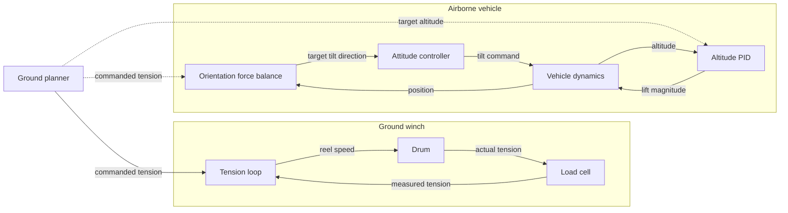

# RAWES Outer Tension / Orientation / Altitude Control Loop

**Reference:** De Schutter J., Leuthold R., Diehl M. (2018).
"Optimal Control of a Rigid-Wing Rotary Kite System for Airborne Wind Energy."
IFAC Proceedings, Vol. 51, No. 13, pp. 523-528.

---

## Overview

Two subsystems cooperate across a **tether** under tension: a **ground winch** that sets how hard the tether is pulled, and a kite that produces lift via a rotor and has a fast inner-loop PID (as implemented by Ardupilot) that controls attitude and movement rates against its gyros, and slower outer control loop that controls altitude and target attitude. 

The winch and the vehicle are coupled by a single shared number — the **commanded tension** $T_{\text{cmd}}$, the winch's own setpoint, also broadcast to the vehicle. The ground-to-air link carries only slow setpoints (this tension and the target altitude), never fast feedback, so the two ends can be designed and tuned independently. The work then splits into four tasks, deliberately kept decoupled so they never fight each other:

| Task | Where | Type | Output |
|------|-------|------|--------|
| Tension | Ground winch | Feedback | Reel speed |
| Orientation | Kite | Feedforward | Direction of the lift |
| Altitude | Kite | Feedback (PID) | Collective pitch |
| Attitude | Kite | Feedback (PID 400hz) | Cyclic control |

## Winch — tension feedback

The winch drives the *actual* tension $T_t$ (from its load cell) to the command by modulating reel speed, $v_{\text{reel}} = \Pi(T_{\text{cmd}} - T_t)$ — reel out to shed tension, reel in to build it. This is the only tension feedback anywhere in the system; the vehicle never sees the noisy load cell and simply trusts $T_{\text{cmd}}$.

## Kite orientation — a force balance (feedforward)

In steady state the vehicle is held by four forces — lift, gravity, tether tension, and aerodynamic drag — but this design deliberately ignores drag, leaving three that must sum to zero. The lift then has to cancel the other two:

$$\vec{F}_{\text{lift}} = -\big(\vec{F}_{\text{gravity}} + \vec{F}_{\text{tension}}\big).$$

Writing gravity as $mg\,\hat{\vec{z}}$ (down) and tension as $T_{\text{cmd}}\,\hat{\vec{t}}$ (toward the anchor, with $\hat{\vec{t}} = -\vec{r}/|\vec{r}|$ from the vehicle position $\vec{r}$ in North-East-Down), the required lift points opposite to their sum. The disk axis the attitude controller must hold, $\vec{b}_z$, lies along that resultant (the lift is produced along $-\vec{b}_z$), and the lift magnitude the vehicle must produce is its length:

$$\vec{b}_z = \frac{T_{\text{cmd}}\,\hat{\vec{t}} + mg\,\hat{\vec{z}}}{\big\lVert\, T_{\text{cmd}}\,\hat{\vec{t}} + mg\,\hat{\vec{z}} \,\big\rVert}, \qquad T_R = \big\lVert\, T_{\text{cmd}}\,\hat{\vec{t}} + mg\,\hat{\vec{z}} \,\big\rVert.$$

The direction goes to the attitude controller; the magnitude is a ready-made feedforward for altitude. No feedback is needed — it is pure geometry at the current tension and position, and $\hat{\vec{t}}$ already carries the horizontal bearing, so the result automatically lies in the vertical plane through the tether. Equivalently, the lift's tilt off the tether is $\tan\xi = mg\cos\theta_{\text{el}}/(T_{\text{cmd}} + mg\sin\theta_{\text{el}}) \approx mg\cos\theta_{\text{el}}/T_{\text{cmd}}$; at our steady-cruise operating point ($m=5.0$ kg, hub at 100 m range so $\theta_{\text{el}}\approx 25°$, $T_{\text{cmd}}=300$ N) that is only ~8°, so very little steering effort is needed to trim. Ignoring drag costs only a small steady offset — the vehicle settles at a marginally lower equilibrium elevation, not an instability. Note the $1/T$ scaling: tilt grows fast as tension drops (see below).

## Kite altitude — lift magnitude (PID feedback)

While orientation sets lift *direction*, a PID on altitude error sets its *magnitude*:

$$\text{lift} = \text{lift}_{\text{trim}} + K_p\,e_{\text{alt}} + K_i\!\int e_{\text{alt}}\,dt - K_d\, v_{z}.$$

The equilibrium feedforward $\text{lift}_{\text{trim}}$ (the $T_R$ above) carries the steady load so the integrator does not have to; the integral is clamped (anti-windup); the velocity damping $K_d v_z$ is taken from the measurement and gain-scheduled down while attitude is moving fast, so orientation transients don't bleed into lift; and the output is slew-limited. This loop is the system's fast disturbance rejector (gusts), while the orientation force balance only slowly re-trims. Fast feedback on magnitude, slow feedforward on direction — that division of labour is why the two are separate.

## Why it should stay stable

The shared tension couples the loops, creating a few paths to manage: (1) a regenerative altitude path (altitude → tilt → lift → altitude) near the operating limits, broken by slewing the elevation that feeds the force balance so the fast altitude PID owns immediate rejection; (2) a bandwidth ordering $\omega_{\text{schedule}} \ll \omega_{\text{winch}} < \omega_{\text{attitude}}$ that keeps the winch tracking commands without chasing fast transients; and (3) the $1/T$ tilt sensitivity, which blows up at low tension, so the tension fed into the force balance is floored at a small positive value.

## Proposed enhancement — a shared tension schedule

Instead of an instantaneous command, the ground could send a short tension *schedule* — a target tension plus the time to reach it — that both ends evaluate against a synchronized clock: the winch drives actual tension along it while the vehicle re-aims its lift along the same profile (a two-degree-of-freedom structure). The profile should be smooth enough not to jerk the orientation command (a ramp with eased ends, bounding the peak tension rate), should resume from the current value if it is replaced mid-transition, and should own the transition rate so the vehicle's local slew limits act only as safety saturations.
