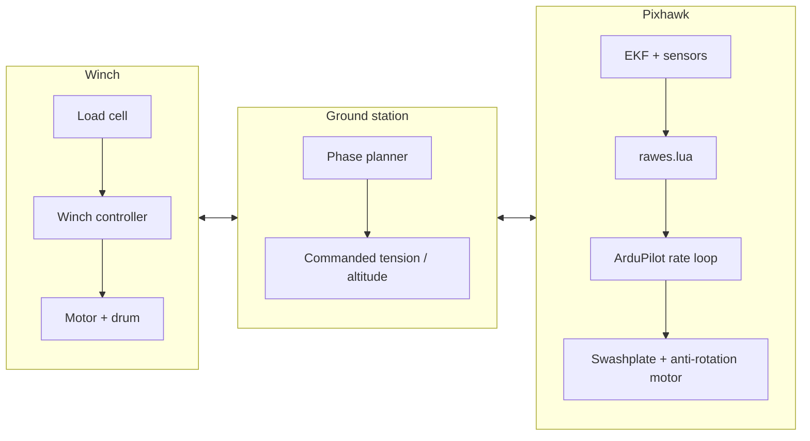
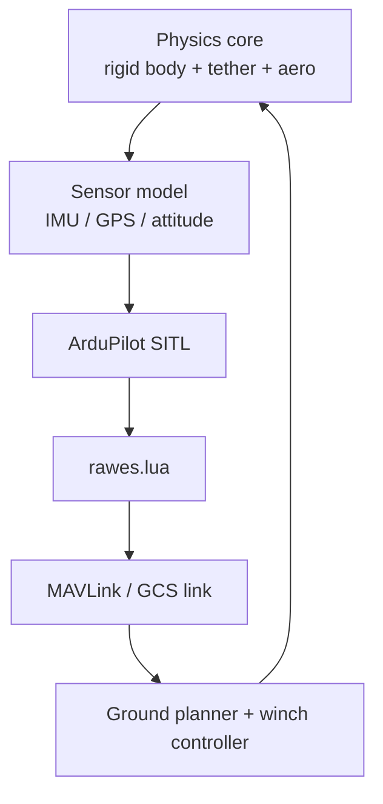
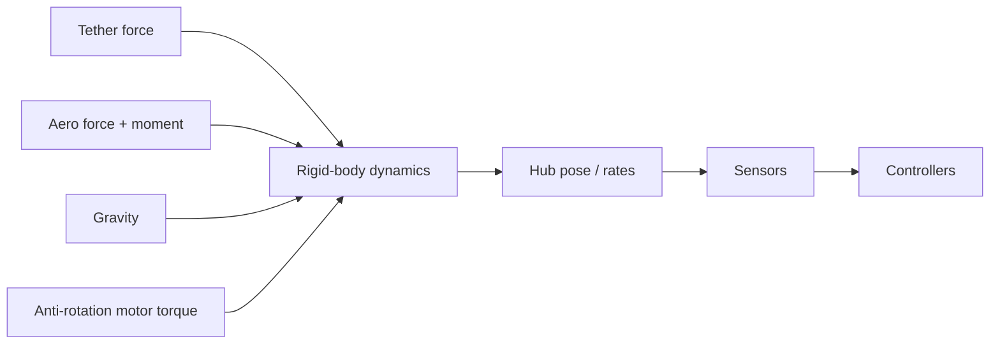
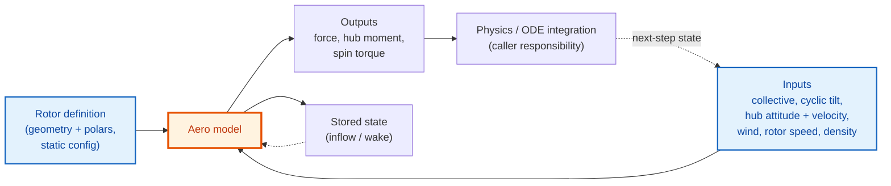

<!-- _paginate: false -->

# RAWES SITL and Aero Architecture

A tethered rotary airborne wind-energy prototype: the SITL test framework, the aero model, and how they couple.

---

## Why this system exists

- RAWES is a tethered rotary airborne wind-energy prototype built around a rotorcraft-like hub, a ground winch, and a Pixhawk running ArduPilot plus Lua.
- The main goal of the simulation and SITL framework is to exercise the real control stack under repeatable conditions: the ground planner, the winch, the Lua scripts, the ArduPilot inner loops, and the physics/aero models.
- The system is not a generic flight simulator. It is structured to preserve the same control boundaries, timing, and sign conventions that the hardware and stack tests expect.
- The external aero package in the separate `aero` repository provides the blade-element/momentum model used by the physics path.

---

## Physical system at a glance

- The architecture has three live nodes: the winch on the ground, the ground station, and the airborne Pixhawk.
- The winch owns tension sensing and reel-speed actuation.
- The ground station owns phase sequencing and setpoint generation.
- The Pixhawk owns flight control through `rawes.lua` and ArduPilot’s rate controller.
- The simulation mirrors that split instead of collapsing everything into one controller.

---

## What the SITL framework actually simulates

- The stack is not only physics; it also includes communications, state machines, controller timing, and the startup hand-off from kinematic hold to free flight.
- The physics worker steps at 1200 Hz and must answer every servo packet: ArduPilot SITL runs in lockstep in a docker container.
- The test harness records telemetry, logs events, and provides post-run diagnosis tools.

---

## Timing and control rates

- The framework spans several time scales, and the separation is deliberate.
- The physics integrator and SITL lockstep run at the highest rate to keep the simulation numerically stable and to answer every servo packet.
- The ArduPilot rate PID loops on the Pixhawk close the actuator-level attitude loop underneath the Lua policy layer.
- `rawes.lua` runs at a lower rate and produces slow setpoints for ArduPilot.
- The winch controller runs fast enough to track load-cell tension changes.

| Layer | Typical rate | Role |
|---|---:|---|
| Physics / SITL lockstep | 1200 Hz | Rigid-body dynamics, tether, aero, sensors |
| ArduPilot rate PID (Pixhawk) | 400 Hz | Inner attitude / rate loop driving the actuators |
| Winch controller | 400 Hz | Tension tracking and reel motion |
| `rawes.lua` | 50 Hz | Orientation and collective targets |
| Ground planner | 10 Hz | Phase sequencing and commanded setpoints |
| Telemetry / diagnosis | 10–50 Hz+ | Logs, event traces, offline checks |

---

## Ground station responsibilities

- The ground station is the supervisor, not the flight controller. 
- It sequences phases such as steady flight, pumping, and landing.
- It forwards commanded tension and target altitude to the airborne controller.
- It does not pass measured load-cell tension to the aircraft, and it does not directly command the attitude loop.
- Separation keeps the tension loop on the winch and the attitude/altitude loop on the kite.

---

## Winch controller and tether dynamics

- The winch is a closed loop around its own load cell.
- Its output is reel speed, shaped by motion limits so cable motion is smooth enough for the rest of the stack.
- The tether model provides the link between winch motion and airborne force balance.
- In the current design, the airframe sees commanded tension through the force balance, while the winch sees measured tension through its own controller.
- That is a key architectural distinction: the aircraft does not get tension feedback from the load cell.

---

## `rawes.lua` on the Pixhawk

- `rawes.lua` is the airborne policy layer.
- It turns slow setpoints into body-axis orientation and collective commands.
- The script has distinct modes for steady flight, manual bench work, passive release, and landing.
- In steady flight, it computes the desired rotor-axis direction from position, gravity, and commanded tension, then uses altitude control to trim collective.
- The Lua layer feeds ArduPilot, rather than replacing it.

---

## Communication paths and data ownership

- The system uses MAVLink between ground and aircraft, and a separate wired link between ground and winch.
- Commanded tension and target altitude move upward on the radio link.
- Telemetry, attitude, motor state, and log data move back down.
- The simulation harness preserves the same directionality so that tests reveal integration issues rather than hiding them.
- This also means the support framework must keep message timing, queue depth, and state ownership consistent with the live stack.

---

## Sensor model and frame conventions

- The sensor model reports the physical hub state, not an abstract attitude chosen for convenience.
- The design uses NED world coordinates and FRD body coordinates consistently through the control and physics layers.
- Hub orientation, angular rates, and specific force are all derived from the rigid-body state rather than patched in after the fact.
- That choice matters because the EKF and the Lua controller both depend on the same sign conventions.
- The documentation is explicit about this because most subtle bugs in this project are sign or frame mistakes.

---

## Dynamics, tether, and rotor spin

- The physics model treats the hub as a rigid body with a separate rotor-spin state.
- Tether force, aerodynamic force, gravity, and counter-torque all act on that body.
- The anti-rotation motor is modeled as a real torque path rather than a purely algebraic correction in the current design.
- Gyroscopic coupling is included, but it is still a model of the current hardware and not a claim of universal rotorcraft behavior.

---

## What the aero module does

- The external aero package (`dynbem`) provides the blade-element/momentum model that the physics stack calls into.
- The default path uses a quasi-static BEM model by default; dynamic-inflow variants (Pitt-Peters, Oye) and vortex particle exist with the **same interface**.
- The quasi-static BEM picks the right momentum relation per operating point:

| Regime | How it is handled |
|---|---|
| Hover / climb | Classical helicopter momentum theory |
| Windmill / autorotation | Wind-turbine solver (Brent root-find on inflow angle) for `a < 0.4` |
| Turbulent windmill (heavily loaded) | Buhl empirical quadratic for `0.4 < a < 1` where momentum theory breaks down |
| Vortex ring state (steep descent) | Leishman/Castles-Gray empirical inflow override |

---

## Aero module: state in, state out, and stored state

- Every call takes a rotor operating point in, returns hub loads out, and (for the dynamic models) carries stored inflow/wake state between calls.
- The stored state is what separates the models: quasi-static keeps nothing, the dynamic-inflow models keep a few inflow harmonics, and the VPM keeps an explicit wake.
- The rotor definition (geometry + airfoil polars) is fixed configuration; the physics/ODE integration that closes the loop is the caller's responsibility, not the aero model's.

| Model | Stored state between calls |
|---|---|
| Quasi-static BEM (default) | None; state array is empty |
| Pitt-Peters | 3 inflow harmonics: `lambda_0`, `lambda_c`, `lambda_s` |
| Oye | Per-annulus 2-stage inflow filter: `W_int`, `W` (length `2*n_elements`) |
| VPM (experimental) | Explicit wake: vortex particles (position, vector strength, core size) plus per-blade flap/feather DOFs and azimuth |

---

## The VPM: an experimental higher-fidelity check

- The vortex particle method (VPM) is the one model in the package that represents the wake explicitly, as a cloud of regularized vortex particles rather than a momentum-theory inflow.
- Effects the BEM models handle with separate empirical patches (wake skew, descent/autorotation, vortex ring state) fall out of the same wake convection in the VPM formulation.
- It is still inviscid and leans on the same airfoil polar tables for sectional lift and drag, so stall and compressibility remain polar-table concerns.

Cost per step (parallel; machine-dependent, so read the ratios, not the absolute ms). BEM is ~11 ms/step, Oye / Pitt-Peters ~0.1 ms.

| Wake size N | Direct sum O(N^2) | Barnes-Hut O(N log N) | BH vs BEM |
|---:|---:|---:|---:|
| 5,000 | ~59 ms | ~53 ms | ~5x |
| 16,000 | ~428 ms | ~139 ms | ~13x |
| 32,000 | ~2,265 ms | ~337 ms | ~31x |

---

## Aero validation against classic rotor experiments

- The aero package is checked against digitized wind-tunnel data from several classic rotor experiments.
- I'd frame these numbers as an honest picture rather than a success story: the default quasi-static BEM is consistent in structure but has a known, systematic thrust bias, and the experimental VPM tightens that where it has been run.
- The values below are taken from the aero package's own empirical-validation notes. VPM has only been run against the hover and forward-flight autorotation datasets so far.

| Dataset (source) | Regime / quantity | Quasi-static BEM error | VPM error |
|---|---|---:|---:|
| Castles & Gray 1951 (NACA TN-2474) | Hover CT | +11% (Table I) to ~+30-45% (Table V) | ~8-13% |
| Castles & Gray 1951 | Hover CQ / power | ~14% RMSE (Table I) | <~21% |
| Castles & Gray 1951 | Figure of merit | sanity band only | <~11% |
| Caradonna & Tung 1981 (NASA TM-81232) | Hover CT | ~+30 to +45% | not run |
| Harrington 1951 (NACA TN-2318) | Full-scale hover CT | ~+30 to +45% | not run |
| Wheatley & Hood 1935 (NACA TR 515, PCA-2 autogyro) | Forward-flight autorotation | CT ratio ~1.25-2.65; negative CQ residual | <= ~8% to mu = 0.32 |

---

## Independent cross-check against CCBlade

- Beyond wind-tunnel data, the aero package is compared point-for-point against CCBlade, NREL's open-source BEM, on two rotors.
- This is a code-to-code agreement check, so it does not fix the absolute-thrust bias against real data, but it does show the implementation is internally sound.

| Cross-check | Sweep | CT agreement | CQ agreement |
|---|---|---:|---:|
| NREL Phase VI (twisted/tapered HAWT) | 21 operating points | ~2% median, 2.3% max | ~2.4% median, 2.9% max |
| Beaupoil RAWES rotor (4-blade, R=2.5 m) | 25 operating points | ~1.4% median, 1.8% max | ~2.7% median, 11.1% max at autorotation crossing |

- The larger CQ outlier on the Beaupoil rotor is near the autorotation crossing where the torque coefficient passes through zero, so the relative error inflates even though the absolute agreement is good.

---

## Known gaps

- The servo-flap actuation model is covered by behavior tests but is not yet benchmarked against a dedicated published servo-flap rotor dataset, so its authority should be treated as engineering behavior rather than a calibrated claim.
- The BEM does not model dynamic stall, blade flapping degrees of freedom, or compressibility corrections.
- Several source datasets were digitized from scanned figures, so some scatter reflects extraction quality rather than model error.
- The tether, winch and hub physics are modeled separately from the aero package and have their own, lighter validation.

