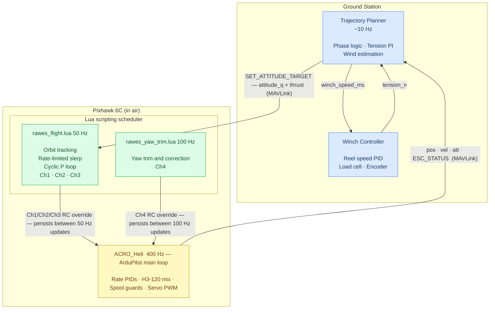

# RAWES — Flight Control Protocol and Architecture

## 1. System Overview

### 1.1 What is RAWES?

A RAWES (Rotary Airborne Wind Energy System) is a tethered autogyrating rotor
kite.  Wind drives the rotor to spin (autorotation); the spinning rotor
generates lift; the tether is angled so that lift has a component along the
tether, pulling against it and generating tension.  A ground-based winch
converts that tension into electrical energy by paying out the tether under
load (reel-out), then reeling it back in under low load (reel-in).  The
difference in tension between the two phases is the net energy per cycle.

The rotor has no motor to drive rotation — only trailing-edge flaps on each
blade, driven by a swashplate, which adjust blade pitch and therefore thrust
direction.  This is the only control input.  The flight controller's job is to
point the rotor disk in the right direction at the right time.

### 1.2 Glossary

| Term | Meaning |
|---|---|
| **body_z** | The unit vector along the rotor axle (spin axis). Naming convention used throughout this document and the codebase. |
| **Orbit tracking** | The Pixhawk-side control function that continuously rotates the attitude setpoint to match the hub's orbital position, keeping body_z aligned with the tether direction as the hub moves around the anchor. Implemented in `rawes_flight.lua` at 50 Hz; the trajectory planner is not involved. |
| **NED** | North-East-Down coordinate frame (X=North, Y=East, Z=Down). Used by ArduPilot, the Lua scripts, MAVLink messages, and the Python simulation. Up is `[0,0,−1]`. |

### 1.3 Physical and control variables

| Symbol | Name | Description |
|---|---|---|
| **pos** | Hub position | 3D position of the rotor hub in NED [m] |
| **vel** | Hub velocity | 3D velocity of the rotor hub in NED [m/s] |
| **body_z** | Disk axis | Unit vector along the rotor axle (also tether direction at equilibrium) |
| **ξ** | Disk tilt from wind | Angle between body_z and the horizontal wind direction [°]. Controls how much thrust acts along vs. perpendicular to the tether. |
| **β** | Tether elevation | Angle of the tether above horizontal [°]. Determines the natural body_z direction at equilibrium. |
| **T** | Tether tension | Force along the tether [N]. Directly determines power = T × v_reel. |
| **ω_spin** | Rotor spin | Angular velocity of the rotor about its axle [rad/s]. Sustained by autorotation. Derived from GB4008 counter-torque motor eRPM: `omega_spin = eRPM × 2π/60 / 11 × 44/80`. |
| **ω** | Orbital angular velocity | Angular velocity of the hub about axes perpendicular to the axle [rad/s]. Controlled by cyclic swashplate inputs. |
| **L₀** | Tether rest length | Unstretched tether length [m]. Changed by the winch to reel out/in. |
| **θ_col** | Collective pitch | Average blade pitch across all blades [rad]. Controls thrust magnitude. |
| **θ_lon** | Longitudinal cyclic | Tilt of the swashplate fore/aft [rad]. Tilts disk north/south. |
| **θ_lat** | Lateral cyclic | Tilt of the swashplate left/right [rad]. Tilts disk east/west. |
| **v_winch** | Winch speed | Rate of tether length change [m/s]. +ve = pay out, −ve = reel in. |

### 1.4 The natural orbit

At equilibrium, the hub does not hover in one place — it orbits the anchor
point at constant tether length and elevation.  The tether direction defines
the equilibrium disk axis (body_z), and as the hub moves the disk tilts with
it, creating a lateral force that drives the orbit.  This is the system's
natural resting state and requires zero control effort to maintain.

The orbit is not a problem to be corrected — it is the expected flight
condition.  The baseline attitude setpoint rotates with the orbit automatically
(orbit tracking), and the trajectory planner only needs to command deviations.

### 1.5 The pumping cycle (De Schutter 2018)

**Reel-out (power phase):** The disk is tether-aligned (ξ ≈ 30–55°).  High
collective produces high thrust mostly along the tether.  High tether tension.
The winch pays out against this tension, driving a generator.

**Reel-in (recovery phase):** The disk tilts so that ξ increases toward 90°.
Thrust acts mostly upward rather than along the tether.  Tether tension drops
to near the gravity component alone (~15–30 N).  The winch reels in cheaply.

Net energy per cycle = (T_out − T_in) × v_reel × t_phase > 0 as long as T_out > T_in.

### 1.6 Counter-torque motor

The rotor hub spins freely in the wind, but the electronics, swashplate, and
servos must stay stationary.  The GB4008 (66KV, 24N22P = 11 pole pairs) drives
the axle via an 80:44 spur gear, applying continuous counter-torque to prevent
the electronics assembly from co-rotating with the hub — directly analogous to
the tail rotor of a helicopter.

The gear ratio sets the motor operating RPM band; all authority comes from the
yaw rate PI loop on the Pixhawk.  The AM32 ESC reports eRPM via DShot telemetry,
which the Pixhawk converts to rotor spin rate:

```
omega_spin = eRPM × 2π/60 / 11 × 44/80
```

This is an inner-loop function implemented in `rawes_yaw_trim.lua` at 100 Hz.
The trajectory planner never commands it.

---

## 2. Control Architecture

Three nodes, two communication boundaries.  The Pixhawk runs two distinct
loops at different rates — the 400 Hz ArduPilot main loop (ACRO_Heli) and the
Lua scripting scheduler (50 Hz / 100 Hz).  Lua writes RC overrides that the
main loop consumes at full rate.



**Tether tension is measured at the base station**, not on the hub.  A load
cell on the winch drum measures exactly the right quantity for energy accounting
(work = T_base × v_reel).  The base-to-hub tension difference is the tether
weight component along the tether (0.3–3.1 N at operating lengths — under 5 %
of the operating range; absorbed by the PI integrator).

The tension PI runs on the ground (trajectory planner), where the load cell
measurement is local and fresh.  The PI output — a normalized collective value
[0..1] — is sent to the Pixhawk as the `thrust` field of `SET_ATTITUDE_TARGET`.
The `rawes_flight.lua` script passes this directly to Ch3 RC override — no
conversion on the Pixhawk.  The Pixhawk has no knowledge of tension.

### Design principles

**Natural orbit is free.** Lua orbit-tracking tracks the tether direction at
50 Hz without planner involvement.  The planner only intervenes to request a
specific disk orientation.

**Inner loops stay on the Pixhawk.** Attitude tracking (cyclic), body_z
slewing, and counter-torque control run inside Lua scripts on the Pixhawk at
50–100 Hz.  No custom firmware is required — both scripts run on top of stock
ACRO_Heli mode.  The planner sends the collective directly; the Pixhawk
executes it.

**Winch is on the ground.** The Pixhawk is never involved in winch control.

**Thrust field = normalized collective.** The `thrust` field of
`SET_ATTITUDE_TARGET` carries a normalized collective [0..1] computed by the
ground PI.  The Lua flight script forwards this directly to Ch3 RC override —
no tension awareness, no conversion, no PI on the Pixhawk.  This is
structurally identical to a pilot's throttle stick in ACRO mode.

---

## 3. Protocol

### 3.1 STATE — Pixhawk → Planner (~10 Hz, all standard streams)

The planner reads everything it needs from standard ArduPilot telemetry — no custom messages
and no custom Pixhawk code required:

| Standard stream | MAVLink message | What the planner uses |
|---|---|---|
| Position + velocity | `LOCAL_POSITION_NED` (msg #32) | Hub position and velocity in NED |
| Attitude | `ATTITUDE_QUATERNION` (msg #31) | Full orientation; `body_z_ned = quat_apply(q, [0,0,1])` |
| Rotor spin | `ESC_STATUS` (msg #291) | `rpm[RAWES_CTR_ESC]`; planner converts: `omega_spin = rpm × 2π/60 / 11 × 44/80` |

`ESC_STATUS` is streamed automatically by ArduPilot from `AP_ESC_Telem` — no Pixhawk-side code
needed beyond setting the stream rate.

### 3.1.1 Anchor Position

`rawes_flight.lua` needs the anchor position to compute
`bz_tether = normalize(pos_hub − anchor)` at every 50 Hz Lua step.
The anchor is set via three `SCR_USER` parameters:

| Parameter | Description |
|---|---|
| `SCR_USER3` | Anchor North offset from EKF origin (m) |
| `SCR_USER4` | Anchor East offset from EKF origin (m) |
| `SCR_USER5` | Anchor Down offset from EKF origin (m) |

These are read at each Lua step (no init conversion needed).  The hub can be
anywhere when the script starts — ground-launched, hand-launched, or already
in the air.

The wind direction does **not** affect the anchor calculation.  `bz_tether` is
derived from actual hub position, so it naturally tracks wherever the hub flies —
downwind, crosswind, or during wind shifts — without any wind knowledge on the
Pixhawk.

### 3.2 Planner → Pixhawk Uplink (~10 Hz)

Exactly one MAVLink message: `SET_ATTITUDE_TARGET`.

| Field | Description |
|---|---|
| `quaternion` | Desired disk orientation in NED frame. Identity `[1,0,0,0]` = natural tether-aligned orbit (planner silent). Non-identity: `body_z_target_ned = quat_apply(q, [0,0,1])`. `rawes_flight.lua` slews toward it at `SCR_USER2` (RAWES_BZ_SLEW) rad/s. |
| `thrust` | Normalized collective [0..1], computed by the ground PI from the load cell measurement. `rawes_flight.lua` passes this directly to Ch3 RC override — no conversion on the Pixhawk. |

The ground PI runs locally with fresh load cell data:
```
error          = tension_setpoint_n − tension_measured_n   (both in N, local)
collective_rad = kP × error + kI × ∫error dt
thrust         = clamp((collective_rad − col_min_rad) / (col_max_rad − col_min_rad), 0, 1)
```
`col_min_rad` / `col_max_rad` and the PI gains are ground-station configuration.

### 3.3 Winch Command — Planner → Winch Controller (local link)

| Field | Description |
|---|---|
| `winch_speed_ms` | Winch rate [m/s]. +ve = pay out, −ve = reel in, 0 = hold. Maps to `MAV_CMD_DO_WINCH` if the winch controller speaks MAVLink. |

The Pixhawk is not involved.

### 3.4 Trajectory Planner Logic (~10 Hz)

```
Each step:

1. Read standard streams:
        pos_ned + vel_ned  ← LOCAL_POSITION_NED
        body_z_ned         ← ATTITUDE_QUATERNION  (quat_apply(q, [0,0,1]))
        omega_spin         ← ESC_STATUS[RAWES_CTR_ESC].rpm × 2π/60 / 11 × 44/80
2. Read tension_n from Winch Controller (local link — no MAVLink hop)

3. Determine phase (reel-out / reel-in) from local elapsed time since release

4. Run tension PI (local, fresh data):
       error          = tension_setpoint_n − tension_n
       collective_rad = kP × error + kI × ∫error dt
       thrust         = clamp((collective_rad − col_min_rad) / (col_max_rad − col_min_rad), 0, 1)

5. Compute:
       attitude_q     ← identity during reel-out (planner silent)
                         quat_from_vectors([0,0,1], body_z_reel_in_ned) during reel-in
                         body_z_reel_in_ned = cos(xi)*wind_dir_ned + sin(xi)*[0,0,-1]
                         ([0,0,-1] = up in NED)
       winch_speed_ms ← +v_reel_out or −v_reel_in

6. Send SET_ATTITUDE_TARGET (attitude_q + thrust) → Pixhawk
7. Send winch_speed_ms                             → Winch Controller
```

---

## 4. Wind Estimation

Wind direction and speed are needed to compute `body_z_reel_in`.  Four methods,
ordered by implementation complexity:

**Method 1 — Rotor spin rate (in-plane speed):**
Using the autorotation torque balance: `v_inplane = omega_spin² × K_drag / K_drive`.
`v_wind ≈ v_inplane / sin(xi)` where xi comes from Method 2.

**Method 2 — Orbital mean position (direction):**
Over one orbit, `wind_dir ≈ normalize(mean(pos_ned_horizontal))`.
No extra hardware. Direction converges within one orbit (~60 s).

**Method 3 — Ground anemometer (future):**
3D ultrasonic anemometer at ground station, extrapolated to hub altitude via
log profile: `v(h) = v_ref × ln(h/z₀) / ln(h_ref/z₀)`.  No protocol impact —
the planner reads it locally.

**Method 4 — EKF wind state augmentation (future):**
Augment the Pixhawk EKF with a 3D wind vector estimated from tension, velocity,
and omega_spin.  If implemented, `wind_ned` would be added as a `NAMED_VALUE_FLOAT` custom field.

---

## 5. Takeoff and Landing

### 5.1 Takeoff

**Physical sequence:**
1. Ground station spins rotor to ω_spin ≥ ω_min (~10–15 rad/s). Planner monitors STATE; Pixhawk does nothing.
2. Release mechanism drops rotor. Lift > weight → rapid climb.
3. Tether pays out. Once taut, tension develops and lateral stability begins.
4. Natural orbit establishes. Planner begins pumping cycle.

**Phase ownership:**

| Phase | Planner | Pixhawk (Lua + ACRO) |
|---|---|---|
| Spin-up | Monitor `omega_spin`; trigger release at ω ≥ ω_min | None |
| Free climb (slack tether) | Pay out winch; send explicit `attitude_q` target | `rawes_flight.lua` holds attitude; Ch3 from `thrust` |
| Tether catch | Detect tension > threshold (local winch read); reduce thrust | Orbit tracking begins once `_eq_captured` |
| Transition to pumping | Ramp to operating tension setpoint | Natural orbit; follow `SET_ATTITUDE_TARGET` |

During the slack-tether phase, `_eq_captured` is false so orbit tracking is
suppressed until EKF position is valid and tether direction is meaningful.

### 5.2 Landing — spiral descent

```
Step 1 — Normal reel-in:
    Planner: slow winch reel-in, reduce tension setpoint.
    Lua: orbit track (identity attitude_q); Ch3 from thrust.
    Hub spirals inward and downward.

Step 2 — Final approach (tether_length < ~10 m):
    Planner: ramp thrust → 0 over ~5 s; hold or very slow reel-in.
    Lua: collective approaches zero; body_z alignment maintained.
    Autorotation continues — rotor stores kinetic energy during descent.

Step 3 — Flare (optional):
    Planner: brief thrust spike (~0.3) for 1–2 s.
    Lua: momentary collective increase slows final descent.

Step 4 — Ground contact:
    Planner: engage ground motor (local command).
    Lua: hold last attitude command (slerp goal unchanged).
```

**The division of responsibility is identical to pumping flight.**  Landing is
a subset of the normal protocol — no new COMMAND fields are required.

---

## 6. Example: De Schutter Pumping Cycle

```
t=0s:   → Pixhawk:          attitude_q=[1,0,0,0] (identity),
                             thrust = ground PI output (targeting ~200 N, ≈0.2 normalized)
        → Winch controller: winch_speed=+0.4 m/s (pay out)
        rawes_flight.lua holds tether-aligned orbit naturally.  Winch pays out.
        Ground PI regulates tension to 200 N by adjusting thrust each 10 Hz step.

t=30s:  → Pixhawk:          attitude_q=quat_from_vectors([0,0,1],[0,cos55°,-sin55°]),
                             (NED: wind east → Y; up → −Z; xi=55° from wind toward vertical)
                             thrust = ground PI output (targeting ~80 N, ≈0.5 normalized)
        → Winch controller: winch_speed=-0.4 m/s (reel in)
        rawes_flight.lua slews body_z toward 55° from wind (~5 s at SCR_USER2=0.40 rad/s).

t=35s+: rawes_flight.lua holds 55° tilt.  Ground PI holds low tension.  Winch reels in.

t=60s:  → Pixhawk:          attitude_q=[1,0,0,0] (identity),
                             thrust = ground PI output (targeting ~200 N)
        → Winch controller: winch_speed=+0.4 m/s (pay out)
        rawes_flight.lua slews body_z back to tether-aligned.  Next reel-out begins.
```

---

## 7. Lua Implementation

RAWES flight control runs as two Lua scripts on top of stock ACRO_Heli mode.
No custom firmware, no firmware fork.

### 7.1 Why Lua instead of C++

| Property | Custom C++ firmware | Lua scripts |
|---|---|---|
| Requires firmware fork | Yes — maintain separate branch | No — stock ArduPilot |
| Field update | Reflash Pixhawk via USB/DFU | Drop files onto SD card via MAVFtp |
| Reuse ACRO rate PIDs | Via class inheritance | Via RC override injection |
| Cyclic update rate | 400 Hz in main loop | 50 Hz (adequate — orbit ≈ 0.2 rad/s) |
| Simulation validation | Requires C++ ↔ Python mapping | Python mediator already implements identical algorithm |

### 7.2 Channel Ownership

The two scripts divide the four ACRO RC channels between them:

| Channel | Owner | Rate | Path |
|---|---|---|---|
| Ch1 — roll rate | `rawes_flight.lua` | 50 Hz | body_z error (roll) → `ATC_RAT_RLL` PID → swashplate |
| Ch2 — pitch rate | `rawes_flight.lua` | 50 Hz | body_z error (pitch) → `ATC_RAT_PIT` PID → swashplate |
| Ch3 — collective | ground PI via MAVLink | ~10 Hz | Normalized thrust [0..1] from load cell → Ch3 RC override |
| Ch4 — yaw rate | `rawes_yaw_trim.lua` | 100 Hz | Torque trim + correction → `ATC_RAT_YAW` → GB4008 |

**Phase switching:** During reel-in the planner sends `SET_ATTITUDE_TARGET`
with a non-identity quaternion.  `rawes_flight.lua` decodes `body_z_target`
and rate-limits the slerp toward it at `SCR_USER2` rad/s.  After 2 s without
a planner packet the script reverts to natural orbit automatically.

**Collective passthrough:** The ground PI sends normalized collective as
`RC_CHANNELS_OVERRIDE, Ch3`.  `rawes_flight.lua` forwards this to Ch3 with no
further computation — the Pixhawk has no tension awareness.

### 7.3 Two-Loop Timing

The Lua scheduler and the ArduPilot main loop run independently at different
rates:

| Loop | Rate | Owns |
|---|---|---|
| ArduPilot main loop (ACRO_Heli) | 400 Hz | Rate PIDs, H3-120 mix, spool guards, servo PWM |
| `rawes_flight.lua` | 50 Hz | Orbit tracking, slerp, cyclic P loop → Ch1/Ch2/Ch3 |
| `rawes_yaw_trim.lua` | 100 Hz | Yaw trim and correction → Ch4 |

RC overrides set by Lua **persist** until the next Lua update.  The 400 Hz
ACRO loop applies the most recently set override at every step — attitude
tracking is bounded by the 50 Hz Lua rate, but disturbance rejection (rate PID
D-term) operates at full 400 Hz bandwidth.

ArduPilot expires RC overrides after ~1 s of inactivity.  At 50/100 Hz both
scripts refresh well within the expiry window.

### 7.4 Division of Responsibility

| Function | Provided by | Notes |
|---|---|---|
| Rate PIDs — roll, pitch, yaw | ACRO_Heli (400 Hz) | Full-rate damping between Lua updates |
| H3-120 swashplate mixing | ACRO_Heli | `H_SWASH_TYPE = 3` (H3_120, default) |
| Spool state guards | ACRO_Heli | `SHUT_DOWN` / `GROUND_IDLE` refuse RC input |
| Arming infrastructure | ACRO_Heli | Standard pre-arm checks; arm via MAVLink or GCS |
| AHRS / EKF state | ArduPilot firmware | `ahrs:*` Lua bindings available in any mode |
| Telemetry streams | ArduPilot firmware | `LOCAL_POSITION_NED`, `ATTITUDE_QUATERNION`, `ESC_STATUS` |
| Orbit tracking | `rawes_flight.lua` | Port of `controller.py::orbit_tracked_body_z_eq()` |
| Rate-limited slerp | `rawes_flight.lua` | Port of `mediator.py` blend loop |
| Cyclic P loop | `rawes_flight.lua` | Port of `controller.py::compute_rate_cmd()` |
| Counter-torque feedforward | `rawes_yaw_trim.lua` | Port of `mediator_torque.py` trim |
| Tension PI, phase logic, winch | Trajectory planner (ground) | Pixhawk has no tension awareness |

---

## 8. rawes_flight.lua

**SITL validation status:**
- `test_lua_flight_rc_overrides` PASSES — script loads in SITL, captures equilibrium at t≈0.5 s after ACRO arm, generates cyclic RC overrides (max cyclic activity 227 PWM). Stack test uses `internal_controller=True` (mediator holds hub stable; Lua output is observed via `SERVO_OUTPUT_RAW`). Phase 2 (Lua as sole cyclic controller) pending.
- `test_h_swash_phang` PASSES — confirms H_SW_PHANG=0 and H_SWASH_TYPE=3 are correct for the RAWES servo layout. See §13 and §12.

### 8.0 Parameters (SCR_USER slots)

| Parameter | SCR_USER | Default | Description |
|---|---|---|---|
| `RAWES_KP_CYC` | SCR_USER1 | 1.0 | Cyclic P gain — rad/s per rad of body_z error |
| `RAWES_BZ_SLEW` | SCR_USER2 | 0.40 | body_z slew rate limit (rad/s) |
| `RAWES_ANCHOR_N` | SCR_USER3 | 0.0 | Anchor North offset from EKF origin (m) |
| `RAWES_ANCHOR_E` | SCR_USER4 | 0.0 | Anchor East offset from EKF origin (m) |
| `RAWES_ANCHOR_D` | SCR_USER5 | 0.0 | Anchor Down offset from EKF origin (m) |
| `RAWES_MAX_CYC_DELTA` | SCR_USER6 | 30 | Max cyclic PWM change per 20 ms step (output rate limiter). Prevents sudden swashplate movements regardless of error source (attitude jitter, planner timeout, phase transitions). 30 PWM/step = 1500 PWM/s ≈ 0.67 s to traverse full stick. 0 = disabled. |

`SCR_USER7..8` are reserved (future: reel-in tilt angle, gain scheduling).

Set before flight via MAVLink parameter set or include in a `.parm` file.
No firmware recompilation needed to change any parameter.

### 8.1 50 Hz Control Loop

```
Each step (every 20 ms):

1. Guard: only run in ACRO mode (mode 1 in ArduCopter).  Return early otherwise.

2. Read state:
       bz_now  ← ahrs:body_to_earth(Vector3f([0,0,1]))   -- body_z in NED
       pos_ned ← ahrs:get_relative_position_NED_origin()
       anchor  ← Vector3f(SCR_USER3, SCR_USER4, SCR_USER5)
       diff    ← pos_ned − anchor

3. Capture equilibrium (once, when |diff| ≥ 0.5 m):
       _bz_eq0   ← bz_now                    (body_z at capture)
       _tdir0    ← diff / |diff|              (tether direction at capture)
       _bz_slerp ← _bz_eq0                   (initialise rate-limited setpoint)

4. Orbit tracking (each step):
       bz_tether ← diff / |diff|
       axis  ← _tdir0 × bz_tether
       angle ← atan2(|axis|, _tdir0 · bz_tether)
       _bz_orbit ← Rodrigues(_bz_eq0, axis/|axis|, angle)

5. Planner timeout (2 s since last SET_ATTITUDE_TARGET):
       clear _bz_target → revert to natural orbit

6. Rate-limited slerp:
       goal      ← _bz_target or _bz_orbit
       remain    ← acos(_bz_slerp · goal)
       step      ← min(SCR_USER2 × dt, remain)
       _bz_slerp ← Rodrigues(_bz_slerp, (_bz_slerp × goal)/|…|, step)

7. Cyclic:
       err_ned  ← bz_now × _bz_slerp          (world-frame error)
       err_body ← ahrs:earth_to_body(err_ned)  (body-frame error)
       err_bx   ← err_body.x                   (roll)
       err_by   ← err_body.y                   (pitch)
       roll_rate  ← SCR_USER1 × err_bx         (rad/s)
       pitch_rate ← SCR_USER1 × err_by         (rad/s)

8. RC override (ACRO_RP_RATE deg/s = ±500 µs):
       scale ← 500 / (ACRO_RP_RATE × π/180)
       Ch1 PWM ← clamp(1500 + scale × roll_rate,  1000, 2000)
       Ch2 PWM ← clamp(1500 + scale × pitch_rate, 1000, 2000)

9. Output rate limiter (SCR_USER6 = RAWES_MAX_CYC_DELTA, default 30 PWM/step):
       Ch1 PWM ← prev_ch1 + clamp(Ch1 − prev_ch1, −max_delta, +max_delta)
       Ch2 PWM ← prev_ch2 + clamp(Ch2 − prev_ch2, −max_delta, +max_delta)
       prev_ch1, prev_ch2 ← Ch1, Ch2
       rc:get_channel(1):set_override(Ch1)
       rc:get_channel(2):set_override(Ch2)
```

> **Note on Rodrigues:** Lua's `Vector3f` operator overloading (`*`, `+`) is not available
> in this ArduPilot build.  `rodrigues()` in the actual script uses explicit component
> arithmetic (no `*` or `+` on Vector3f objects).  See `simulation/scripts/rawes_flight.lua`
> for the exact implementation.

### 8.2 Algorithm Notes

**Orbit tracking** applies the same rotation to `_bz_eq0` that the tether has
made since equilibrium capture.  This keeps body_z tracking the natural tether
direction as the hub orbits, with zero control effort during steady orbit.  Port
of `controller.py::orbit_tracked_body_z_eq()`.

**Rate-limited slerp** rate-limits body_z transitions (identity→tilted during
reel-in) at `SCR_USER2` rad/s (default 0.40 rad/s).  During steady orbit the
slerp target moves slowly (orbit angular rate ~0.2 rad/s < 0.40 rad/s slew
limit), so the slerp stays locked to orbit with no perceptible lag.

**Cyclic P loop** converts body_z error to body-frame roll and pitch rates.
ACRO's `ATC_RAT_RLL/PIT` inner PIDs supply the rate damping.  Start
`SCR_USER1 = 0.3` and increase slowly — Kaman flap lag adds phase delay that
reduces the stability margin vs. direct blade pitch.

**ACRO_RP_RATE** (ArduPilot parameter, default 360 deg/s) sets the full-stick
rate.  The `scale` factor maps the computed rate command to PWM so the ACRO PID
sees the correct physical rate.  If `ACRO_RP_RATE` is changed, update the
constant in `rawes_flight.lua`.

### 8.3 Full Script

See `simulation/scripts/rawes_flight.lua`.

---

## 9. rawes_yaw_trim.lua (Counter-Torque)

The counter-torque script is already validated (15/15 tests pass).  Full
documentation in `simulation/torque/README.md`.  Summary:

```
motor_rpm  ← battery:voltage(0)   [SITL: mediator encodes RPM as voltage]
           or RPM:get_rpm(0)       [hardware: DSHOT telemetry from AM32]

trim       = tau_bearing / (tau_stall × (1 − ω_motor/ω₀))
           ≈ 0.747 at nominal 28 rad/s axle speed

yaw_corr   = −Kp_yaw × gyro:z()   [Kp_yaw = 0.001]

throttle   = clamp(trim + yaw_corr, 0, 1)
Ch4 PWM    ← 1000 + throttle × 1000
rc:set_override(4, pwm)
```

The `trim` feedforward handles steady-state bearing drag.  The `Kp_yaw`
correction handles transient disturbances.  ArduPilot's `ATC_RAT_YAW` is
still active and provides additional correction on top of the Lua trim.

---

## 10. Files

| File | Status | Description |
|------|--------|-------------|
| `simulation/scripts/rawes_flight.lua` | **New** | Orbit tracking + cyclic controller (this document's §8) |
| `simulation/torque/scripts/rawes_yaw_trim.lua` | Existing | Counter-torque feedforward (validated) |
| `simulation/torque/scripts/lua_defaults.parm` | Existing | SITL param overrides for Lua tests |

To deploy to hardware: copy both `.lua` files to `APM/scripts/` on the SD card.

---

## 11. Simulation Mapping

| Lua component | Python equivalent | File |
|---|---|---|
| `rawes_flight.lua` equilibrium capture | `_body_z_eq0`, `_tether_dir0` at free-flight start | `mediator.py` |
| `rawes_flight.lua` orbit tracking | `orbit_tracked_body_z_eq()` | `controller.py` |
| `rawes_flight.lua` rate-limited slerp | Rate-limited slerp in mediator inner loop | `mediator.py` |
| `rawes_flight.lua` cyclic P loop | `compute_swashplate_from_state()` | `controller.py` |
| ACRO `ATC_RAT_RLL/PIT` (rate damping) | `RatePID(kp=2/3)` inner loop | `controller.py` |
| Ch3 collective (from ground RC override) | `TensionController` PI output → normalized collective | `controller.py` |
| `rawes_yaw_trim.lua` trim + correction | `mediator_torque.py` compute_trim + Kp | `mediator_torque.py` |
| `ESC_STATUS` rpm (planner reads) | `SpinSensor.measure()` — models AM32 eRPM jitter | `sensor.py` |
| Standard telemetry streams | ArduPilot sends natively; planner reads | `mediator.py` |

---

## 12. Known Gaps and Risks

| Risk | Impact | Mitigation |
|------|--------|-----------|
| `H_SW_PHANG` cyclic phase | **Resolved** — H_SW_PHANG=0 confirmed | `test_h_swash_phang` measured cross_ch1=1.5%, cross_ch2=19.7% (both <20%) at H_SW_PHANG=0. ArduPilot H3_120 formula's +90° roll advance angle aligns with RAWES servo geometry without correction. |
| Kaman flap lag | Medium — phase margin loss | Start `SCR_USER1 (KP_CYC) = 0.3`; increase slowly; D-term in `ATC_RAT_RLL/PIT` damps oscillation |
| Load cell hardware (tension feedback) | **High — critical path** | Validate ground PI in simulation before hardware; load cell must be on winch before flight |
| Orbit tracking before first tether tension | Medium — no tether direction during free climb | Equilibrium capture guard (`|diff| < 0.5 m`) prevents tracking until tether is taut |
| Planner timeout during reel-in tilt | Low — automatic fallback | 2 s timeout snaps slerp goal back to `_bz_orbit` (natural orbit) |
| `rc:set_override()` API version | Low — stock ArduPilot 4.5+ | Verify binding name on target firmware; fallback: `SRV_Channels:set_output_pwm()` with H3-120 mix in Lua |
| `ACRO_RP_RATE` mismatch | Medium — wrong rate scaling | Constant in `rawes_flight.lua` must match ArduPilot `ACRO_RP_RATE` parameter |
| GB4008 direction (`H_TAIL_DIR`) | Medium — yaw runaway | Verify on bench: hub spinning CCW → motor must apply CW torque |

---

## 13. ArduPilot Configuration

### Scripting

| Parameter | Value | Reason |
|---|---|---|
| `SCR_ENABLE` | 1 | Enable Lua scripting subsystem |
| `SCR_USER1` | 1.0 | `RAWES_KP_CYC` — cyclic P gain; start at 0.3 |
| `SCR_USER2` | 0.40 | `RAWES_BZ_SLEW` — body_z slew rate (rad/s) |
| `SCR_USER3..5` | 0.0 | Anchor N/E/D offsets (m) — set to anchor NED from EKF origin |
| `SCR_USER6` | 30 | `RAWES_MAX_CYC_DELTA` — max cyclic PWM change per 20 ms step; 0 = disabled |

### Swashplate and RSC

| Parameter | Value | Reason |
|-----------|-------|--------|
| `FRAME_CLASS` | 6 (Heli) | Traditional helicopter frame (ArduCopter-Heli; matches copter-heli.parm default) |
| `H_SWASH_TYPE` | 3 (H3_120, default) | 3-servo lower ring at 120° driving 4 push-rods. Enum: 0=H3 Generic, 1=H1, 2=H3_140, 3=H3_120. |
| `H_RSC_MODE` | 1 (CH8 passthrough) | Wind-driven rotor — instant runup_complete |
| `H_SW_PHANG` | 0 (confirmed) | Cyclic phase trim (±30 deg). Empirically verified by `test_h_swash_phang`: cross-coupling 1.5% (roll) and 19.7% (pitch) at H_SW_PHANG=0. ArduPilot's built-in +90° roll advance angle in the H3_120 formula already aligns with RAWES servo layout (S1=0°/East, S2=120°, S3=240°). |
| `H_COL_MAX` | TBD (≈0.10 rad) | Limit collective to keep flap loads in linear regime |
| `H_CYC_MAX` | TBD | Limit cyclic amplitude to ≤15° rotor tilt |
| `SERVO1_FUNCTION` | 33 (Motor1 / S1) | Swashplate servo S1 |
| `SERVO2_FUNCTION` | 34 (Motor2 / S2) | Swashplate servo S2 |
| `SERVO3_FUNCTION` | 35 (Motor3 / S3) | Swashplate servo S3 |
| `ATC_RAT_RLL_IMAX` | 0 | Prevent orbital angular rate integrator windup |
| `ATC_RAT_PIT_IMAX` | 0 | Same |
| `ATC_RAT_YAW_IMAX` | 0 | Same |
| `ACRO_TRAINER` | 0 | Disable leveling trainer (equilibrium is 65° from vertical) |
| `ACRO_RP_RATE` | 360 | Must match constant in `rawes_flight.lua` |

### GB4008 Anti-Rotation Motor

| Parameter | Value | Reason |
|-----------|-------|--------|
| `H_TAIL_TYPE` | 4 (DDFP) | Assigns yaw rate PID output to SERVO4 |
| `SERVO4_FUNCTION` | 36 (Motor4) | GB4008 ESC |
| `SERVO4_MIN` | 1000 | ESC disarm |
| `SERVO4_MAX` | 2000 | ESC maximum |
| `SERVO4_TRIM` | ~1150 | Idle torque at rest |
| `ATC_RAT_YAW_P` | 0.20 | Starting value (trim handles steady state) |
| `ATC_RAT_YAW_I` | 0.05 | Absorbs steady-state bearing friction |
| `ATC_RAT_YAW_D` | 0.0 | Start at zero |
| `H_COL2YAW` | TBD | Feedforward: collective changes alter drag → GB4008 must compensate |

### Kaman Flap Lag

RAWES blade pitch changes via aerodynamic moment on the flap, not direct
mechanical linkage.  This adds a second-order lag in the cyclic response.
`SCR_USER1 (KP_CYC)` is the primary tuning lever — start at 0.3 and increase
slowly.  The `ATC_RAT_RLL/PIT_D` term provides damping across the lag.

---

## 14. References

- `simulation/scripts/rawes_flight.lua` — orbit tracking + cyclic controller
- `simulation/torque/scripts/rawes_yaw_trim.lua` — counter-torque feedforward
- `simulation/torque/README.md` — full counter-torque documentation and test results
- `simulation/controller.py` — `orbit_tracked_body_z_eq()`, `compute_swashplate_from_state()`, `TensionController`
- `simulation/mediator.py` — rate-limited slerp, STATE/COMMAND packet assembly
- `simulation/sensor.py` — `SpinSensor` (omega_spin noise model)
- [physical_design.md](../physical_design.md) — swashplate geometry, servo specs, power architecture
- ArduPilot Traditional Helicopter docs — https://ardupilot.org/copter/docs/traditional-helicopter-connecting-apm.html
- ArduPilot Lua scripting API — https://ardupilot.org/dev/docs/lua-scripts.html
