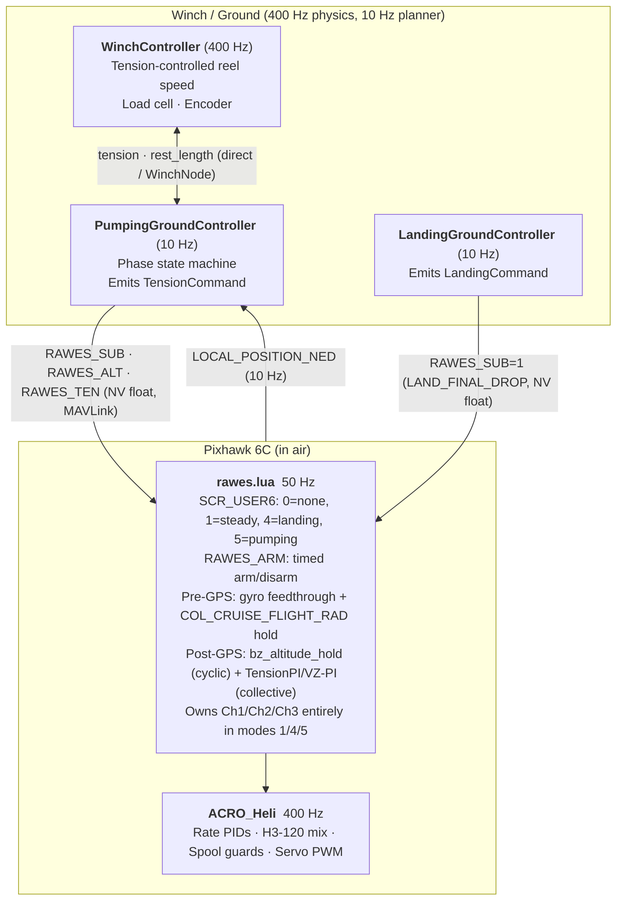
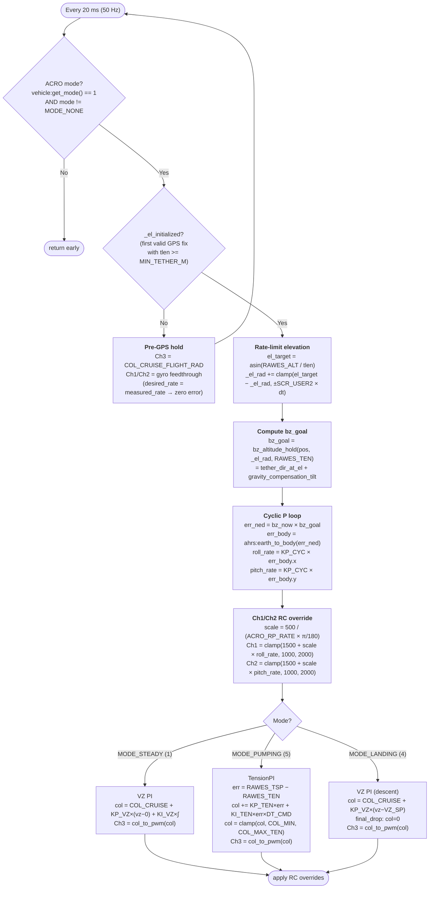

# RAWES — Flight Control Stack Reference

Complete reference for the deployed RAWES flight control system: ground planner, winch
controller, Pixhawk Lua scripts, ArduPilot configuration, and startup/arming procedures.

---

## 1. System Architecture

Three nodes, two communication boundaries. The Pixhawk runs two loops: the 400 Hz ArduPilot
main loop (ACRO_Heli) and the Lua scripting scheduler (50 Hz). Lua writes RC overrides that
the main loop consumes at full rate. rawes.lua owns all cyclic and collective control — the
ground station only sends NV floats (RAWES_SUB, RAWES_ALT, RAWES_TEN) and reads telemetry.



**Key design principles:**

- **rawes.lua owns all flight control.** Cyclic (Ch1/Ch2) and collective (Ch3) are written by
  Lua in modes 1, 4, and 5. The ground station never sends SET_ATTITUDE_TARGET.
- **Altitude hold is tether-geometry based.** `bz_altitude_hold` computes a body_z setpoint
  that holds elevation angle toward the target altitude, with gravity-compensation tilt. It is
  derived purely from hub position and tether geometry — no barometer, no vz feedback for cyclic.
- **TensionPI lives in rawes.lua (pumping).** Lua closes the collective loop on tether tension
  feedback received via `RAWES_TEN`. The ground planner manages phase timing and winch.
- **WinchController is tension-controlled.** Cruise speed is proportional to tension error
  (`kp*(T_measured - T_target)`); reel-out drives energy generation; reel-in holds target length.
- **Dual GPS for yaw.** EK3_SRC1_YAW=2 (RELPOSNED moving-baseline, two F9P antennas 50 cm
  apart). Compass disabled. Yaw known from first GPS fix — no motion required.

---

## 2. Concepts & Glossary

### 2.1 Glossary

| Term | Meaning |
|---|---|
| body_z | Unit vector along the rotor axle (spin axis), NED frame |
| bz_altitude_hold | Function: given hub position + target elevation + tension → body_z_eq that holds altitude. Mirrors Python `compute_bz_altitude_hold`. |
| Elevation hold | Rate-limited azimuth-preserving slew of body_z toward the tether direction at `asin(target_alt / tether_len)`. |
| TensionPI | Collective PI controller: error = tension_setpoint − tension_measured → collective_rad. Lives in rawes.lua (pumping) and Python TensionApController (simtests). |
| TensionCommand | Ground→AP 10 Hz message: (tension_setpoint_n, tension_measured_n, alt_m, phase). AP's TensionPI feeds on the ground-transmitted tension_measured_n. |
| NED | North-East-Down coordinate frame. Altitude = −pos[2]. Up = [0,0,−1]. |
| Slerp | Spherical linear interpolation — moves body_z toward a target at a constant angular rate (rad/s). Uses Rodrigues rotation component-wise (no quaternion library in Lua). |
| Rodrigues | Rotates unit vector v around axis k by angle θ: `v·cos(θ) + (k×v)·sin(θ) + k·(k·v)·(1−cos(θ))`. Used in rawes.lua for cyclic projection and slerp. |
| xi | Angle between body_z and the horizontal wind direction [deg]. xi=0 → tether-aligned. xi=80° → disk nearly perpendicular to wind (reel-in tilt). |
| RAWES_SUB | Named float sent by ground planner to rawes.lua: pumping substates 0–4, or landing LAND_FINAL_DROP=1. |
| RAWES_ALT | Named float: target altitude [m] above anchor. Lua rate-limits elevation toward `asin(RAWES_ALT/tlen)`. |
| RAWES_TEN | Named float: tether tension estimate [N] from ground load cell. Lua TensionPI feeds on this. |
| RAWES_ARM | Named float: arm vehicle + timed disarm countdown [ms]. Re-send refreshes timer. |

### 2.2 Physical and Control Variables

| Symbol | Name | Description |
|---|---|---|
| pos | Hub position | 3D position of rotor hub in NED [m] |
| vel | Hub velocity | 3D velocity of rotor hub in NED [m/s] |
| body_z | Disk axis | Unit vector along rotor axle (≈ tether direction at equilibrium) |
| xi | Disk tilt from wind | Angle between body_z and horizontal wind direction [deg] |
| el | Tether elevation | `asin(alt / tlen)` — elevation angle of tether above horizontal [rad] |
| T | Tether tension | Force along tether at anchor [N] |
| L0 | Tether rest length | Unstretched tether length [m], changed by winch |
| theta_col | Collective pitch | Average blade pitch [rad]; Ch3 RC override 1000–2000 µs |
| v_winch | Winch speed | Tether length change rate [m/s]. +ve = pay out, −ve = reel in |

---

## 3. Ground Station

### 3.1 Overview

The ground station runs the phase state machine (PumpingGroundController, 10 Hz) and the
winch (WinchController, 400 Hz). It reads the load cell to get tension, and sends three NV
floats to rawes.lua: RAWES_SUB (phase), RAWES_ALT (target altitude), and RAWES_TEN (tension
measurement used as TensionPI feedback inside Lua). The ground station never commands
collective directly — rawes.lua owns Ch3.

### 3.2 Pumping Cycle (De Schutter 2018)

```
Reel-out (power phase): disk tether-aligned (xi~30–55°), TensionPI targets 435 N.
   Winch pays out against tension → generator power. target_alt constant.

Transition (t_transition ~3.7 s): altitude ramp up; body_z slews toward reel-in tilt.

Reel-in (recovery phase): disk at xi~50°, TensionPI targets 226 N.
   Winch reels in at low tension cost.

Transition-back: altitude ramp back down; body_z slews back to tether alignment.
```

**Phase state machine (PumpingGroundController → TensionCommand at 10 Hz):**

| Phase | RAWES_SUB | tension_setpoint_n | RAWES_ALT |
|---|---|---|---|
| hold | 0 | 435 N | IC altitude |
| reel-out | 1 | 435 N | IC altitude |
| transition | 2 | 435→226 N ramp | Ramps UP over t_transition |
| reel-in | 3 | 226 N | tlen×sin(el_reel_in_rad) |
| (transition-back implied by next reel-out start) | — | 226→435 N | Ramps DOWN at next reel-out start |

**Altitude smoothing:** Ground owns all alt_m ramps. AP must not add a second layer — it
already rate-limits elevation at 0.40 rad/s. Sudden jumps are ground-controller bugs, detected
by `ap_unreachable_alt` in `BadEventLog` (gap > slew_rate × 1 s flagged).

**WinchController (400 Hz, tension-controlled):**

```
reel-out: winch_target_tension = tension_ic (300 N)
   v_cruise = kp × (T_measured − 300 N). At T=435 N: v = 0.005 × 135 = 0.675 m/s → capped at 0.40 m/s.
   Setting target=435 N instead would give near-zero speed — wrong.

reel-in: winch_target_tension = tension_in (226 N)
   v_cruise = kp × (226 N − T_measured). Slack boost below 30 N: speed approaches 2× nominal.
```

| Parameter | Value | Purpose |
|---|---|---|
| kp | 0.005 (m/s)/N | Cruise speed per tension error |
| v_max_out | 0.40 m/s | Reel-out cap |
| v_max_in | 0.80 m/s | Reel-in cap |
| accel_limit | 0.5 m/s² | Trapezoidal motion profile |
| T_soft_max | 470 N | Generator taper starts |
| T_hard_max | 496 N | Motor current limit (80% break load) |
| T_reel_in_start | 250 N | Gate: AP must reduce tension before reel-in motor engages |
| T_soft_min | 30 N | Slack boost start |
| T_hard_min | 10 N | Maximum slack boost speed |

### 3.3 TensionCommand Protocol

Ground→AP command packet (10 Hz), carried by `VirtualComms` (simtest) or `GcsComms` (stack):

```python
@dataclass(frozen=True)
class TensionCommand:
    tension_setpoint_n: float   # PI setpoint; AP's TensionPI drives collective to reach this
    tension_measured_n: float   # Load cell reading; AP uses as PI feedback (ground-transmitted)
    alt_m: float                # Target altitude; AP rate-limits elevation toward asin(alt/tlen)
    phase: str                  # "hold" | "reel-out" | "transition" | "reel-in"
```

**Feasibility checks in TensionApController (`BadEventLog` events):**

| Event | Condition | Fault |
|---|---|---|
| `ap_impossible_alt` | alt_m > tether_length | Ground sent physically unreachable altitude |
| `ap_unreachable_alt` | elevation gap > slew_rate × 1 s | Ground jumped altitude too fast |

If `ap_*` events fire → ground planner sent bad commands. Slack/spike without `ap_*` → AP
tracking failure.

### 3.4 Winch Node Protocol Boundary

`WinchNode` (`winch_node.py`) enforces the physics/planner separation:

- Physics calls `update_sensors(tension, wind_world)` after each 400 Hz physics step.
- Planner reads `get_telemetry()` → `{tension_n, tether_length_m, wind_ned}` only.
- Planner calls `receive_command(speed, dt)` → `WinchController.step()`.
- Wind seed for `WindEstimator` (if used) comes from `Anemometer.measure()` at 3 m height,
  not the raw wind vector.

---

## 4. Pixhawk Lua Scripts

### 4.1 rawes.lua Overview

Single unified controller (`simulation/scripts/rawes.lua`) running at 50 Hz (FLIGHT_PERIOD_MS=20)
on a 100 Hz base tick (BASE_PERIOD_MS=10).

**SCR_USER parameter slots:**

| Parameter | SCR_USER | Default | Description |
|---|---|---|---|
| RAWES_KP_CYC | SCR_USER1 | 1.0 | Cyclic outer P gain [rad/s per rad of body_z error] |
| RAWES_BZ_SLEW | SCR_USER2 | 0.40 | body_z slew rate limit [rad/s] |
| RAWES_ANCHOR_N | SCR_USER3 | 0.0 | Anchor North from EKF origin [m] |
| RAWES_ANCHOR_E | SCR_USER4 | 0.0 | Anchor East from EKF origin [m] |
| RAWES_ANCHOR_D | SCR_USER5 | varies | Anchor altitude above EKF origin [m]. Set to `−initial_state["pos"][2]` (NED Z negated). |
| RAWES_MODE | SCR_USER6 | 0 | Mode selector: 0=none, 1=steady, 4=landing, 5=pumping |

**Named float inputs (ground → Lua, via `gcs.send_named_float`):**

| Name | Value | Purpose |
|---|---|---|
| RAWES_ARM | ms | Arm vehicle + start disarm countdown of `ms` milliseconds. Re-send refreshes timer. |
| RAWES_SUB | 0–4 | Pumping substate or landing trigger (LAND_FINAL_DROP=1) |
| RAWES_ALT | m | Target altitude above anchor. Lua rate-limits elevation at SCR_USER2 rad/s. |
| RAWES_TEN | N | Tether tension estimate from load cell. Used as TensionPI feedback in mode 5. |

`_nv_floats` dict resets to `{}` on every mode change.

**Key physical constants:**

| Constant | Value | Meaning |
|---|---|---|
| MASS_KG | 5.0 | Hub + rotor mass |
| G_ACCEL | 9.81 | Gravity [m/s²] |
| MIN_TETHER_M | 0.5 | Minimum tether length before GPS init activates elevation hold |
| COL_MIN_RAD | −0.28 | Hard collective floor [rad] |
| COL_MAX_RAD | 0.10 | Hard collective ceiling [rad] |
| COL_CRUISE_FLIGHT_RAD | −0.18 | Pre-GPS collective hold; VZ integrator warm-start value |
| COL_SLEW_MAX | 0.022 | Max collective change per 50 Hz step [rad/step] |
| ACRO_RP_RATE_DEG | 360.0 | Must match ArduPilot ACRO_RP_RATE parameter |

### 4.2 Pre-GPS Stabilization (all modes)

Before `_el_initialized` is set (first valid GPS position fix with tlen ≥ MIN_TETHER_M):

1. Hold collective at `COL_CRUISE_FLIGHT_RAD` (−0.18 rad) to prevent tension runaway.
2. Feed gyro through to Ch1/Ch2: ACRO desired_rate = measured_rate → rate_error = 0 →
   zero corrective torque → natural orbital rate preserved.

On first valid GPS fix: initialize `_el_rad` and `_target_alt` from position, set
`_el_initialized = true`, send STATUSTEXT.

### 4.3 Mode 1 — Steady (SCR_USER6=1)

Post-GPS, each 50 Hz step:

1. Rate-limit `_el_rad` toward `asin(RAWES_ALT / tlen)` at SCR_USER2 rad/s.
2. Compute `bz_goal = bz_altitude_hold(pos, _el_rad, RAWES_TEN)` — tether direction
   at rate-limited elevation + gravity-compensation tilt (mirrors Python `compute_bz_altitude_hold`).
3. Cyclic P loop: `err = bz_now × bz_goal` projected to body frame →
   `ch1 = rate_to_pwm(KP_CYC × err.x)`, `ch2 = rate_to_pwm(KP_CYC × err.y)`.
4. Collective: VZ PI controller (`KP_VZ=0.05`, `KI_VZ=0.005`, `vz_sp=0`).

**Ch3 ownership:** Lua owns Ch3 entirely in mode 1. Ground does not send collective.

### 4.4 Mode 5 — Pumping (SCR_USER6=5)

Phase driven by `NAMED_VALUE_FLOAT("RAWES_SUB", N)` from ground. Collective uses TensionPI
(mirrors Python `TensionPI`); cyclic uses altitude hold.

**TensionPI constants (rawes.lua):**

| Constant | Value | Meaning |
|---|---|---|
| KP_TEN | 2e-4 | Proportional gain [rad/N] |
| KI_TEN | 1e-3 | Integral gain [rad/(N·step)] at DT_CMD=0.1 s steps |
| COL_MAX_TEN | 0.0 | TensionPI collective ceiling [rad] |
| DT_CMD | 0.1 s | Integration step for TensionPI (10 Hz command rate) |

**Setpoints by substate:**

| RAWES_SUB | Phase | TensionPI setpoint |
|---|---|---|
| 0 | hold | TEN_REEL_OUT = 435 N |
| 1 | reel_out | TEN_REEL_OUT = 435 N |
| 2 | transition | TEN_REEL_OUT = 435 N |
| 3 | reel_in | TEN_REEL_IN = 226 N |
| 4 | transition_back | TEN_REEL_OUT = 435 N |

Integrator warm-starts at `COL_REEL_OUT / KI_TEN` on first mode entry. Feedback is
`RAWES_TEN` (ground load cell). Altitude hold: ground sends `RAWES_ALT = IC_altitude`
(constant in simtest; Python simtest holds constant altitude).

### 4.5 Mode 4 — Landing (SCR_USER6=4)

**Architecture (unified):**

```
LandingGroundController (10 Hz) → LandingCommand → LandingApController (400 Hz) + WinchController (400 Hz)
```

Lua receives `RAWES_SUB=1` (LAND_FINAL_DROP) from ground planner when `cmd.phase=="final_drop"`.

**Phases:**

| Phase | body_z | Collective | Winch |
|---|---|---|---|
| reel_in | slerps xi~30°→80° | VZ PI (vz_sp=0) | holds at IC length |
| descent | fixed (xi~80°) | VZ PI (vz_sp=0.5 m/s) | tension target=180 N → v_land |
| final_drop | hold last | collective=0 | hold |

**Lua landing (mode 4) algorithm:**

1. Gate on `ahrs:healthy()`. Until healthy, return early.
2. On first healthy call: capture `_bz_eq0` from AHRS. Send "RAWES land: captured" STATUSTEXT.
3. Collective: `col_cmd = COL_CRUISE_FLIGHT_RAD + KP_VZ × (vz_actual − VZ_LAND_SP)`
   where `VZ_LAND_SP=0.5 m/s` (positive = descending in NED). `KP_VZ=0.05`.
4. Final drop: when ground sends `RAWES_SUB=1` (LAND_FINAL_DROP): set collective=0,
   send "RAWES land: final_drop" STATUSTEXT.
5. Cyclic: altitude hold at current tether direction (body_z tracks tether as hub descends).

**Fixture `acro_armed_landing_lua`:** hub at xi~80°
(`pos0=[0.0, 3.473, −19.696]`, `vel0=[0.0, 0.96, 0.0]`, `tether_rest_length=20 m`,
`kinematic_vel_ramp_s=20.0` so hub exits kinematic at vel=0 — eliminates tether jolt).

### 4.6 RAWES_ARM: Timed Arm/Disarm

`NAMED_VALUE_FLOAT("RAWES_ARM", ms)` arms the vehicle and starts a disarm countdown.
Re-sending refreshes the timer. Works in any mode.

**State machine:** `"interlock_low"` → `"arming"` → `"armed"` → timed disarm

**SITL sequence:**
1. GCS force-arms the vehicle (bypasses SITL prearm failures).
2. GCS sends `NAMED_VALUE_FLOAT("RAWES_ARM", ms)`.
3. Lua sets Ch3=1000 (throttle low), Ch8=2000 (motor interlock ON), starts countdown.
4. Once `arming:is_armed()` true: Lua sends "RAWES arm-on: armed, expires in Xs".
5. On expiry: Lua calls `arming:disarm()`, sends "RAWES arm-on: expired, disarmed".

**On hardware:** `arming:arm()` can be called directly from Lua (no force arm needed).

### 4.7 Channel Ownership

| Channel | Owner | Rate | Path |
|---|---|---|---|
| Ch1 — roll rate | rawes.lua | 50 Hz | body_z error (roll component) → ACRO ATC_RAT_RLL PID → swashplate |
| Ch2 — pitch rate | rawes.lua | 50 Hz | body_z error (pitch component) → ACRO ATC_RAT_PIT PID → swashplate |
| Ch3 — collective | rawes.lua (modes 1/4/5) | 50 Hz | VZ PI (mode 1), VZ descent (mode 4), TensionPI (mode 5). Mode 0: not overridden. |
| Ch4 — yaw | rawes.lua holds 1500 µs | 50 Hz | Neutral — prevents ACRO yaw integrator windup. ATC_RAT_YAW drives SERVO4 independently. |
| Ch8 — motor interlock | rawes.lua (RAWES_ARM active) | 50 Hz | 2000 µs (interlock ON) while armed; 1000 µs during disarm transition. |
| SERVO4 — GB4008 | ArduPilot ATC_RAT_YAW | 400 Hz | DDFP CCW (H_TAIL_TYPE=4): sign flip → positive throttle counters CW hub drift. rawes.lua does NOT write SERVO4. |

### 4.8 Yaw Regulation — ArduPilot ATC_RAT_YAW

Yaw regulation is handled entirely by ArduPilot's built-in yaw rate PID. rawes.lua writes
no commands to the GB4008 motor.

```
Sensing:    gyro.z (from ACRO_Heli EKF attitude)
Control:    ATC_RAT_YAW P/I/D → SERVO4 (H_TAIL_TYPE=4 DDFP CCW)
Actuator:   GB4008 motor via standard PWM on MAIN OUT 4 (IOMCU)
```

**H_TAIL_TYPE=4 (DDFP CCW):** applies sign flip before thrust mapping.

```
CW hub drift → positive psi_dot → yaw error = 0 − positive = negative PID
CCW sign flip: −PID → +throttle → GB4008 counters drift. ✓
Type 3 (no flip): −PID → clamped to 0 → motor stays off → drift uncorrected. ✗
```

**Biased throttle mapping in SITL** (`mediator_torque.py`):

```
pwm ≤ 1500 µs: throttle = trim × (pwm − 1000) / 500
pwm > 1500 µs: throttle = trim + (1 − trim) × (pwm − 1500) / 500
trim = equilibrium_throttle(omega_rotor) ≈ 0.485 at omega_rotor=28 rad/s
```

Equilibrium throttle: `throttle_eq = omega_rotor × GEAR_RATIO / RPM_SCALE = 28 × 1.818 / 105 ≈ 0.485`

### 4.9 Simulation Mapping

| Lua component | Python equivalent | File |
|---|---|---|
| `bz_altitude_hold` | `compute_bz_altitude_hold` | `controller.py` |
| `_el_rad` rate-limiting | `AltitudeHoldController.update` | `controller.py` |
| TensionPI collective (mode 5) | `TensionPI.update` | `controller.py` |
| VZ PI collective (mode 1) | `TensionApController._vz_pi` | `ap_controller.py` |
| Cyclic P loop | `compute_rate_cmd` | `controller.py` |
| ACRO ATC_RAT_RLL/PIT (rate damping) | `RatePID(kp=2/3)` | `controller.py` |
| RAWES_ARM state machine | N/A — Lua only | `rawes.lua` |
| ATC_RAT_YAW (yaw regulation) | `torque_model.py` hub ODE | `mediator_torque.py` |

---

## 5. Yaw / Torque Compensation

### 5.1 The Problem

The RAWES rotor (blades + outer hub shell) spins freely in autorotation. The stationary inner
assembly (flight controller, battery, servos) must maintain a fixed heading while the outer shell
spins. The GB4008 anti-rotation motor counters the reaction torque from rotor drag.

### 5.2 Actuator: GB4008 + 80:44 Gear

**Motor:** EMAX GB4008, 66 KV, hollow shaft, stator fixed to inner assembly.
**ESC:** REVVitRC 50A AM32 (standard PWM, 800–2000 µs).
**Gear:** 80:44 spur (motor runs at 1.818× rotor hub speed).

Motor shaft speed tracks PWM with a first-order lag (MOTOR_TAU=20 ms):

```
d(omega_motor)/dt = (throttle × RPM_SCALE − omega_motor) / MOTOR_TAU
```

Inner assembly yaw rate: `psi_dot = omega_rotor − omega_motor / GEAR_RATIO`

**Model parameters:**

| Symbol | Value | Source |
|---|---|---|
| RPM_SCALE | 105 rad/s | GB4008 66KV × 15.2V (4S LiPo) |
| GEAR_RATIO | 80/44 ≈ 1.818 | Motor pinion faster than rotor |
| MOTOR_TAU | 0.02 s | Typical BLDC + ESC step response |

H_YAW_TRIM = −(throttle_eq − SPIN_MIN)/(SPIN_MAX − SPIN_MIN) = −0.419

### 5.3 Key Parameters

| Parameter | Value | Purpose |
|---|---|---|
| H_TAIL_TYPE | 4 (DDFP CCW) | Sign flip: negative yaw error → positive GB4008 throttle |
| ATC_RAT_YAW_P | 0.20 | Starting P gain |
| ATC_RAT_YAW_I | 0.05 | Corrects residual yaw not cancelled by trim |
| ATC_RAT_YAW_D | 0.0 | Start at zero |
| ATC_RAT_YAW_IMAX | 0 | No integrator windup |

---

## 6. ArduPilot Configuration

### 6.1 Scripting Parameters

| Parameter | Value | Reason |
|---|---|---|
| SCR_ENABLE | 1 | Enable Lua scripting subsystem |
| SCR_USER1 | 1.0 | RAWES_KP_CYC — cyclic P gain; start at 0.3 on hardware |
| SCR_USER2 | 0.40 | RAWES_BZ_SLEW — body_z slew rate [rad/s] |
| SCR_USER3/4 | 0.0 | Anchor N/E offsets from EKF origin [m] |
| SCR_USER5 | −pos0[2] | Anchor altitude above EKF origin [m]. Must be set post-arm. |
| SCR_USER6 | 0/1/4/5 | RAWES_MODE selector |

**SCR_ENABLE bootstrap:** After EEPROM wipe, Lua only starts if SCR_ENABLE=1 is already in
EEPROM. The `acro_armed_lua` fixture sets it via MAVLink post-arm (persists for future boots).
Lua is unavailable on the first boot from a fresh EEPROM.

### 6.2 Swashplate and RSC

| Parameter | Value | Reason |
|---|---|---|
| FRAME_CLASS | 6 (Heli) | Traditional helicopter frame |
| H_SWASH_TYPE | 3 (H3_120) | 3-servo lower ring at 120° |
| H_RSC_MODE | 1 (CH8 passthrough) | Wind-driven rotor — instant runup_complete |
| H_SW_PHANG | 0 (confirmed) | No phase offset. Built-in +90° roll advance in H3_120 already aligns with RAWES layout. Cross-coupling <20% confirmed via test_h_phang. |
| H_COL_MIN | 1000 µs | Full servo range (not default 1250–1750) |
| H_COL_MAX | 2000 µs | Full servo range |
| SERVO1_FUNCTION | 33 (Motor1/S1) | Swashplate servo S1 |
| SERVO2_FUNCTION | 34 (Motor2/S2) | Swashplate servo S2 |
| SERVO3_FUNCTION | 35 (Motor3/S3) | Swashplate servo S3 |
| ACRO_TRAINER | 0 | Disable leveling (equilibrium is 65° from vertical) |
| ACRO_RP_RATE | 360 | Must match constant in rawes.lua |
| ATC_RAT_RLL_IMAX | 0 | Prevent orbital angular rate integrator windup |
| ATC_RAT_PIT_IMAX | 0 | Same |
| ATC_RAT_YAW_IMAX | 0 | Same |

**Why ACRO, not STABILIZE:** The hub has no passive stability. ACRO converts RC rate commands to
cyclic without attitude restoration toward level. rawes.lua supplies the continuous rate commands
needed to hold body_z at the natural 65° tether tilt. STABILIZE commands cyclic to drive
roll=0/pitch=0 and crashes within seconds. Do not switch to STABILIZE.

### 6.3 GPS Configuration (Dual F9P, RELPOSNED Yaw)

| Parameter | Value | Reason |
|---|---|---|
| EK3_SRC1_YAW | 2 | Dual-antenna GPS yaw (RELPOSNED moving baseline) |
| EK3_GPS_CHECK | 0 | Mask GPS quality checks (SITL GPS has no real quality fields) |
| EK3_POS_I_GATE | 50.0 | Widened innovation gate (extreme attitude causes apparent position noise) |
| EK3_VEL_I_GATE | 50.0 | Same |
| GPS_AUTO_CONFIG | 0 | **Critical:** prevents ArduPilot from reconfiguring F9P chips, which corrupts RELPOSNED in SITL |
| GPS1_TYPE | 17 (F9P RTK_BASE) | Master antenna: sends RTCM corrections |
| GPS2_TYPE | 18 (F9P RTK_ROVER) | Rover antenna: receives RTCM, outputs RELPOSNED |
| GPS1_POS_X | 0.25 m | +25 cm along body X |
| GPS2_POS_X | −0.25 m | −25 cm along body X (50 cm baseline → ~1° yaw error at 50 cm) |
| SIM_GPS2_DISABLE | 0 | Enable second GPS in SITL |
| SIM_GPS2_HDG | 1 | Generate RELPOSNED heading field in SITL |
| COMPASS_USE | 0 | Disabled — GB4008 swamps magnetometer on hardware; cycles corrupt GPS fusion in SITL |
| COMPASS_ENABLE | 0 | Same |

**GPS fusion timeline (stationary kinematic hold, dual GPS):**

| Event | Time from mediator start |
|---|---|
| EKF3 tilt alignment | ~4–5 s |
| GPS detected (SITL JSON backend) | ~8 s |
| gpsGoodToAlign=true (10 s mandatory delay from GPS detect) | ~18 s |
| delAngBiasLearned=true (constant-zero gyro during stationary hold) | ~21 s |
| GPS fuses ("EKF3 IMU0 is using GPS") | **~34 s** |
| `_el_initialized` fires in rawes.lua | **~34 s** (on first valid position fix) |
| kinematic exit (startup_damp_seconds=80 s) | **80 s** |

With dual GPS (EK3_SRC1_YAW=2): yaw is known from the first GPS fix. No motion required.
`delAngBiasLearned` converges at ~21 s with constant-zero gyro (stationary hold). GPS fuses
at ~34 s — well before kinematic exit at 80 s.

### 6.4 GB4008 Anti-Rotation Motor

| Parameter | Value | Reason |
|---|---|---|
| H_TAIL_TYPE | 4 (DDFP CCW) | Routes ATC_RAT_YAW PID to SERVO4 with CCW sign flip |
| SERVO4_FUNCTION | 36 (Motor4) | GB4008 ESC on MAIN OUT 4 |
| SERVO4_MIN | 800 µs | ESC disarm |
| SERVO4_MAX | 2000 µs | ESC maximum |
| ATC_RAT_YAW_P | 0.20 | Starting value |
| ATC_RAT_YAW_I | 0.05 | Corrects residual drift |
| ATC_RAT_YAW_D | 0.0 | Start at zero |

---

## 7. Takeoff & Landing

### 7.1 Takeoff

```
1. Ground: spin rotor to omega_spin ≥ omega_min (~10–15 rad/s). Monitor ESC RPM.
2. Release mechanism drops rotor. Lift > weight → rapid climb.
3. Tether pays out. Once taut, tension develops and lateral stability begins.
4. rawes.lua pre-GPS phase: gyro feedthrough + COL_CRUISE_FLIGHT_RAD hold until GPS fuses.
5. GPS fuses → _el_initialized → altitude hold + TensionPI active.
6. Ground planner begins pumping cycle.
```

### 7.2 Landing — Unified Architecture

**Three phases (LandingGroundController → LandingApController + WinchController):**

```
Phase 1 — reel_in:
    body_z slerps xi~30°→80° (same tether-alignment direction, just tilting disk upward).
    Winch holds at IC tether length. VZ PI (vz_sp=0) holds altitude.

Phase 2 — descent:
    body_z fixed (disk nearly horizontal at xi~80°).
    Winch tension target=180 N: kp×(180−natural_T) gives v_land.
    VZ PI (vz_sp=0.5 m/s): Lua holds Ch3 via rawes.lua mode 4.

Phase 3 — final_drop:
    Ground sends RAWES_SUB=LAND_FINAL_DROP (=1).
    Lua sets collective=0. Hub drops last ~2 m.
```

**Why vertical (not spiral) descent:** As tether shortens during orbit, orbital speed increases
(figure-skater). At short tether lengths, orbital speed exceeds reel-in rate → slack → tension
spikes. Vertical descent above the anchor avoids this.

**Why descent rate controller, not TensionPI:** TensionPI reacts to tension error. Hub faster
than winch → slack → near-zero tension → TensionPI commands max collective → tether snaps taut
→ oscillation. VZ PI reacts to hub velocity directly (from LOCAL_POSITION_NED).

---

## Appendix A. 50 Hz Control Loop



---

## Appendix B. Startup & Arming

### B.1 SITL Arm Sequence (non-Lua tests)

```python
params = {
    "ARMING_SKIPCHK": 0xFFFF,  # skip ALL pre-arm checks (4.7+ name; ARMING_CHECK silently fails)
    "H_RSC_MODE":     1,        # CH8 passthrough — instant runup_complete
    "FS_THR_ENABLE":  0,        # no RC throttle failsafe
    "FS_GCS_ENABLE":  0,        # no GCS heartbeat failsafe
}
# Sequence:
# 1. Set params above
# 2. Wait for ATTITUDE messages (EKF attitude aligned)
# 3. Send CH8=2000 (motor interlock ON; RSC at setpoint for mode 1)
# 4. Send force arm (param2=21196 in MAV_CMD_COMPONENT_ARM_DISARM)
# 5. HEARTBEAT shows armed=True immediately (mode 1 = instant runup_complete)
```

### B.2 RAWES_ARM Lua Timer (Lua tests)

```python
# Sequence:
# 1. GCS force-arms the vehicle
# 2. GCS sends NAMED_VALUE_FLOAT("RAWES_ARM", ms)
# 3. Lua holds Ch3=1000 + Ch8=2000, starts countdown
# 4. Sends "RAWES arm-on: armed, expires in Xs" STATUSTEXT once arming:is_armed()
# 5. On expiry: arming:disarm(), sends "RAWES arm-on: expired, disarmed"
```

### B.3 Common Failure Modes

| Symptom | Cause | Fix |
|---|---|---|
| "PreArm: Motors: H_RSC_MODE invalid" | H_RSC_MODE=0 (SITL default) | Set H_RSC_MODE=1 |
| COMMAND_ACK ACCEPTED but HEARTBEAT never armed | RSC not at runup_complete | Use H_RSC_MODE=1 + CH8=2000 |
| GPS never fuses | GPS_AUTO_CONFIG=1 corrupts RELPOSNED | Set GPS_AUTO_CONFIG=0 |
| GPS fuses then drops — compass cycles | COMPASS_ENABLE=1 synthetic compass cycling every 10 s | Set COMPASS_USE=0, COMPASS_ENABLE=0 |
| `_el_initialized` never fires | Tether < MIN_TETHER_M (0.5 m) or no valid position | Verify GPS fusion + tether length |
| rawes.lua not running | SCR_ENABLE=0 in EEPROM (first boot after wipe) | Re-boot; fixture sets SCR_ENABLE=1 via MAVLink post-arm |

### B.4 Parameter Reference

| Parameter | Value | Reason |
|---|---|---|
| ARMING_SKIPCHK | 0xFFFF | Skip all pre-arm checks (4.7+ name) |
| H_RSC_MODE | 1 | CH8 passthrough — instant runup_complete |
| COMPASS_USE | 0 | Disabled — GB4008 interference on hardware; cycling in SITL |
| COMPASS_ENABLE | 0 | Same |
| GPS_AUTO_CONFIG | 0 | Do not reconfigure F9P chips (corrupts RELPOSNED) |
| FS_THR_ENABLE | 0 | No RC throttle failsafe (SITL has no real RC) |
| FS_GCS_ENABLE | 0 | No GCS heartbeat failsafe |
| INITIAL_MODE | 1 | Boot into ACRO |

---

## Appendix C. ArduPilot Internals

### C.1 ArduCopter Helicopter Arming

Two-stage arm:

1. **Pre-arm checks** — `AP_Arming_Copter::arm()`. Force arm (`param2=21196`) bypasses.
   `ARMING_SKIPCHK=0xFFFF` disables all checks.

2. **Motor armed state** — `AP_MotorsHeli::output()` runs every loop; resets `_flags.armed=false`
   if `is_armed_and_runup_complete()` returns false. **Not bypassed by force arm.**
   HEARTBEAT armed bit = false until RSC completes runup. With H_RSC_MODE=1, runup completes
   instantly when CH8=2000.

### C.2 RSC Modes

| Mode | Name | Runup behaviour |
|---|---|---|
| 0 | Disabled | **Invalid** — "PreArm: Motors: H_RSC_MODE invalid" |
| 1 | CH8 Passthrough | Immediate — RSC = CH8. **Use for SITL.** |
| 2 | Setpoint | Ramp to H_RSC_SETPOINT; requires H_RUNUP_TIME > H_RSC_RAMP_TIME |
| 4 | External Governor | Requires RPM telemetry from ESC |

### C.3 Motor Interlock (CH8)

| CH8 | State | RSC |
|---|---|---|
| 1000 µs | LOW (disabled) | RSC output = 0 |
| 2000 µs | HIGH (enabled) | RSC can run |

---

## Appendix D. EKF3 GPS Position Fusion

### D.1 readyToUseGPS() Gate

GPS position fusion begins only when all six conditions hold simultaneously:

```cpp
bool NavEKF3_core::readyToUseGPS(void) const {
    return validOrigin && tiltAlignComplete && yawAlignComplete
        && (delAngBiasLearned || assume_zero_sideslip())
        && gpsGoodToAlign && gpsDataToFuse;
}
```

### D.2 gpsGoodToAlign (10-second mandatory delay)

`calcGpsGoodToAlign()` sets `lastGpsVelFail_ms=now` on its first call regardless of check
results. `EK3_GPS_CHECK=0` masks quality checks (HDOP, sats, drift) but the 10-second clock
still runs. GPS position fusion cannot happen until at least 11–12 s after SITL launch.

### D.3 yawAlignComplete — Critical Gate for RAWES

With EK3_SRC1_YAW=2 (dual-antenna GPS, RELPOSNED): yaw is derived from the RELPOSNED
baseline vector between two F9P antennas. Yaw aligns on the first valid GPS fix — no motion
required. This is the key advantage over EK3_SRC1_YAW=1 (compass) or =8 (GSF): those require
either magnetometer (disabled on hardware) or movement.

| EK3_SRC1_YAW | Source | RAWES status |
|---|---|---|
| 0 | None | Fusion never starts |
| 1 | Compass | Works in SITL but compass disabled on hardware |
| 2 | GPS dual-antenna (RELPOSNED) | **Correct for RAWES** |
| 8 | GSF (velocity-derived) | Requires movement — fails at zero velocity |

### D.4 delAngBiasLearned

ArduCopter never calls `set_fly_forward(true)`, so `assume_zero_sideslip()=false`.
`delAngBiasLearned` is required and cannot be bypassed.

With constant-zero gyro (stationary kinematic hold): converges at **~21 s** from SITL start.

### D.5 GPS Fusion Timeline (dual GPS, stationary kinematic, EK3_SRC1_YAW=2)

| Event | Time from mediator start |
|---|---|
| EKF3 tilt alignment | ~4–5 s |
| GPS detected (SITL JSON backend) | ~8 s |
| yawAlignComplete (RELPOSNED, first fix) | ~8 s |
| gpsGoodToAlign=true (10 s delay from GPS detect) | ~18 s |
| delAngBiasLearned=true (constant-zero gyro) | ~21 s |
| GPS position fusion starts | **~34 s** |
| `_el_initialized` fires in rawes.lua | **~34 s** |
| kinematic exit (`startup_damp_seconds=80`) | **80 s** |

GPS fuses at ~34 s, well before kinematic exit at 80 s. The hub is fully under Lua altitude
hold during kinematic (synthetic sensors keep physics consistent). Unlike the old
kinematic_vel_ramp approach, the stationary hold (`vel0=[0,0,0]`, `kinematic_vel_ramp_s=0`)
does not require velocity tapering for GPS fusion — dual-antenna yaw eliminates the velocity
dependency.

### D.6 Kinematic Phase Sensor Consistency

All sensors sent during kinematic must be physically consistent with the prescribed trajectory:

```
accel_body = R.T @ (d_vel/dt − gravity)
           = R.T @ [0, 0, −9.81]    (for stationary hold: d_vel/dt = 0)
gyro_body  = R.T @ omega_body       (full body angular velocity; no stripping)
vel        = [0, 0, 0]              (stationary hold)
```

Verify with `validate_sitl_sensors.py` after any kinematic change.

### D.7 Required Parameters for GPS Fusion

| Parameter | Required value | Why |
|---|---|---|
| EK3_SRC1_YAW | 2 | Dual-antenna GPS yaw (RELPOSNED) |
| EK3_GPS_CHECK | 0 | Mask quality checks (SITL GPS lacks real quality fields) |
| EK3_POS_I_GATE | 50 | Widened gate (extreme attitude → apparent position noise) |
| EK3_VEL_I_GATE | 50 | Same |
| GPS_AUTO_CONFIG | 0 | Preserve RELPOSNED stream |
| COMPASS_USE | 0 | Disabled |
| COMPASS_ENABLE | 0 | Disabled |

### D.8 CONST_POS_MODE Bit

`EKF_STATUS_REPORT.flags` bit 7 (0x0080) = `const_pos_mode`:

```cpp
status.flags.const_pos_mode = (PV_AidingMode == AID_NONE) && filterHealthy;
```

Set when EKF is healthy (tilt + yaw aligned) but has no position/velocity aiding (AID_NONE).
Clears when `readyToUseGPS()` returns true.

---

## Appendix E. Lua API Constraints

| What you'd expect | What actually works |
|---|---|
| `ahrs:get_rotation_body_to_ned()` | Doesn't exist. Use `ahrs:body_to_earth(v)` / `ahrs:earth_to_body(v)` |
| `Vector3f(x, y, z)` | Constructor ignores args. Use `Vector3f()` then `:x()/:y()/:z()` setters |
| `v:normalized()` | Doesn't exist. Copy then `:normalize()` in-place |
| `vec * scalar` or `vec + vec` | `*` not overloaded; `+` may silently fail. Use component arithmetic |
| `rc:set_override(chan, pwm)` | Use `rc:get_channel(n):set_override(pwm)` (cache channel at module load) |
| ArduCopter ACRO = 6 | ACRO = **1**. Mode 6 is RTL |

**"RAWES flight: loaded" STATUSTEXT:** Sent at module load (~1 s after SITL starts). The GCS
connects ~4 s later. This message is always dropped before GCS has an active link — never use
it as a readiness signal. Use periodic diagnostic messages ("RAWES: ch1=...") or wait for
"RAWES land: captured" / GPS fusion events.

**`rawes_test_surface.lua`:** Lua unit tests run rawes.lua in-process via lupa. Constants
and functions are exposed to Python through `_rawes_fns` table in `rawes_test_surface.lua`.
When adding a module-level constant or function to rawes.lua that tests need, also add it to
`_rawes_fns` in the same commit. Function-local variables are not accessible — hoist to module
level first.

---

## Appendix F. Files & References

| File | Description |
|---|---|
| `simulation/scripts/rawes.lua` | Unified Lua controller (modes 0/1/4/5, RAWES_ARM, TensionPI, bz_altitude_hold) |
| `simulation/tests/sitl/rawes_sitl_defaults.parm` | Boot-time ArduPilot params (EKF3, GPS, compass, servos) |
| `simulation/tests/sitl/flight/conftest.py` | Flight fixtures: `acro_armed`, `acro_armed_lua_full`, `acro_armed_pumping_lua`, `acro_armed_landing_lua` |
| `simulation/tests/sitl/stack_infra.py` | Shared infrastructure: `_sitl_stack`, `_acro_stack`, `StackContext`, `SitlContext` |
| `simulation/controller.py` | `compute_bz_altitude_hold`, `AltitudeHoldController`, `TensionPI`, `RatePID`, `compute_rate_cmd`, `OrbitTracker` |
| `simulation/ap_controller.py` | `TensionApController` (400 Hz AP side), `LandingApController` |
| `simulation/pumping_planner.py` | `TensionCommand`, `PumpingGroundController` (10 Hz phase state machine) |
| `simulation/unified_ground.py` | `UnifiedGroundController`, `DirectComms`, `LuaComms`, `GcsComms` |
| `simulation/winch.py` | `WinchController` (tension-controlled, 400 Hz) |
| `simulation/winch_node.py` | `WinchNode` + `Anemometer` (physics/planner protocol boundary) |
| `simulation/physics_core.py` | `PhysicsCore` — shared 400 Hz physics (dynamics, aero, tether, spin ODE, kinematic) |
| `simulation/mediator.py` | SITL co-simulation loop — thin wrapper around PhysicsCore |
| `simulation/torque_model.py` | Hub yaw kinematics: `HubParams`, `HubState`, `step()`, `equilibrium_throttle()` |
| `simulation/mediator_torque.py` | Standalone torque SITL mediator |
| `simulation/comms.py` | `VirtualComms` (simtest), `MavlinkComms` (SITL/hardware) |
| `simulation/gcs.py` | `RawesGCS` MAVLink client: arm, mode, params, RC override, `send_named_float` |
| `simulation/sensor.py` | `PhysicalSensor` — honest NED sensors (accel, gyro, vel) |
| `simulation/analysis/analyse_run.py` | Post-run report: physics + EKF/GPS + attitude per time bucket |
| `simulation/analysis/analyse_landing.py` | Landing diagnosis: alt/vz/winch/tension/collective per bucket |
| `hardware/design.md` | Assembly layout, rotor geometry, swashplate, Kaman flap mechanism |
| `hardware/dshot.md` | DShot reference, AM32 EDT, GB4008 wiring |
| `theory/pumping_cycle.md` | De Schutter 2018 — pumping cycle, aero, structural constraints |
