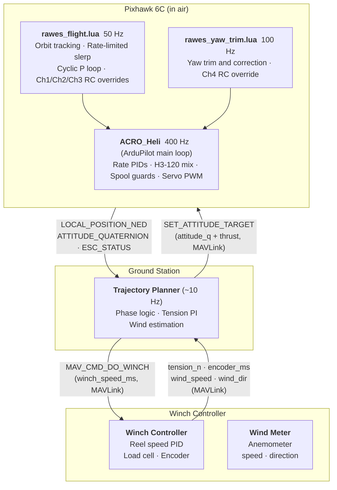
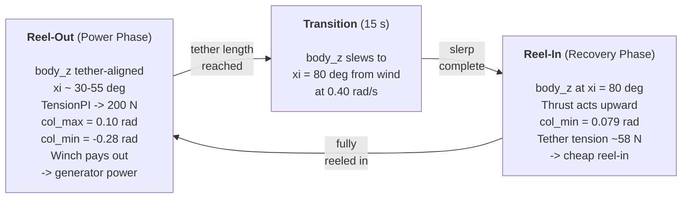
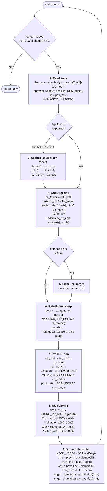

# RAWES -- Flight Control Stack Reference

Complete reference for the deployed RAWES flight control system: ground planner, winch
controller, Pixhawk Lua scripts, ArduPilot configuration, and startup/arming procedures.

---

## 1. System Architecture

Three nodes, two communication boundaries. The Pixhawk runs two distinct loops at different
rates -- the 400 Hz ArduPilot main loop (ACRO_Heli) and the Lua scripting scheduler (50/100 Hz).
Lua writes RC overrides that the main loop consumes at full rate.



**Key design principles:**

- **Natural orbit is free.** Lua orbit-tracking tracks the tether direction at 50 Hz without
  planner involvement. The planner only intervenes to request a specific disk orientation.
- **Inner loops stay on the Pixhawk.** Attitude tracking (cyclic), body_z slewing, and
  counter-torque control run inside Lua scripts at 50-100 Hz. No custom firmware required --
  both scripts run on top of stock ACRO_Heli mode.
- **Winch is a separate MAVLink node.** The Pixhawk is never involved in winch control. The ground station commands winch speed via MAV_CMD_DO_WINCH and receives tension, encoder, and anemometer data back over MAVLink. The wind meter is co-located on the winch node.
- **Thrust field = normalized collective.** The thrust field of SET_ATTITUDE_TARGET carries
  normalized collective [0..1] from the ground PI. The Lua script forwards it directly to
  Ch3 RC override -- no tension awareness on the Pixhawk.

**Tether tension** is measured at the base station, not on the hub. A load cell on the winch
drum measures exactly the right quantity for energy accounting (work = T_base x v_reel).
The base-to-hub tension difference is the tether weight component along the tether
(0.3-3.1 N at operating lengths -- under 5% of operating range; absorbed by PI integrator).

---

## 2. Concepts & Glossary

### 2.1 Glossary

| Term | Meaning |
|---|---|
| body_z | Unit vector along the rotor axle (spin axis) |
| Orbit tracking | Pixhawk-side control that rotates attitude setpoint to match hub orbital position |
| NED | North-East-Down coordinate frame (X=North, Y=East, Z=Down). Up is [0,0,-1] |
| Rodrigues rotation | Rotates a unit vector **v** around a unit axis **k** by angle **theta**: `v_rot = v*cos(theta) + (k x v)*sin(theta) + k*(k.v)*(1-cos(theta))`. Used throughout rawes_flight.lua for orbit tracking and rate-limited slerp because it operates directly on Vector3f components without requiring a quaternion library. |

### 2.2 Physical and Control Variables

| Symbol | Name | Description |
|---|---|---|
| pos | Hub position | 3D position of rotor hub in NED [m] |
| vel | Hub velocity | 3D velocity of rotor hub in NED [m/s] |
| body_z | Disk axis | Unit vector along rotor axle (also tether direction at equilibrium) |
| xi | Disk tilt from wind | Angle between body_z and horizontal wind direction [deg] |
| beta | Tether elevation | Angle of tether above horizontal [deg] |
| T | Tether tension | Force along tether [N]. Power = T x v_reel |
| omega_spin | Rotor spin | Angular velocity about axle [rad/s]. From GB4008 eRPM |
| omega | Orbital angular velocity | Angular velocity about axes perpendicular to axle [rad/s] |
| L0 | Tether rest length | Unstretched tether length [m]. Changed by winch |
| theta_col | Collective pitch | Average blade pitch across all blades [rad] |
| theta_lon | Longitudinal cyclic | Swashplate fore/aft tilt [rad] |
| theta_lat | Lateral cyclic | Swashplate left/right tilt [rad] |
| v_winch | Winch speed | Tether length change rate [m/s]. +ve = pay out, -ve = reel in |

---

## 3. Ground Station

### 3.1 Overview

The rotor is a wind-driven autogyrating hub on a tether. Gyroscopic precession causes it
to orbit the anchor point continuously -- this is the natural equilibrium, not a disturbance
to be corrected. Blade pitch is controlled via a swashplate (H3-120 servo layout) using
cyclic and collective, actuated indirectly through Kaman trailing-edge flaps.

Energy extraction follows a pumping cycle (De Schutter 2018):

- **Reel-out:** disk axis tether-aligned (xi ~ 30-55 deg), high collective, high tether
  tension (~200 N). Winch pays out against this tension and drives a generator.
- **Reel-in:** disk tilted to xi = 80 deg, thrust acts mostly upward, tether tension drops
  to ~58 N. Winch reels in at low cost. Net energy per cycle ~ +1735 J.

Control is split across three nodes, all communicating via MAVLink. The ground station runs
the pumping cycle logic and tension PI, receives load cell, encoder, and anemometer data from
the winch controller via MAVLink, and commands winch speed via MAV_CMD_DO_WINCH. The wind meter is hosted on the winch node (co-located physically) and its readings serve as the
seed/fallback for the ground station's orbital wind estimator. The ground station sends one MAVLink message (SET_ATTITUDE_TARGET) to
the Pixhawk at ~10 Hz. The Pixhawk runs two Lua scripts on top of stock ACRO_Heli:
rawes_flight.lua tracks the tether direction and closes the cyclic attitude loop at 50 Hz;
rawes_yaw_trim.lua feeds forward motor torque to the GB4008 counter-torque motor at 100 Hz.
No custom firmware is required.

### 3.2 The Natural Orbit

At equilibrium, the hub orbits the anchor point at constant tether length and elevation. The
tether direction defines the equilibrium disk axis (body_z), and as the hub moves the disk
tilts with it, creating a lateral force that drives the orbit. This is the system's natural
resting state and requires zero control effort to maintain.

The orbit is not a problem to be corrected -- it is the expected flight condition. The baseline
attitude setpoint rotates with the orbit automatically (orbit tracking), and the trajectory
planner only needs to command deviations.

> **Sim:** `test_steady_flight.py` (unit) runs the open-loop physics to equilibrium and writes `steady_state_starting.json`. `test_closed_loop_60s.py` (simtest) runs a 60 s orbit using the two-loop attitude controller (RatePID) with no ArduPilot.

### 3.3 Pumping Cycle

**Reel-out (power phase):** The disk is tether-aligned (xi ~= 30-55 deg). High collective
produces high thrust mostly along the tether. High tether tension. The winch pays out against
this tension, driving a generator.

**Reel-in (recovery phase):** The disk tilts to xi=80 deg. Thrust acts almost entirely upward
rather than along the tether. Tether tension drops to ~58 N (mostly gravity component).
The winch reels in cheaply.

Net energy per cycle = (T_out - T_in) x v_reel x t_phase > 0 as long as T_out > T_in.

**DeschutterPlanner** (`simulation/planner.py`) implements this strategy:



**Why col_min_reel_in = 0.079 rad:** At xi=80 deg, the disk is nearly perpendicular to the
wind. Almost all thrust acts upward (sin(80 deg) ~= 0.985), so even modest collective
maintains altitude. col_min is set just above the collective at which net vertical thrust
equals gravity (zero-altitude-hold point), giving a hard floor below which the TensionPI
cannot push. This is derived from the rotor definition via `col_min_for_altitude_rad()`.

**Stack test results (beaupoil_2026, SkewedWakeBEM, wind=10 m/s East):**

| Config | Reel-out tension | Reel-in tension | Net energy | Peak tension |
|---|---|---|---|---|
| xi=80 deg (production) | 199 N | ~58 N | +1735 J | 455 N |
| xi=55 deg (baseline) | 199 N | 86 N | +1396 J | 455 N |

Peak tension 455 N < 496 N (80% break load limit). Min physics altitude 5.7 m throughout.

> **Sim:** `test_deschutter_cycle.py` (unit) validates a full reel-out/reel-in cycle with `DeschutterPlanner` against the physics model. `test_pumping_cycle.py` (stack) runs end-to-end with ArduPilot SITL -- reel-out 199 N, reel-in ~58 N, net energy +1735 J.

### 3.4 Tension PI Controller

The ground PI runs locally with fresh load cell data:

```
error          = tension_setpoint_n - tension_measured_n   (both in N, local)
collective_rad = kP x error + kI x integral(error) dt
thrust         = clamp((collective_rad - col_min_rad) / (col_max_rad - col_min_rad), 0, 1)
```

col_min_rad / col_max_rad and PI gains are ground-station configuration.

Anti-windup: conditional integration (stop integrating when saturated and error pushes further).
Prevents integral wind-up during kinematic startup.

> **Sim:** `TensionController` in `controller.py`. In unit/simtests it runs against truth-state tension from `tether.py` at 400 Hz. In stack tests `mediator.py` calls it each physics step and forwards the normalized collective as a Ch3 RC override.

### 3.5 Wind Estimation

Wind direction and speed are needed to compute body_z_reel_in.
WindEstimator in planner.py implements all estimation in-loop; DeschutterPlanner
passes state to it on every step and reads back wind_dir_ned /
wind_speed_at(altitude_m) for reel-in body_z computation.

**Direction -- orbital mean position (implemented):**
Over one full orbit the hub's mean horizontal position points downwind.
```
wind_dir_ned = normalize(mean(pos_ned_horizontal))   # over rolling 60 s window
```
No extra hardware. Converges within one orbit (~60 s). Before ready
(< min_samples accumulated) the estimator returns a seed direction supplied
at construction (ground anemometer reading or operator input).

**In-plane speed -- autorotation torque balance (implemented):**
At spin equilibrium, aerodynamic drive torque equals drag torque:
```
v_inplane = omega_spin^2 * K_drag / K_drive
```
K_drive and K_drag are rotor-specific constants (currently tuned for beaupoil_2026).
Full wind speed is recovered from:
```
v_wind = v_inplane / sin(xi)
```
where xi is the angle between body_z (mean over window) and wind_dir_ned.
Exposed as wind_speed_ms (bulk mean) and wind_speed_at(altitude_m) (shear-corrected).

**Altitude-stratified shear and veer (implemented):**
The buffer is altitude-binned (5 m bins, minimum 3 samples/bin, minimum 3 bins
before fitting). Two fits are performed each call:

| Property            | Model                                    | API              |
| ------------------- | ---------------------------------------- | ---------------- |
| shear_alpha         | Power-law: log(v) = alpha*log(z) + const | wind_speed_at(z) |
| veer_rate_deg_per_m | Linear: azimuth = veer_rate*z + const    | wind_dir_at(z)   |

Typically available after 3-5 pumping cycles of altitude excursion. Both models
fall back gracefully to the bulk mean when insufficient data.

Buffer management: rolling 60 s window; hard cap of 600 samples (prevents O(n^2)
at 400 Hz). Per-step cache invalidated on each update() call.

**Ground anemometer (not yet implemented):**
Already supported as the seed/fallback direction -- wiring to actual hardware
just requires passing the live anemometer reading as seed_wind_ned at construction.

**EKF wind state augmentation (future):**
Augment the Pixhawk EKF with a 3D wind vector estimated from tension, velocity,
and omega_spin. If implemented, wind_ned would be added as a NAMED_VALUE_FLOAT
custom field.

> **Sim:** `WindEstimator` in `planner.py`, seeded with the true simulation wind vector (stand-in for the hardware anemometer). `test_wind_estimator.py` validates rolling-window direction and speed. `test_deschutter_wind.py` validates shear-corrected speed across altitude bins.

### 3.6 Winch Controller & MAVLink Protocol

**Pixhawk -> Planner (~10 Hz, standard streams):**

| Standard stream | MAVLink message | What the planner uses |
|---|---|---|
| Position + velocity | LOCAL_POSITION_NED (msg #32) | Hub position and velocity in NED |
| Attitude | ATTITUDE_QUATERNION (msg #31) | Full orientation; body_z_ned = quat_apply(q, [0,0,1]) |
| Rotor spin | ESC_STATUS (msg #291) | rpm[RAWES_CTR_ESC]; planner converts: omega_spin = rpm x 2pi/60 / 11 x 44/80 |

ESC_STATUS is streamed automatically by ArduPilot from AP_ESC_Telem -- no Pixhawk-side code
needed beyond setting the stream rate.

**Planner -> Pixhawk Uplink (~10 Hz):**

Exactly one MAVLink message: SET_ATTITUDE_TARGET.

| Field | Description |
|---|---|
| quaternion | Desired disk orientation in NED frame. Identity [1,0,0,0] = natural tether-aligned orbit (planner silent). Non-identity: body_z_target_ned = quat_apply(q, [0,0,1]). rawes_flight.lua slews toward it at SCR_USER2 (RAWES_BZ_SLEW) rad/s. |
| thrust | Normalized collective [0..1], computed by ground PI from load cell. rawes_flight.lua passes this directly to Ch3 RC override -- no conversion on the Pixhawk. |

**Planner -> Winch Controller (local link):**

| Field | Description |
|---|---|
| winch_speed_ms | Winch rate [m/s]. +ve = pay out, -ve = reel in, 0 = hold. Maps to MAV_CMD_DO_WINCH if the winch controller speaks MAVLink. |

The Pixhawk is not involved in winch control.

**Anchor Position:**

rawes_flight.lua needs the anchor position to compute bz_tether = normalize(pos_hub - anchor)
at every 50 Hz Lua step. The anchor is set via three SCR_USER parameters:

| Parameter | Description |
|---|---|
| SCR_USER3 | Anchor North offset from EKF origin (m) |
| SCR_USER4 | Anchor East offset from EKF origin (m) |
| SCR_USER5 | Anchor Down offset from EKF origin (m) |

These are read at each Lua step. The hub can be anywhere when the script starts -- ground-launched,
hand-launched, or already in the air.

The wind direction does NOT affect the anchor calculation. bz_tether is derived from actual hub
position, so it naturally tracks wherever the hub flies without wind knowledge on the Pixhawk.

---

> **Sim:** `winch_node.py` -- `WinchNode` enforces the protocol boundary. The mediator calls `update_sensors(tension, wind_world)` after `tether.compute()` each step; the planner reads `get_telemetry()` which returns `{tension_n, tether_length_m, wind_ned}` only -- no direct access to `tether._last_info`, `wind_world`, or `WinchController`. Wind seed for `WindEstimator` comes from `Anemometer.measure()` (3 m height), not the raw wind vector. `winch_node.receive_command(speed, dt)` delegates to `WinchController.step()` with tension safety limiting.

## 4. Pixhawk Lua Scripts

### 4.1 rawes_flight.lua -- Orbit Tracker

**SITL Validation Status:**

- test_lua_flight_rc_overrides PASSES -- script loads in SITL, captures equilibrium at t~=0.5 s
  after ACRO arm, generates cyclic RC overrides (max cyclic activity 227 PWM).
- test_h_swash_phang PASSES -- confirms H_SW_PHANG=0 and H_SWASH_TYPE=3 correct for RAWES servo
  layout. See section 6 ArduPilot Configuration.

**Parameters (SCR_USER slots):**

| Parameter | SCR_USER | Default | Description |
|---|---|---|---|
| RAWES_KP_CYC | SCR_USER1 | 1.0 | Cyclic P gain -- rad/s per rad of body_z error |
| RAWES_BZ_SLEW | SCR_USER2 | 0.40 | body_z slew rate limit (rad/s) |
| RAWES_ANCHOR_N | SCR_USER3 | 0.0 | Anchor North offset from EKF origin (m) |
| RAWES_ANCHOR_E | SCR_USER4 | 0.0 | Anchor East offset from EKF origin (m) |
| RAWES_ANCHOR_D | SCR_USER5 | 0.0 | Anchor Down offset from EKF origin (m) |
| RAWES_MAX_CYC_DELTA | SCR_USER6 | 30 | Max cyclic PWM change per 20 ms step. 30 PWM/step = 1500 PWM/s ~= 0.67 s to traverse full stick. 0 = disabled. |

SCR_USER7..8 are reserved (future: reel-in tilt angle, gain scheduling).

Set before flight via MAVLink parameter set or .parm file. No firmware recompilation needed.

**Algorithm Notes:**

**Orbit tracking** applies the same rotation to _bz_eq0 that the tether has made since
equilibrium capture. This keeps body_z tracking the natural tether direction as the hub orbits,
with zero control effort during steady orbit. Port of controller.py::orbit_tracked_body_z_eq().

**Rate-limited slerp** rate-limits body_z transitions (identity->tilted during reel-in) at
SCR_USER2 rad/s (default 0.40 rad/s). During steady orbit the slerp target moves slowly
(orbit angular rate ~0.2 rad/s < 0.40 rad/s slew limit), so the slerp stays locked to orbit
with no perceptible lag.

**Cyclic P loop** converts body_z error to body-frame roll and pitch rates. ACRO's ATC_RAT_RLL/PIT
inner PIDs supply the rate damping. Start SCR_USER1 = 0.3 and increase slowly -- Kaman flap lag
adds phase delay that reduces the stability margin vs. direct blade pitch.

**ACRO_RP_RATE** (ArduPilot parameter, default 360 deg/s) sets the full-stick rate. The scale
factor maps the computed rate command to PWM so the ACRO PID sees the correct physical rate.
If ACRO_RP_RATE is changed, update the constant in rawes_flight.lua.

> **Sim:** The script runs unchanged inside the ArduPilot SITL Docker container. `mediator.py` provides physics via the SITL UDP JSON protocol. `test_lua_flight_rc_overrides` (stack) validates equilibrium capture at t~0.5 s and cyclic RC override output. `test_lua_flight_logic.py` (31 unit tests) covers Rodrigues rotation, orbit tracking, slerp, and cyclic projection independently of SITL.

### 4.2 rawes_yaw_trim.lua -- Yaw Trim

The counter-torque script is already validated (15/15 tests pass). Full documentation in
simulation/torque/README.md. Summary:

```
motor_rpm  <- battery:voltage(0)   [SITL: mediator encodes RPM as voltage]
           or RPM:get_rpm(0)       [hardware: DSHOT telemetry from AM32]

trim       = tau_bearing / (tau_stall x (1 - omega_motor/omega_0))
           ~= 0.747 at nominal 28 rad/s axle speed

yaw_corr   = -Kp_yaw x gyro:z()   [Kp_yaw = 0.001]

throttle   = clamp(trim + yaw_corr, 0, 1)
Ch4 PWM    <- 1000 + throttle x 1000
```

The trim feedforward handles steady-state bearing drag. The Kp_yaw correction handles transient
disturbances. ArduPilot's ATC_RAT_YAW is still active and provides additional correction on top
of the Lua trim.

> **Sim:** `mediator_torque.py` encodes motor RPM as battery voltage (`battery:voltage(0)`) since the ArduPilot JSON backend does not parse the `rpm` field. The Lua script reads this and computes feedforward trim identically to hardware. `test_lua_yaw_trim.py` (stack) confirms 0.27 deg/s max yaw rate. On hardware, replace with `RPM:get_rpm(0)` from DSHOT telemetry.

### 4.3 Channel Ownership

| Channel | Owner | Rate | Path |
|---|---|---|---|
| Ch1 -- roll rate | rawes_flight.lua | 50 Hz | body_z error (roll) -> ATC_RAT_RLL PID -> swashplate |
| Ch2 -- pitch rate | rawes_flight.lua | 50 Hz | body_z error (pitch) -> ATC_RAT_PIT PID -> swashplate |
| Ch3 -- collective | ground PI via MAVLink | ~10 Hz | Normalized thrust [0..1] from load cell -> Ch3 RC override |
| Ch4 -- yaw rate | rawes_yaw_trim.lua | 100 Hz | Torque trim + correction -> ATC_RAT_YAW -> GB4008 |

### 4.4 Simulation Mapping

| Lua component                            | Python equivalent                                    | File               |
| ---------------------------------------- | ---------------------------------------------------- | ------------------ |
| rawes_flight.lua equilibrium capture     | _body_z_eq0, _tether_dir0 at free-flight start       | mediator.py        |
| rawes_flight.lua orbit tracking          | orbit_tracked_body_z_eq()                            | controller.py      |
| rawes_flight.lua rate-limited slerp      | Rate-limited slerp in mediator inner loop            | mediator.py        |
| rawes_flight.lua cyclic P loop           | compute_swashplate_from_state()                      | controller.py      |
| ACRO ATC_RAT_RLL/PIT (rate damping)      | RatePID(kp=2/3) inner loop                           | controller.py      |
| Ch3 collective (from ground RC override) | TensionController PI output -> normalized collective | controller.py      |
| rawes_yaw_trim.lua trim + correction     | mediator_torque.py compute_trim + Kp                 | mediator_torque.py |
| ESC_STATUS rpm (planner reads)           | SpinSensor.measure() -- models AM32 eRPM jitter      | sensor.py          |

---

## 5. Yaw / Torque Compensation

### 5.1 The Problem

The RAWES rotor (blades + outer hub shell) spins freely in autorotation driven by wind.
The stationary inner assembly -- flight controller, battery, servo linkages -- is mounted
on bearings inside the spinning shell. Bearing friction between the spinning shell and
the stationary assembly creates a drag torque that tries to spin the stationary assembly
in the same direction as the rotor. If uncorrected, the stationary assembly slowly
rotates, wrapping the tether and losing heading control.

### 5.2 Actuator: GB4008 + 80:44 Gear

**Motor:** EMAX GB4008, 66 KV, 90T, 24N22P brushless gimbal motor (hollow shaft)
**ESC:**   REVVitRC 50A AM32, 3-6S, servo PWM / DSHOT, firmware AM32

The motor stator is fixed to the stationary assembly. The motor rotor is geared to the
spinning axle via an **80:44 spur gear** (motor side has 44 teeth; axle side has 80 teeth).
The motor therefore spins at `80/44 ~= 1.82x` the axle speed.

When the motor produces electromagnetic torque on its rotor, Newton's third law applies an
equal and opposite torque to its stator (the stationary assembly). This reaction torque
counteracts bearing drag and holds the assembly at a fixed heading.

The GB4008 behaves as a standard DC motor:

```
tau = tau_stall x max(0, throttle - omega_motor / omega_0)

tau_stall  = V_bat / (KV_rad x R)
           = 15.2 / (6.91 x 7.5) ~= 0.293 N*m   (at full throttle, zero speed)

omega_0    = KV_rad x V_bat = 6.91 x 15.2 ~= 105 rad/s   (no-load speed at full throttle)
```

The motor only produces torque when `throttle > omega_motor / omega_0` (above the back-EMF
threshold). At nominal axle speed (28 rad/s), `omega_motor ~= 51 rad/s` and the back-EMF
threshold is `51/105 ~= 48.5%`. **Equilibrium throttle is ~= 75%.**

Hub yaw dynamics:

```
I_hub x psi_ddot = Q_bearing + Q_motor

Q_bearing = k_bearing x (omega_axle - psi_dot)           [viscous bearing drag]
Q_motor   = -(80/44) x tau_motor(throttle, omega_rel)    [reaction on hub, opposing drag]
omega_rel = (omega_axle - psi_dot) x (80/44)             [motor speed relative to hub]
```

Default parameters:

| Symbol     | Value           | Source                               |
| ---------- | --------------- | ------------------------------------ |
| I_hub      | 0.007 kg*m^2    | ~1 kg stationary assembly, r~=0.12 m |
| k_bearing  | 0.005 N*m*s/rad | Tunable; start here                  |
| tau_stall  | 0.293 N*m       | From hardware specs (R=7.5 ohm)      |
| omega_0    | 105 rad/s       | KV x V_bat                           |
| Gear ratio | 80/44 ~= 1.818  | Motor faster than axle               |

**Gear Efficiency Analysis:**

At nominal operating point (omega_axle = 28 rad/s, k_bearing = 0.005):

| Gear ratio     | Motor speed % | Throttle | Current | Input power | Efficiency |
| -------------- | ------------- | -------- | ------- | ----------- | ---------- |
| 1.0  (no gear) | 26.7%         | 74.4%    | 0.97 A  | 10.9 W      | 35.8%      |
| 1.818 (80:44)  | 48.5%         | 74.7%    | 0.53 A  | 6.0 W       | 64.9%      |
| 3.191 (max)    | 85.0%         | 100%     | 0.30 A  | 4.6 W       | 85.0%      |

The current 80:44 gear gives 65% efficiency with 25% throttle headroom for disturbances.
A higher ratio (e.g. 3:1) would give 80%+ efficiency but leave almost no headroom.

### 5.3 Control Architecture

Three layers operate in series:

1. **Feedforward trim (rawes_yaw_trim.lua):** Computes the equilibrium throttle from motor RPM
   and applies it as a base command. At nominal 28 rad/s axle speed the trim is ~=74.7%.
   This handles steady-state bearing drag without any integrator.

2. **Kp yaw rate correction (rawes_yaw_trim.lua):** A proportional correction `yaw_corr = -Kp_yaw x gyro.z()` (Kp_yaw = 0.001) is added to the trim. Handles transient disturbances before
   the ArduPilot PID loop can respond.

3. **ArduPilot ATC_RAT_YAW PID (ACRO_Heli):** ACRO mode commands a desired yaw rate (zero with
   neutral stick). The yaw rate PID outputs a tail-rotor command (Ch4) to null the sensed yaw
   rate. Because the Lua feedforward already supplies the bulk of the required torque, the PID
   only corrects deviations -- no integrator wind-up is needed for steady-state torque balance.

**Biased throttle mapping:**

In SITL the mediator maps Ch4 PWM to motor throttle using a biased mapping so that neutral
stick (1500 us) corresponds exactly to the equilibrium trim throttle:

```
pwm <= 1500 us:  throttle = trim x (pwm - 1000) / 500
pwm >  1500 us:  throttle = trim + (1 - trim) x (pwm - 1500) / 500
trim = equilibrium_throttle(omega_axle, params) ~= 0.747
```

On hardware (Pixhawk 6C), H_TAIL_TYPE = 0 (servo output) gives symmetric output around
neutral PWM (1500 us), which the ESC mapping should be calibrated to reproduce the same
biased throttle curve.

### 5.4 Key Parameters

| Parameter       | Value  | Purpose                                |
| --------------- | ------ | -------------------------------------- |
| ARMING_SKIPCHK  | 0xFFFF | Skip all pre-arm checks                |
| H_RSC_MODE      | 1      | CH8 passthrough -- instant runup       |
| H_TAIL_TYPE     | 0      | Servo output, symmetric +/-1500 us     |
| H_COL2YAW       | 0      | No collective->yaw feedforward         |
| ATC_RAT_YAW_P   | 0.001  | Very small P -- trim does steady-state |
| ATC_RAT_YAW_I/D | 0      | No integrator (trim handles it)        |
| EK3_SRC1_YAW    | 1      | Compass yaw source                     |
| COMPASS_USE     | 1      | Compass enabled                        |

### 5.5 Hardware Tuning

Four-step procedure for commissioning the GB4008 on the physical rotor:

1. **Measure k_bearing:** Spin axle at known RPM with motor disconnected; measure torque
   on hub with a torque wrench or force gauge at known radius. Update `HubParams.k_bearing`
   in `model.py`.

2. **Verify equilibrium throttle:** At nominal autorotation RPM, command motor until
   psi_dot = 0 with no PID active. Record the throttle percentage. Compare to
   `equilibrium_throttle()` prediction; adjust `k_bearing` if they disagree.

3. **Set trim:** Update `--trim-throttle` (mediator) or H_TRIM_THROTTLE (hardware) to
   the measured equilibrium throttle so neutral stick = exact equilibrium.

4. **Tune ATC_RAT_YAW_P:** Increase from 0.001 until yaw disturbance rejection is fast
   enough without oscillation. The trim handles steady state; P only corrects transients.
   With the GB4008 at R=7.5 ohm, the stability limit at 400 Hz is P ~= 2.7.

### 5.6 Power Budget

The GB4008 at equilibrium draws approximately:

```
I_eq ~= 0.53 A
P_eq ~= 6 W
```

The 4S 450 mAh LiPo provides roughly 450 mAh / 0.53 A ~= 50 minutes of continuous
anti-rotation at nominal autorotation RPM -- well within flight duration limits.

---

> **Sim:** Full physics model in `simulation/torque/model.py` (hub yaw ODE, GB4008 motor, RK4 integrator). `mediator_torque.py` runs a standalone SITL co-simulation with configurable RPM profiles (constant, slow/fast sinusoidal, gust, pitch-roll). 9 unit tests + 6 stack tests all pass. See `simulation/torque/README.md` for full detail.

## 6. ArduPilot Configuration

### 6.1 Scripting Parameters

| Parameter    | Value | Reason                                                                    |
| ------------ | ----- | ------------------------------------------------------------------------- |
| SCR_ENABLE   | 1     | Enable Lua scripting subsystem                                            |
| SCR_USER1    | 1.0   | RAWES_KP_CYC -- cyclic P gain; start at 0.3                               |
| SCR_USER2    | 0.40  | RAWES_BZ_SLEW -- body_z slew rate (rad/s)                                 |
| SCR_USER3..5 | 0.0   | Anchor N/E/D offsets (m) -- set to anchor NED from EKF origin             |
| SCR_USER6    | 30    | RAWES_MAX_CYC_DELTA -- max cyclic PWM change per 20 ms step; 0 = disabled |

### 6.2 Swashplate and RSC

| Parameter | Value | Reason |
|-----------|-------|--------|
| FRAME_CLASS | 6 (Heli) | Traditional helicopter frame |
| H_SWASH_TYPE | 3 (H3_120, default) | 3-servo lower ring at 120 deg driving 4 push-rods |
| H_RSC_MODE | 1 (CH8 passthrough) | Wind-driven rotor -- instant runup_complete |
| H_SW_PHANG | 0 (confirmed) | Empirically verified: cross-coupling 1.5% (roll) and 19.7% (pitch). ArduPilot built-in +90 deg roll advance angle in H3_120 formula already aligns with RAWES servo layout (S1=0/East, S2=120, S3=240 deg). |
| H_COL_MAX | TBD (~0.10 rad) | Limit collective to keep flap loads in linear regime |
| H_CYC_MAX | TBD | Limit cyclic amplitude to <=15 deg rotor tilt |
| SERVO1_FUNCTION | 33 (Motor1 / S1) | Swashplate servo S1 |
| SERVO2_FUNCTION | 34 (Motor2 / S2) | Swashplate servo S2 |
| SERVO3_FUNCTION | 35 (Motor3 / S3) | Swashplate servo S3 |
| ATC_RAT_RLL_IMAX | 0 | Prevent orbital angular rate integrator windup |
| ATC_RAT_PIT_IMAX | 0 | Same |
| ATC_RAT_YAW_IMAX | 0 | Same |
| ACRO_TRAINER | 0 | Disable leveling trainer (equilibrium is 65 deg from vertical) |
| ACRO_RP_RATE | 360 | Must match constant in rawes_flight.lua |

### 6.3 GB4008 Anti-Rotation Motor

| Parameter       | Value       | Reason                                                               |
| --------------- | ----------- | -------------------------------------------------------------------- |
| H_TAIL_TYPE     | 4 (DDFP)    | Assigns yaw rate PID output to SERVO4                                |
| SERVO4_FUNCTION | 36 (Motor4) | GB4008 ESC                                                           |
| SERVO4_MIN      | 1000        | ESC disarm                                                           |
| SERVO4_MAX      | 2000        | ESC maximum                                                          |
| SERVO4_TRIM     | ~1150       | Idle torque at rest                                                  |
| ATC_RAT_YAW_P   | 0.20        | Starting value (trim handles steady state)                           |
| ATC_RAT_YAW_I   | 0.05        | Absorbs steady-state bearing friction                                |
| ATC_RAT_YAW_D   | 0.0         | Start at zero                                                        |
| H_COL2YAW       | TBD         | Feedforward: collective changes alter drag -> GB4008 must compensate |

### 6.4 Kaman Flap Lag

RAWES blade pitch changes via aerodynamic moment on the flap, not direct mechanical linkage.
This adds a second-order lag in the cyclic response. SCR_USER1 (KP_CYC) is the primary tuning
lever -- start at 0.3 and increase slowly. The ATC_RAT_RLL/PIT_D term provides damping.

### 6.5 Known Gaps and Risks

| Risk                                       | Impact                                          | Mitigation                                                                                 |      |                                                 |
| ------------------------------------------ | ----------------------------------------------- | ------------------------------------------------------------------------------------------ | ---- | ----------------------------------------------- |
| H_SW_PHANG cyclic phase                    | Resolved -- H_SW_PHANG=0 confirmed              | test_h_swash_phang measured cross_ch1=1.5%, cross_ch2=19.7% (both <20%).                   |      |                                                 |
| Kaman flap lag                             | Medium -- phase margin loss                     | Start KP_CYC=0.3; increase slowly; D-term in ATC_RAT_RLL/PIT damps oscillation             |      |                                                 |
| Load cell hardware (tension feedback)      | High -- critical path                           | Validate ground PI in simulation before hardware; load cell must be on winch before flight |      |                                                 |
| Orbit tracking before first tether tension | Medium -- no tether direction during free climb | Equilibrium capture guard (                                                                | diff | < 0.5 m) prevents tracking until tether is taut |
| Planner timeout during reel-in tilt        | Low -- automatic fallback                       | 2 s timeout snaps slerp goal back to _bz_orbit (natural orbit)                             |      |                                                 |
| ACRO_RP_RATE mismatch                      | Medium -- wrong rate scaling                    | Constant in rawes_flight.lua must match ArduPilot ACRO_RP_RATE parameter                   |      |                                                 |
| GB4008 direction (H_TAIL_DIR)              | Medium -- yaw runaway                           | Verify on bench: hub spinning CCW -> motor must apply CW torque                            |      |                                                 |

---

> **Sim:** Parameters are applied via `gcs.py` (`set_param`) over MAVLink before arming. The Docker image bakes defaults into `copter-heli.parm` (SCR_ENABLE, H_RSC_MODE, etc.). Stack test fixtures in `conftest.py` apply the full required parameter set automatically at fixture startup.

## 7. Takeoff & Landing

### 7.1 Takeoff

Physical sequence:
1. Ground station spins rotor to omega_spin >= omega_min (~10-15 rad/s). Planner monitors STATE.
2. Release mechanism drops rotor. Lift > weight -> rapid climb.
3. Tether pays out. Once taut, tension develops and lateral stability begins.
4. Natural orbit establishes. Planner begins pumping cycle.

Phase ownership:

| Phase | Planner | Pixhawk (Lua + ACRO) |
|---|---|---|
| Spin-up | Monitor omega_spin; trigger release at omega >= omega_min | None |
| Free climb (slack tether) | Pay out winch; send explicit attitude_q target | rawes_flight.lua holds attitude; Ch3 from thrust |
| Tether catch | Detect tension > threshold (local winch read); reduce thrust | Orbit tracking begins once _eq_captured |
| Transition to pumping | Ramp to operating tension setpoint | Natural orbit; follow SET_ATTITUDE_TARGET |

During the slack-tether phase, _eq_captured is false so orbit tracking is suppressed until
EKF position is valid and tether direction is meaningful.

### 7.2 Landing -- Vertical Descent

**Key constraint:** the rotor disk must be horizontal (body_z pointing up, NED [0,0,-1]) at
touchdown or the blade tips strike the ground.  A tilted disk during the pumping orbit is fine;
during final approach it is not.

**Geometry insight:** at the end of the reel-in phase, body_z is already at xi=80 deg from the
wind direction.  Because the East wind is horizontal, that means the disk is only ~10 deg from
horizontal -- leveling is nearly instant.  The tether, now nearly vertical, supports >95% of the
hub weight throughout the descent, making the tether a passive altitude-hold mechanism rather than
a source of tension spikes.

**Why not a spiral descent?**  As the tether shortens during a tethered orbit the hub speeds up
(figure-skater effect).  At short tether lengths the orbital speed exceeds the reel-in rate and
the tether goes slack, causing tension spikes and oscillation.  A vertical drop directly above the
anchor avoids this entirely.

**Landing sequence (validated in simulation, test_pump_and_land.py):**

```
Step 1 -- End of reel-in (normal pumping):
    Planner: complete reel-in to REST_LENGTH (~50 m). Body_z at xi~80 deg.
    Lua: standard reel-in orbit tracking.  Hub is ~49 m above anchor.

Step 2 -- Leveling (<1 s):
    Planner: send attitude_q targeting BZ_LEVEL = [0,0,-1] NED.
    Lua: slerp body_z toward [0,0,-1] at body_z_slew_rate_rad_s (0.40 rad/s).
    Because xi=80 deg -> only 10 deg from horizontal, leveling completes in ~1 s.
    Switch to descent rate controller (see below).

Step 3 -- Vertical descent (~32 s from 50 m):
    Planner: winch reel in at V_LAND = 1.5 m/s.
    Planner: descent rate controller for collective:
        vz_error = hub_vel_z - V_LAND    (NED; +ve = too fast)
        collective = clamp(COL_CRUISE + KP_VZ * vz_error, col_min, col_max)
        COL_CRUISE = 0.079 rad  (col_min_reel_in at xi=80 deg)
        KP_VZ      = 0.05 rad/(m/s)
    Lua: body_z_eq fixed at [0,0,-1]; hover gains (kp=1.5, kd=0.5).
    Tether pendulum effect centres hub above anchor during descent.

Step 4 -- Final drop (tether <= MIN_TETHER_M = 2 m):
    Planner: collective = 0; winch hold.
    Hub drops last ~2 m onto catch device.
    No flare needed -- hub is already directly above anchor.
```

**Responsibility split (same protocol -- no new COMMAND fields):**

| Step | Planner (ground) | Lua / ACRO (Pixhawk) |
|---|---|---|
| Leveling | attitude_q = bz_level quaternion; descent rate ctrl | slerp body_z; hover kp/kd; Ch3 thrust |
| Descent | V_LAND winch command; descent rate ctrl | body_z_eq = [0,0,-1]; hover kp/kd |
| Final drop | collective = 0; winch hold | hold last attitude |

**Simulation results (test_landing.py -- isolated landing from xi=80 deg, 20 m tether):**

| Metric | Value |
|---|---|
| Max tension (leveling + descent) | 403 N  (<620 N break load) |
| Min altitude during descent | 1.92 m  (floor = 1.0 m) |
| Anchor distance at touchdown | 0.51 m |
| Disk tilt at touchdown | 2.2 deg |
| Touchdown speed (vz) | 0.00 m/s |
| Total time | 12.3 s |

**Simulation results (test_pump_and_land.py -- full pumping cycle then land from ~50 m):**

| Metric | Value |
|---|---|
| Net pumping energy | +1857 J |
| Max tension during landing | 359 N |
| Anchor distance at touchdown | 0.69 m |
| Disk tilt at touchdown | 2.0 deg |
| Touchdown speed (vz) | 0.00 m/s |
| Total sequence time | 92 s |

**Why the descent rate controller instead of TensionPI:**
TensionPI reacts to tension error.  When the hub descends faster than the reel-in rate the tether
goes slack, TensionPI sees near-zero tension, commands max collective, tether snaps taut again --
classic oscillation.  The descent rate controller reacts to hub vz directly (from
LOCAL_POSITION_NED) and keeps descent at V_LAND regardless of tether state.

---

> **Sim:** Landing is validated in `tests/unit/test_landing.py` (isolated from xi=80 deg, 20 m)
> and `tests/unit/test_pump_and_land.py` (full pumping cycle + landing from ~50 m).
> Both run without ArduPilot (simtest mark).  Stack tests still start with the hub already
> airborne at the equilibrium position, held kinematically for 45 s while the EKF converges.

## Appendix A. Algorithm Detail

### A.1 Planner Logic (~10 Hz)

```
Each step:

1. Read standard streams:
        pos_ned + vel_ned  <- LOCAL_POSITION_NED
        body_z_ned         <- ATTITUDE_QUATERNION  (quat_apply(q, [0,0,1]))
        omega_spin         <- ESC_STATUS[RAWES_CTR_ESC].rpm x 2pi/60 / 11 x 44/80
2. Read tension_n from Winch Controller (local link -- no MAVLink hop)

3. Determine phase (reel-out / reel-in) from local elapsed time since release

4. Run tension PI (local, fresh data):
       error          = tension_setpoint_n - tension_n
       collective_rad = kP x error + kI x integral(error) dt
       thrust         = clamp((collective_rad - col_min_rad) / (col_max_rad - col_min_rad), 0, 1)

5. Compute:
       attitude_q     <- identity during reel-out (planner silent)
                         quat_from_vectors([0,0,1], body_z_reel_in_ned) during reel-in
                         body_z_reel_in_ned = cos(xi)*wind_dir_ned + sin(xi)*[0,0,-1]
                         ([0,0,-1] = up in NED)
       winch_speed_ms <- +v_reel_out or -v_reel_in

6. Send SET_ATTITUDE_TARGET (attitude_q + thrust) -> Pixhawk
7. Send winch_speed_ms                             -> Winch Controller
```

### A.2 50 Hz Control Loop



Note on Rodrigues: Lua's Vector3f operator overloading (* , +) is not available in this ArduPilot
build. rodrigues() in the actual script uses explicit component arithmetic. See
simulation/scripts/rawes_flight.lua for the exact implementation.

### A.3 Yaw Trim Formula

```
motor_rpm  <- battery:voltage(0)   [SITL: mediator encodes RPM as voltage]
           or RPM:get_rpm(0)       [hardware: DSHOT telemetry from AM32]

trim       = tau_bearing / (tau_stall x (1 - omega_motor/omega_0))
           ~= 0.747 at nominal 28 rad/s axle speed

yaw_corr   = -Kp_yaw x gyro:z()   [Kp_yaw = 0.001]

throttle   = clamp(trim + yaw_corr, 0, 1)
Ch4 PWM    <- 1000 + throttle x 1000
```

---

## Appendix B. Startup & Arming

### B.1 Working SITL Arm Sequence

Confirmed working (tested test_arm_minimal.py, ArduPilot 4.7+):

```python
# Parameters that must be set before arming:
params = {
    "ARMING_SKIPCHK": 0xFFFF,  # skip ALL pre-arm checks (4.7+ renamed from ARMING_CHECK)
    "H_RSC_MODE":     1,        # CH8 passthrough -- instant runup_complete
    "FS_THR_ENABLE":  0,        # no RC throttle failsafe
    "FS_GCS_ENABLE":  0,        # no GCS heartbeat failsafe
    "COMPASS_USE":    0,        # velocity-derived yaw only
}

# Sequence:
# 1. Set params above
# 2. Wait for ATTITUDE messages (EKF attitude aligned -- gcs.wait_ekf_attitude())
# 3. Send CH8=2000 (motor interlock ON, RSC at setpoint for mode 1)
# 4. Send force arm (param2=21196)
# 5. HEARTBEAT shows armed=True immediately (mode 1 has instant runup_complete)
```

Note: In ArduPilot 4.7+ the parameter was renamed from ARMING_CHECK to ARMING_SKIPCHK.
Setting ARMING_CHECK silently fails -- no ACK, no error. Always use ARMING_SKIPCHK.

### B.2 Common Failure Modes

| Symptom | Cause | Fix |
|---------|-------|-----|
| "PreArm: Motors: H_RSC_MODE invalid" | H_RSC_MODE=0 (SITL default) | Set H_RSC_MODE=1 |
| COMMAND_ACK ACCEPTED but HEARTBEAT never armed | RSC not at runup_complete | Use H_RSC_MODE=1 + CH8=2000 |
| "PreArm: Motor Interlock Enabled" | CH8=2000 at arm time with checks enabled | Set ARMING_CHECK=0 |
| EKF_STATUS stuck at 0x0400 | EKF in constant-position mode, GPS not locked | Normal during freeze; arm with ARMING_CHECK=0 |
| EKF_STATUS flashes 0x0000 | EKF reinitialising after compass switch | Wait for 0x0000 to pass before arming |
| Vehicle arms but no servo outputs on CH1-3 | Not in a flying mode | Set ACRO mode after arm |

### B.3 Parameter Reference

| Parameter      | Recommended value | Reason                                                                             |
| -------------- | ----------------- | ---------------------------------------------------------------------------------- |
| ARMING_SKIPCHK | 0xFFFF            | Skip all pre-arm checks for SITL (4.7+ name; old name ARMING_CHECK silently fails) |
| H_RSC_MODE     | 1                 | CH8 passthrough -- instant runup_complete                                          |
| COMPASS_USE    | 0                 | Velocity-derived yaw only (no hardware compass in SITL)                            |
| FS_THR_ENABLE  | 0                 | No RC throttle failsafe (SITL has no real RC)                                      |
| FS_GCS_ENABLE  | 0                 | No GCS heartbeat failsafe                                                          |
| INITIAL_MODE   | 1                 | Boot into ACRO (takes effect on next boot, so also set mode explicitly)            |

---

## Appendix C. ArduPilot Internals

### C.1 How ArduCopter Helicopter Arming Works

ArduCopter Helicopter has a two-stage arm that confuses people who are used to multirotor:

1. **Pre-arm checks** -- AP_Arming_Copter::arm() runs checks controlled by ARMING_CHECK.
   - force=True (param2=21196 in MAV_CMD_COMPONENT_ARM_DISARM) bypasses these.
   - ARMING_CHECK=0 disables all checks (including in the non-force path).

2. **Motor armed state** -- AP_MotorsHeli::output() runs on every loop and resets
   _flags.armed=false if is_armed_and_runup_complete() returns false.
   **This is NOT bypassed by force arm.** COMMAND_ACK will say ACCEPTED but HEARTBEAT
   armed bit will be false until the RSC has completed its runup.

The HEARTBEAT armed flag = AP_Notify::flags.armed = motors->armed() = _flags.armed.
So you cannot be "armed" in the HEARTBEAT sense until the RSC is happy.

### C.2 RSC Modes

| Mode | Name | Runup behaviour | Notes |
|------|------|-----------------|-------|
| 0 | Disabled | N/A | **INVALID** -- causes "PreArm: Motors: H_RSC_MODE invalid" and immediate auto-disarm |
| 1 | CH8 Passthrough | Immediate -- RSC = CH8 | No ramp; runup_complete fires instantly when CH8 is high. **Use this for SITL.** |
| 2 | Setpoint | Ramp to H_RSC_SETPOINT | Requires H_RUNUP_TIME (minimum > 0); motor interlock must be ON after arm |
| 3 | Throttle Curve | Ramp via throttle curve | Similar runup wait as mode 2 |
| 4 | External Governor | External feedback | Requires RPM telemetry from ESC |

**SITL default is 0 (invalid).** Always set H_RSC_MODE explicitly.

### C.3 Motor Interlock

CH8 PWM controls the "motor interlock" -- a safety gate that allows/prevents motor operation:

| CH8 value | Interlock state | RSC behaviour |
|-----------|----------------|---------------|
| 1000 | LOW (disabled) | RSC output = 0 / no runup |
| 2000 | HIGH (enabled) | RSC can run |

STATUSTEXT messages:
- "RC8: MotorInterlock HIGH" -- CH8 crossed HIGH threshold
- "RC8: MotorInterlock LOW" -- CH8 crossed LOW threshold
- "PreArm: Motor Interlock Enabled" -- CH8 is HIGH at arm time (pre-arm check)

### C.4 EKF Initialization Sequence

The EKF goes through these phases during SITL startup:

| Time | EKF_STATUS flags | Event |
|------|-----------------|-------|
| t=0 | 0x0400 (CONST_POS_MODE) | EKF initialising in constant-position mode |
| t+2s | 0x0400 | "EKF3 IMU0 switching to compass 1" -- EKF resets for compass init |
| t+3s | 0x0000 (all zero) | Brief re-init flash -- DO NOT ARM HERE |
| t+3s | 0x0000 | "EKF3 IMU0 tilt alignment complete" |
| t+3s | 0x0000 | "EKF3 IMU0 MAG1 initial yaw alignment complete" |
| t+3s | 0x00a7 | EKF has: attitude + velocity (horiz+vert) + vert position |
| t+17s* | 0x00a7 | "EKF3 IMU0 origin set" -- GPS origin fixed |

* "origin set" fires ~14 s after first arm command was sent (GPS detection trigger).
**Do not wait for "origin set" before arming** -- it may not fire until after arm.

0x00a7 decodes as:
- 0x0001 EKF_ATTITUDE [PASS]
- 0x0002 EKF_VELOCITY_HORIZ [PASS]
- 0x0004 EKF_VELOCITY_VERT [PASS]
- 0x0020 EKF_POS_VERT_ABS [PASS]
- 0x0080 EKF_PRED_POS_HORIZ_REL [PASS]
- (no EKF_POS_HORIZ_REL/ABS -- normal with COMPASS_USE=0 + no GPS lock)

**Safe to arm** when EKF_STATUS >= 0x00a7 (or any non-zero, non-0x0400).

---

## Appendix D. EKF3 GPS Position Fusion

Analysed from /ardupilot/build/sitl/bin/arducopter-heli (ArduCopter V4.8.0-dev).

### D.1 The GPS Position Fusion Gate

EKF3 transitions from AID_NONE (= CONST_POS_MODE) to AID_ABSOLUTE (= GPS position fusing)
only when readyToUseGPS() returns true (Control.cpp:594):

```cpp
bool NavEKF3_core::readyToUseGPS(void) const {
    if (frontend->sources.getPosXYSource(core_index) != AP_NavEKF_Source::SourceXY::GPS)
        return false;
    return validOrigin
        && tiltAlignComplete
        && yawAlignComplete
        && (delAngBiasLearned || assume_zero_sideslip())
        && gpsGoodToAlign
        && gpsDataToFuse;
}
```

All six conditions must be simultaneously true.

### D.2 Condition: gpsGoodToAlign (10-second mandatory delay)

calcGpsGoodToAlign() (VehicleStatus.cpp) runs each EKF loop. On its very first call, it sets
lastGpsVelFail_ms=now regardless of check results. After 10 s, gpsGoodToAlign becomes true.

**EK3_GPS_CHECK=0 masks all individual quality checks** (HDOP, sats, speed accuracy, drift, yaw
error, etc.) so they all pass immediately. But **the 10-second clock still runs** from the first
GPS check. There is no parameter to shorten this delay.

**Practical consequence:** GPS position fusion cannot happen until at least **11-12 s** after
SITL launch, even with EK3_GPS_CHECK=0. Stack test timeouts must account for this.

### D.3 Condition: yawAlignComplete (THE critical gate for RAWES setup)

yawAlignComplete starts false and is set only when a yaw measurement successfully fuses.
The source is determined by EK3_SRC1_YAW:

| EK3_SRC1_YAW | SourceYaw value | What it uses |
|---|---|---|
| 0 | NONE | No yaw -- position fusion never starts |
| 1 | COMPASS | SITL simulated magnetometer |
| 2 | GPS | GPS velocity heading -- **default for heli** |
| 3 | GPS_COMPASS_FALLBACK | GPS velocity with compass fallback |
| 6 | EXTNAV | External navigation |
| 8 | GSF | Gaussian Sum Filter (from GPS velocity) |

**EK3_SRC1_YAW=2 (default) FAILS with near-zero velocity.** Both GPS velocity heading and GSF
require a meaningful velocity vector. With velocity near zero, the computed heading is
noise-dominated and yawAlignComplete stays false, so GPS position never fuses.

**Fix: EK3_SRC1_YAW=1 (COMPASS).** SITL simulates the magnetometer based on the synthetic earth
field at the launch location. Yaw aligns within ~1-2 s after tiltAlignComplete.

### D.4 Condition: delAngBiasLearned

ArduCopter/ArduHeli **never calls set_fly_forward(true)** (only ArduPlane does). Therefore
assume_zero_sideslip()=false for helicopter, and delAngBiasLearned is **required**.

**Convergence timing (measured in SITL):**
- With zero motion: P does not converge -- bias fully unobservable.
- With yaw-only rotation (gyro=[0,0,5 deg/s], attitude flat): delAngBiasLearned becomes true
  ~37 s from SITL start.
- With multi-axis oscillation: biases converge faster but cause dead-reckoning drift -> EKF
  unhealthy. Do not add real roll/pitch tilt to the stub.

**Practical consequence:** Stack tests must allow >= 40 s before expecting GPS position fusion.
The binding gate is usually delAngBiasLearned, not gpsGoodToAlign (which clears at t~=19 s).

### D.5 Required Parameters for GPS Position Fusion

| Parameter | Required value | Why |
|---|---|---|
| EK3_SRC1_POSXY | 3 (GPS) | GPS as horizontal position source (default OK) |
| EK3_SRC1_VELXY | 3 (GPS) | GPS as horizontal velocity source (default OK) |
| EK3_SRC1_YAW | **1 (COMPASS)** | Compass yaw -- default=2 (GPS velocity) never works at low speed |
| EK3_GPS_CHECK | **0** | Mask all GPS quality checks (SITL GPS has no real quality fields) |
| COMPASS_USE | **1** | Enable compass for EKF yaw fusion |
| COMPASS_ENABLE | **1** | Enable compass sensor |
| EK3_MAG_CAL | 0 (Never) or 3 (Always) | 0=use raw compass immediately |

Parameters that **do NOT exist** in this build (4.8.0-dev heli):
- EK3_GPS_CTRL -- not compiled; GPS position+velocity fusion is always on when EK3_SRC1_POSXY=3

### D.6 Timing Requirements (stack test design)

**Stationary GPS test (yaw-only stub, EK3_SRC1_YAW=1):**

| Event | Time from SITL start |
|---|---|
| EKF3 tilt alignment | ~3-4 s |
| Compass yaw alignment (EK3_SRC1_YAW=1) | ~4-5 s |
| GPS detected (SITL JSON backend) | ~8-9 s |
| gpsGoodToAlign=true (10 s delay from GPS detect) | ~18-19 s |
| validOrigin=true + GPS data in buffer | ~19 s |
| delAngBiasLearned=true (yaw-only stub motion) | **~37-42 s** |
| GPS position fusion starts | **~41 s** |

**Real RAWES mediator (constant-velocity kinematic, EK3_SRC1_YAW=1):**

| Event | Time from SITL start |
|---|---|
| EKF3 tilt alignment | ~4-5 s |
| Compass yaw alignment (immediate after tilt) | ~5-6 s |
| GPS detected | ~9 s |
| gpsGoodToAlign=true | ~19-20 s |
| delAngBiasLearned=true | **~29-33 s** (faster than stub) |
| GPS position fusion ("EKF3 is using GPS") | **~31-33 s** |

With EK3_SRC1_YAW=1 (compass) and constant body orientation (R=_R0 locked):
- Compass heading is constant -> P[12] converges in ~1 s after tilt align
- P[10,11] converge passively in ~28 s -> delAngBiasLearned at ~33 s
- GPS fuses at ~33 s (hub still in kinematic = stable) -> SUCCESS

**Stack tests must set STARTUP_DAMP_S = 45 s** so GPS fusion (~33 s) occurs during the stable
kinematic phase. The binding gate is delAngBiasLearned.

Required param set for GPS position fusion in real stack tests:
```
EK3_SRC1_YAW  = 1   (compass, NOT GPS velocity)
EK3_MAG_CAL   = 0   (Never -- use raw compass immediately)
COMPASS_USE   = 1
COMPASS_ENABLE= 1
EK3_GPS_CHECK = 0
```

### D.7 CONST_POS_MODE Bit Meaning

EKF_STATUS_REPORT.flags bit 7 (0x0080) = const_pos_mode:

```cpp
status.flags.const_pos_mode = (PV_AidingMode == AID_NONE) && filterHealthy;
```

This is set when the EKF is healthy (tilt + yaw aligned, filterHealthy=true) but has no
position/velocity aiding source (AID_NONE). It clears when readyToUseGPS() returns true.

Seeing 0x00a7 = bits {0,1,2,5,7} means:
- 0x0001 att [PASS], 0x0002 horiz_vel [PASS], 0x0004 vert_vel [PASS], 0x0020 vert_pos_abs [PASS]
- 0x0080 CONST_POS_MODE -- stuck in AID_NONE, GPS position not yet fusing

### D.8 Heli-Specific Behaviour Differences from Copter

1. **fly_forward=false** -- copter/heli never sets fly_forward, so assume_zero_sideslip()=false.
   This means delAngBiasLearned is always required (cannot be bypassed).

2. **Default EK3_SRC1_YAW=2** (GPS velocity heading) -- works for fixed-wing (always moving
   forward) but fails for hover-capable vehicles at low/zero speed.

3. **EK3_MAG_CAL=3 (ALWAYS)** -- more aggressive than fixed-wing default. The EKF tries to
   learn magnetometer biases in-flight always. Does not block yaw alignment itself, but
   wasLearningCompass_ms check can temporarily suppress compass yaw if COMPASS_LEARN=2 is active.

---

## Appendix E. Lua API Constraints

These constraints apply to rawes_flight.lua (and any future Lua scripts) running on the
ArduPilot SITL Docker image and on the Pixhawk 6C with the same firmware.

| What you'd expect | What actually works |
|---|---|
| ahrs:get_rotation_body_to_ned() | Doesn't exist. Use ahrs:body_to_earth(v) and ahrs:earth_to_body(v) |
| Vector3f(x, y, z) | Constructor ignores args (warning + wrong value). Use Vector3f() then :x()/:y()/:z() setters |
| v:normalized() | Doesn't exist. Copy then :normalize() in-place: local r = v3_copy(v); r:normalize(); return r |
| vec * scalar or vec + vec | * not overloaded; + may silently fail. Use component arithmetic directly |
| rc:set_override(chan, pwm) | Doesn't exist. Correct API: rc:get_channel(n):set_override(pwm) (cache channel at module load) |
| ArduCopter ACRO mode = 6 | ACRO = **1**. Mode 6 is RTL. Use vehicle:get_mode() == 1 |

**SCR_ENABLE bootstrap:** After wiping EEPROM, scripting does NOT start from copter-heli.parm
defaults on the first cold boot in this build. Scripting starts only when SCR_ENABLE=1 is already
in EEPROM from a previous session. The acro_armed_lua fixture handles this by NOT wiping EEPROM
and setting SCR_ENABLE=1 via MAVLink post-arm (persists to EEPROM for future boots).
copter-heli.parm already contains SCR_ENABLE 1 but this only takes effect on the second boot.

**Anchor position in LOCAL_POSITION_NED:** After the NED migration, initial_state["pos"][2] is
NED Z (negative ~= -7.12 for altitude 7.12 m above ground). The anchor in LOCAL_POSITION_NED
frame is at [0, 0, -initial_state["pos"][2]] = +7.12 m Down from EKF origin. So
SCR_USER5 = -home_z_enu (negate).

---

## Appendix F. Files & References

### Files

| File                                         | Description                                                                   |
| -------------------------------------------- | ----------------------------------------------------------------------------- |
| simulation/scripts/rawes_flight.lua          | Orbit tracking + cyclic controller                                            |
| simulation/torque/scripts/rawes_yaw_trim.lua | Counter-torque feedforward (validated)                                        |
| simulation/torque/scripts/lua_defaults.parm  | SITL param overrides for Lua tests                                            |
| simulation/torque/README.md                  | Full counter-torque documentation and test results                            |
| simulation/controller.py                     | orbit_tracked_body_z_eq(), compute_swashplate_from_state(), TensionController |
| simulation/mediator.py                       | Rate-limited slerp, STATE/COMMAND packet assembly                             |
| simulation/sensor.py                         | SpinSensor (omega_spin noise model)                                           |
| hardware/design.md                           | Swashplate geometry, servo specs, power architecture                          |

To deploy to hardware: copy both .lua files to APM/scripts/ on the SD card.

### References

- ArduPilot Traditional Helicopter docs: https://ardupilot.org/copter/docs/traditional-helicopter-connecting-apm.html
- ArduPilot Lua scripting API: https://ardupilot.org/dev/docs/lua-scripts.html
- EKF3 source: libraries/AP_NavEKF3/ in ArduPilot repository
